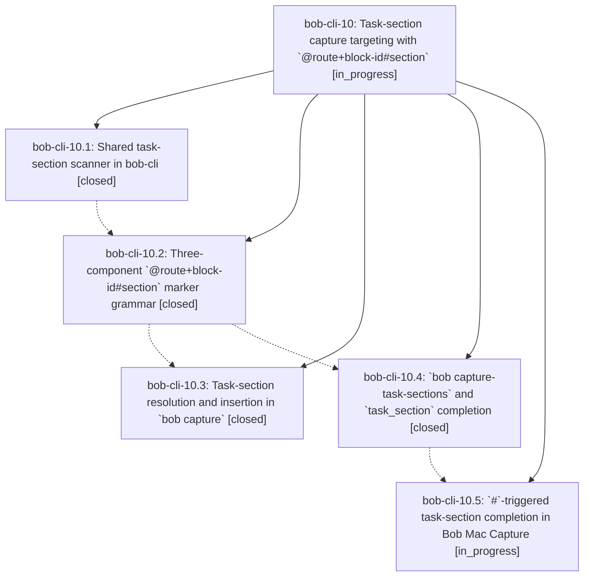

# Bead: bob-cli-10 — Task-section capture targeting with \`@route+block-id#section\`

[Bead Pages](../README.md) / bob-cli-10

**Status:** ◐ in_progress · **Type:** ▸ plan · **Tier:** epic
**Owner:** `bryanbugyi34@gmail.com` · **Created by:** [bbugyi200.athena.085](https://github.com/bobs-org/bob-cli--agents/blob/main/families/bbugyi200.athena.085.md) · **Assignee:** `bob-cli-10.land`
**Created:** 2026-08-19 16:04:38 EDT
**Plan:** [202608/capture\_task\_sections.md](https://github.com/bobs-org/bob-cli--plans/blob/main/202608/capture_task_sections.md)

## Description

Typing `@foo+bar#requirements` in `bob capture` or the Bob Mac Capture panel files the captured note under the `REQUIREMENTS` bullet of the `^bar` task in `foo.md`, with `#`-triggered completion that lists that task's real sections.

## Phases

| Bead | Title | Status | Size | Created | Agents | Commits |
|---|---|---|---|---|---:|---:|
| [bob-cli-10.1](bob-cli-10.1.md) | Shared task-section scanner in bob-cli | ✓ closed | small | 2026-08-19 | 1 | 1 |
| [bob-cli-10.2](bob-cli-10.2.md) | Three-component \`@route+block-id#section\` marker grammar | ✓ closed | medium | 2026-08-19 | 1 | 1 |
| [bob-cli-10.3](bob-cli-10.3.md) | Task-section resolution and insertion in \`bob capture\` | ✓ closed | medium | 2026-08-19 | 1 | 1 |
| [bob-cli-10.4](bob-cli-10.4.md) | \`bob capture-task-sections\` and \`task\_section\` completion | ✓ closed | medium | 2026-08-19 | 1 | 1 |
| [bob-cli-10.5](bob-cli-10.5.md) | \`#\`-triggered task-section completion in Bob Mac Capture | ◐ in_progress | medium | 2026-08-19 | 1 | 0 |

## Lineage

## Agents

| Agent | Bead | Commits |
|---|---|---:|
| [bbugyi200.athena.bob-cli-10.1](https://github.com/bobs-org/bob-cli--agents/blob/main/agents/bbugyi200.athena.bob-cli-10.1/README.md) | [bob-cli-10.1](bob-cli-10.1.md) | 1 |
| [bbugyi200.athena.bob-cli-10.2](https://github.com/bobs-org/bob-cli--agents/blob/main/agents/bbugyi200.athena.bob-cli-10.2/README.md) | [bob-cli-10.2](bob-cli-10.2.md) | 1 |
| [bbugyi200.athena.bob-cli-10.3](https://github.com/bobs-org/bob-cli--agents/blob/main/agents/bbugyi200.athena.bob-cli-10.3/README.md) | [bob-cli-10.3](bob-cli-10.3.md) | 1 |
| [bbugyi200.athena.bob-cli-10.4](https://github.com/bobs-org/bob-cli--agents/blob/main/agents/bbugyi200.athena.bob-cli-10.4/README.md) | [bob-cli-10.4](bob-cli-10.4.md) | 1 |
| [bbugyi200.athena.bob-cli-10.5](https://github.com/bobs-org/bob-cli--agents/blob/main/agents/bbugyi200.athena.bob-cli-10.5/README.md) | [bob-cli-10.5](bob-cli-10.5.md) | 0 |
| [bbugyi200.athena.bob-cli-10.land](https://github.com/bobs-org/bob-cli--agents/blob/main/agents/bbugyi200.athena.bob-cli-10.land/README.md) | [bob-cli-10](README.md) | 0 |

## Commits

| Repo | Commit | Subject | Bead | Committed |
|---|---|---|---|---|
| bob-cli | [`d138e5a`](https://github.com/bobs-org/bob-cli/commit/d138e5a83965a3a676b5ee392a1162bcfae3a775) | feat(capture): add shared task-section scanner module | [bob-cli-10.1](bob-cli-10.1.md) | 2026-08-19 16:25:37 EDT |
| bob-cli | [`8f95e87`](https://github.com/bobs-org/bob-cli/commit/8f95e87b5eb2403676ab12a898840dad00de5ad4) | feat(capture): parse @route+block-id#section sub-bullet markers | [bob-cli-10.2](bob-cli-10.2.md) | 2026-08-19 16:50:11 EDT |
| bob-cli | [`54e4d21`](https://github.com/bobs-org/bob-cli/commit/54e4d213bb27882239e9e61669c81c08dca00d33) | feat(capture): add capture-task-sections and task\_section completion | [bob-cli-10.4](bob-cli-10.4.md) | 2026-08-19 17:37:41 EDT |
| bob-cli | [`3d5c59b`](https://github.com/bobs-org/bob-cli/commit/3d5c59b708e146ddaa71f08ff28ec83ccb203f7c) | feat(capture): insert captured bullets under a selected task section | [bob-cli-10.3](bob-cli-10.3.md) | 2026-08-19 17:48:04 EDT |
