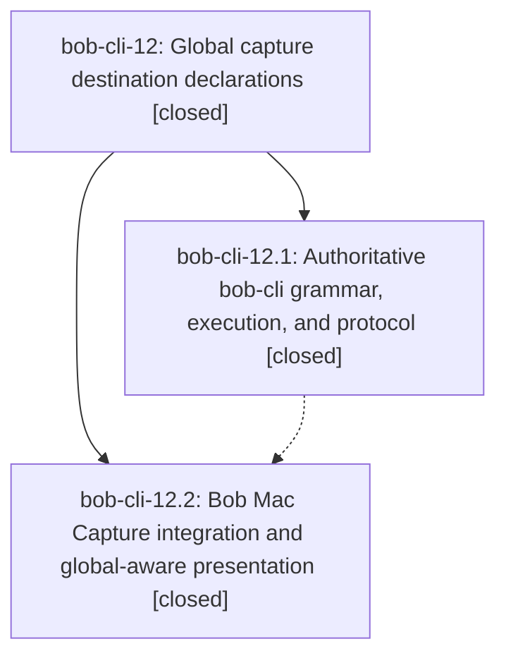

# Bead: bob-cli-12 — Global capture destination declarations

[Bead Pages](../README.md) / bob-cli-12

**Status:** ✓ closed · **Resolution:** done · **Type:** ▸ plan · **Tier:** epic
**Owner:** `bryanbugyi34@gmail.com` · **Created by:** [bbugyi200.athena.0c9.w0](https://github.com/bobs-org/bob-cli--agents/blob/main/families/bbugyi200.athena.0c9.w0.md) · **Assignee:** `bob-cli-12.land`
**Created:** 2026-08-24 07:57:17 EDT · **Closed:** 2026-08-24 08:53:31 EDT
**Plan:** [202608/global\_capture\_destination.md](https://github.com/bobs-org/bob-cli--plans/blob/main/202608/global_capture_destination.md)

## Description

Bob capture drafts can declare one shared task or parent-task destination with @@ syntax, item-local markers override it reliably, and bob-cli plus Bob Mac Capture provide coherent parsing, completion, diagnostics, preview, notifications, and atomic writes.

## Notes

[2026-08-24T12:53:31Z · bob-cli-12.land] Verified both phases against the source, the commits, and live binaries; integrated and cleaned up.

PHASE VERIFICATION. bob-cli 9258da9 (12.1) and bob-mac-capture e40f891 (12.2) are the epic's only commits; both phase notes were addressed and neither phase left a PROPOSED FOLLOW-UP. Reproduced both end-to-end acceptance examples from the plan byte-for-byte against temp vault fixtures: '@@foo' with a '@bar' override produced exactly three results across two notes with the header in neither, and '@@foo+a-id' inserted the first two captures as ordered sibling children of ^a-id with the authored detail still nested, an ordinary task in bar.md, and the fourth item under ^b-id. Confirmed inheritance precedence against every local marker family that landed before this epic: '@bar', '@bar+b-id', '@bar#Ideas', '@bar^new-id', '@bar+b-id#requirements' (the task-section grammar from 3d5c59b/8f95e87), and the bare '#' Pomodoro note (f171a7e/8ab074f) each win for their item while unmarked siblings inherit the header. Confirmed strict errors for header-only drafts, a second declaration, a declaration after content, extra tokens on the header line, '@@foo#Ideas'/'@@foo^id'/'@@foo:id', bad route chars, empty block ID, and --route/--task-ref conflicts; inline code still protects literal '@@'. Confirmed leading blanks, a blank line between header and first item, and CRLF all parse, and that a failing mixed batch (bad parent on item 3) left both fixtures byte-for-byte unchanged. Confirmed additive JSON: capture-parse emits global_destination with post-inheritance item routes and header-excluding indices, spans are global_route/global_sub_bullet_route/global_sub_bullet_block_id, diagnostics are ranged, capture success JSON adds an optional top-level global_destination, and UTF-8 byte offsets stay exact through non-ASCII bodies. Confirmed capture-complete parity between '@foo+'/'@@foo+' including --all-tasks missing-ID candidates, header replacement ranges that exclude both sigils, and inherited same-note wikilink completion routing to foo.md while a '@bar' override routes to bar.md.

CROSS-REPO SYNC. Diffed the bob-mac-capture fake-bob fixture's global parse responses against real bob output for '@@ma', '@@file+', '@@file+hand', '@@foo' task batches, mixed-override batches, and shared-parent batches: every span kind, range, mode, need, and item range matches exactly, so Swift is consuming the real contract rather than a drifted stub. bob-mac-capture CI run 32728276837 on macOS 26 is green for e40f891 (swift-format lint, build, and 332 tests, 0 failures), including all seven new global tests, so phase 12.2's locally-blocked 'just format-lint/build/test' is covered after all.

INTEGRATION. Nothing landed in bob-cli, bob-mac-capture, or bob-plugins between the epic's start (2026-08-24 11:57Z) and now other than the epic's own two commits; e40f891 sits directly on 29228d2 and its BlockIDFieldFocus tests still pass. bob-plugins only mirrors bob capture's indentation and Pomodoro-selection behavior and never parses the draft grammar, so it needs no @@ awareness; no script in bob-cli builds capture drafts. The one integration defect the epic itself introduced was cleanup I finished here: the draft-envelope refactor left split_capture_items and parse_capture_items_with_clip_control as thin wrappers with no production caller, kept alive only by #[cfg_attr(not(test), allow(dead_code))]. Removed both and repointed their two unit tests at split_capture_draft and parse_capture_draft_with_clip_control.

VALIDATION. cargo fmt --check clean, cargo test green (642 lib + 374 cli + 27 + 31 + 1, 0 failures), cargo clippy --all-targets --all-features exits 0 with five warnings, all in dataview.rs/plugins.rs/projects.rs/task_status_hooks.rs and none from capture code.

FOLLOW-UPS. No phase proposed any. The one issue I found on my own -- those five pre-existing clippy warnings -- is a semantic duplicate of task bob-cli-v (Eliminate existing bob-cli clippy warnings), so I corroborated it with a +1 rather than filing a new task, noting that two of the five (chunks_exact_to_as_chunks in dataview.rs:2372 and task_status_hooks.rs:1402) appeared after that bead was written. No other follow-ups; no epic-symbol entries existed and this project has no just symvision recipe.

## Phases

| Bead | Title | Status | Size | Created | Agents | Commits |
|---|---|---|---|---|---:|---:|
| [bob-cli-12.1](bob-cli-12.1.md) | Authoritative bob-cli grammar, execution, and protocol | ✓ closed | medium | 2026-08-24 | 1 | 1 |
| [bob-cli-12.2](bob-cli-12.2.md) | Bob Mac Capture integration and global-aware presentation | ✓ closed | medium | 2026-08-24 | 1 | 1 |

## Lineage

## Agents

| Agent | Bead | Commits |
|---|---|---:|
| [bbugyi200.athena.bob-cli-12.1](https://github.com/bobs-org/bob-cli--agents/blob/main/agents/bbugyi200.athena.bob-cli-12.1/README.md) | [bob-cli-12.1](bob-cli-12.1.md) | 1 |
| [bbugyi200.athena.bob-cli-12.2](https://github.com/bobs-org/bob-cli--agents/blob/main/agents/bbugyi200.athena.bob-cli-12.2/README.md) | [bob-cli-12.2](bob-cli-12.2.md) | 1 |
| [bbugyi200.athena.bob-cli-12.land](https://github.com/bobs-org/bob-cli--agents/blob/main/agents/bbugyi200.athena.bob-cli-12.land/README.md) | [bob-cli-12](README.md) | 1 |

## Commits

| Repo | Commit | Subject | Bead | Committed |
|---|---|---|---|---|
| bob-cli | [`9258da9`](https://github.com/bobs-org/bob-cli/commit/9258da9c109916750ad2d7db36b24b1f66f66a9a) | feat(capture): add global @@ destination declarations | [bob-cli-12.1](bob-cli-12.1.md) | 2026-08-24 08:23:04 EDT |
| bob-mac-capture | [`bob-mac-capture@e40f891`](https://github.com/bobs-org/bob-mac-capture/commit/e40f891e0bef1b1ed1e772f8a3255f033e259bf9) | feat(capture): support global destination headers in mac app | [bob-cli-12.2](bob-cli-12.2.md) | 2026-08-24 08:39:39 EDT |
| bob-cli | [`3c4055d`](https://github.com/bobs-org/bob-cli/commit/3c4055de762e4fc14b2c4679d4e5b325c8347cf1) | refactor(capture): drop the draft envelope's dead item wrappers | [bob-cli-12](README.md) | 2026-08-24 08:55:29 EDT |
