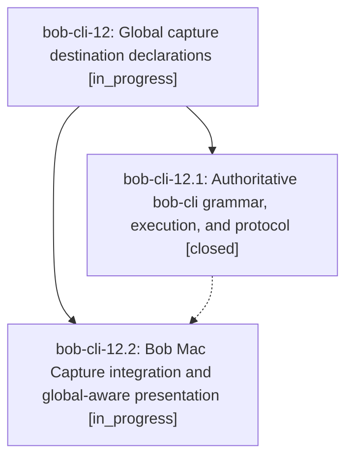

# Bead: bob-cli-12 — Global capture destination declarations

[Bead Pages](../README.md) / bob-cli-12

**Status:** ◐ in_progress · **Type:** ▸ plan · **Tier:** epic
**Owner:** `bryanbugyi34@gmail.com` · **Created by:** [bbugyi200.athena.0c9.w0](https://github.com/bobs-org/bob-cli--agents/blob/main/families/bbugyi200.athena.0c9.w0.md) · **Assignee:** `bob-cli-12.land`
**Created:** 2026-08-24 07:57:17 EDT
**Plan:** [202608/global\_capture\_destination.md](https://github.com/bobs-org/bob-cli--plans/blob/main/202608/global_capture_destination.md)

## Description

Bob capture drafts can declare one shared task or parent-task destination with @@ syntax, item-local markers override it reliably, and bob-cli plus Bob Mac Capture provide coherent parsing, completion, diagnostics, preview, notifications, and atomic writes.

## Phases

| Bead | Title | Status | Size | Created | Agents | Commits |
|---|---|---|---|---|---:|---:|
| [bob-cli-12.1](bob-cli-12.1.md) | Authoritative bob-cli grammar, execution, and protocol | ✓ closed | medium | 2026-08-24 | 1 | 1 |
| [bob-cli-12.2](bob-cli-12.2.md) | Bob Mac Capture integration and global-aware presentation | ◐ in_progress | medium | 2026-08-24 | 1 | 0 |

## Lineage

## Agents

| Agent | Bead | Commits |
|---|---|---:|
| [bbugyi200.athena.bob-cli-12.1](https://github.com/bobs-org/bob-cli--agents/blob/main/agents/bbugyi200.athena.bob-cli-12.1/README.md) | [bob-cli-12.1](bob-cli-12.1.md) | 1 |
| [bbugyi200.athena.bob-cli-12.2](https://github.com/bobs-org/bob-cli--agents/blob/main/agents/bbugyi200.athena.bob-cli-12.2/README.md) | [bob-cli-12.2](bob-cli-12.2.md) | 0 |
| [bbugyi200.athena.bob-cli-12.land](https://github.com/bobs-org/bob-cli--agents/blob/main/agents/bbugyi200.athena.bob-cli-12.land/README.md) | [bob-cli-12](README.md) | 0 |

## Commits

| Repo | Commit | Subject | Bead | Committed |
|---|---|---|---|---|
| bob-cli | [`9258da9`](https://github.com/bobs-org/bob-cli/commit/9258da9c109916750ad2d7db36b24b1f66f66a9a) | feat(capture): add global @@ destination declarations | [bob-cli-12.1](bob-cli-12.1.md) | 2026-08-24 08:23:04 EDT |
