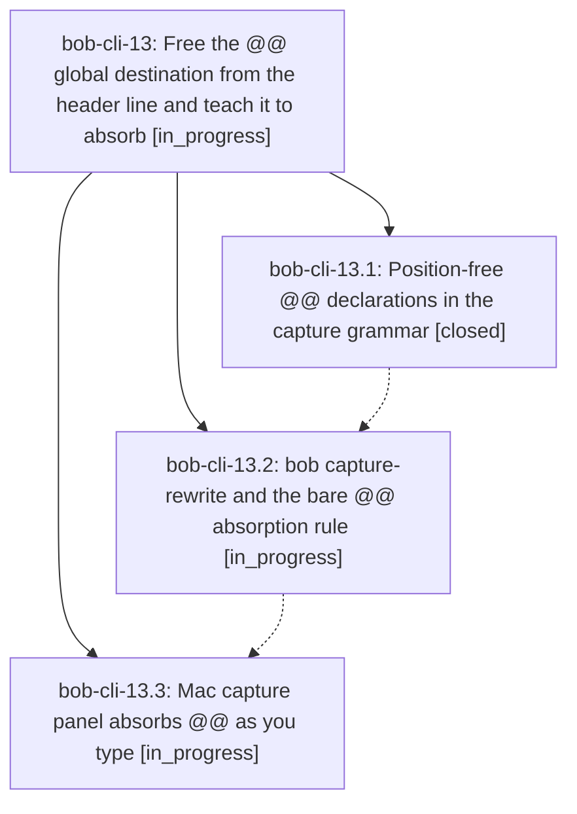

# Bead: bob-cli-13 — Free the @@ global destination from the header line and teach it to absorb

[Bead Pages](../README.md) / bob-cli-13

**Status:** ◐ in_progress · **Type:** ▸ plan · **Tier:** epic
**Owner:** `bryanbugyi34@gmail.com` · **Created by:** [bbugyi200.athena.0cv](https://github.com/bobs-org/bob-cli--agents/blob/main/families/bbugyi200.athena.0cv.md) · **Assignee:** `bob-cli-13.land`
**Created:** 2026-08-24 15:01:18 EDT
**Plan:** [202608/capture\_global\_destination\_anywhere.md](https://github.com/bobs-org/bob-cli--plans/blob/main/202608/capture_global_destination_anywhere.md)

## Description

A `@@route` / `@@route+block-id` global destination declaration can be typed on any line of any capture item instead of only on a header line, and typing a bare `@@` inside an item that already carries a `@file` reference moves that reference onto the `@@` and deletes the original, so a draft can never end up with a shadowed local marker or two competing declarations.

## Phases

| Bead | Title | Status | Size | Created | Agents | Commits |
|---|---|---|---|---|---:|---:|
| [bob-cli-13.1](bob-cli-13.1.md) | Position-free @@ declarations in the capture grammar | ✓ closed | medium | 2026-08-24 | 1 | 1 |
| [bob-cli-13.2](bob-cli-13.2.md) | bob capture-rewrite and the bare @@ absorption rule | ◐ in_progress | medium | 2026-08-24 | 1 | 0 |
| [bob-cli-13.3](bob-cli-13.3.md) | Mac capture panel absorbs @@ as you type | ◐ in_progress | medium | 2026-08-24 | 1 | 0 |

## Lineage

## Agents

| Agent | Bead | Commits |
|---|---|---:|
| [bbugyi200.athena.bob-cli-13.1](https://github.com/bobs-org/bob-cli--agents/blob/main/agents/bbugyi200.athena.bob-cli-13.1/README.md) | [bob-cli-13.1](bob-cli-13.1.md) | 1 |
| [bbugyi200.athena.bob-cli-13.2](https://github.com/bobs-org/bob-cli--agents/blob/main/agents/bbugyi200.athena.bob-cli-13.2/README.md) | [bob-cli-13.2](bob-cli-13.2.md) | 0 |
| [bbugyi200.athena.bob-cli-13.3](https://github.com/bobs-org/bob-cli--agents/blob/main/agents/bbugyi200.athena.bob-cli-13.3/README.md) | [bob-cli-13.3](bob-cli-13.3.md) | 0 |
| [bbugyi200.athena.bob-cli-13.land](https://github.com/bobs-org/bob-cli--agents/blob/main/agents/bbugyi200.athena.bob-cli-13.land/README.md) | [bob-cli-13](README.md) | 0 |

## Commits

| Repo | Commit | Subject | Bead | Committed |
|---|---|---|---|---|
| bob-cli | [`5b15533`](https://github.com/bobs-org/bob-cli/commit/5b155336ff772fb1f9f3dae6b3579fb8ff7f1f39) | feat(capture): allow global destination declarations anywhere | [bob-cli-13.1](bob-cli-13.1.md) | 2026-08-24 15:25:14 EDT |
