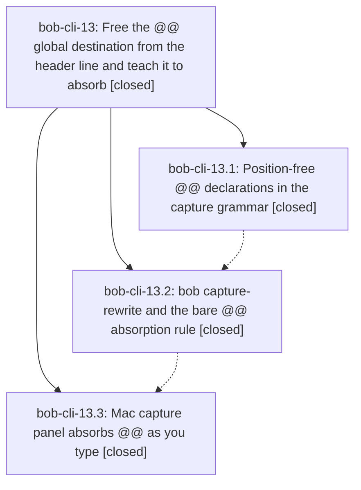

# Bead: bob-cli-13 — Free the @@ global destination from the header line and teach it to absorb

[Bead Pages](../README.md) / bob-cli-13

**Status:** ✓ closed · **Resolution:** done · **Type:** ▸ plan · **Tier:** epic
**Owner:** `bryanbugyi34@gmail.com` · **Created by:** [bbugyi200.athena.0cv](https://github.com/bobs-org/bob-cli--agents/blob/main/families/bbugyi200.athena.0cv.md) · **Assignee:** `bob-cli-13.land`
**Created:** 2026-08-24 15:01:18 EDT · **Closed:** 2026-08-24 16:12:45 EDT
**Plan:** [202608/capture\_global\_destination\_anywhere.md](https://github.com/bobs-org/bob-cli--plans/blob/main/202608/capture_global_destination_anywhere.md)

## Description

A `@@route` / `@@route+block-id` global destination declaration can be typed on any line of any capture item instead of only on a header line, and typing a bare `@@` inside an item that already carries a `@file` reference moves that reference onto the `@@` and deletes the original, so a draft can never end up with a shadowed local marker or two competing declarations.

## Notes

[2026-08-24T20:12:45Z · bob-cli-13.land] Verified all three phases against the plan and the source. grammar (5b15533): declaration tokens are recognized anywhere (confirmed a trailing @@foo on item 2 routes item 1 too, with global_destination.line reported), declaration-only lines still behave as headers, duplicate declarations error with both line numbers, shadowed declarations emit the global_destination_shadowed warning from both capture-parse and capture (warnings field + stderr), and GLOBAL_DESTINATION_EXTRA_TEXT_ERROR / MISPLACED_GLOBAL_DESTINATION_ERROR / GlobalHeaderLine / parse_global_header_strict / reject_embedded_global_declarations are all gone with no leftover 'header' wording in docs or --help. rewrite (025dc06): exercised bob capture-rewrite end to end -- absorb_local_marker for trailing, leading, child-line, and @cash+goog-exit markers; absorb_declaration deleting a whole declaration-only line; all four Rule A5 notices; Rule A6 no-op; idempotence; last-bare-@@ selection with sibling declaration deletion; cursor placement past the rewritten token. macapp (bob-mac-capture 0a31975): reviewed the panel trigger, staleness guard, notice announcement, and rewrite lane; rebuilt swift build --target CaptureCore and --target CaptureCoreTests cleanly (the app target and its tests remain macOS-CI-only on this Linux host). Full 'just' (fmt + clippy --all-targets --all-features + cargo test) passes on master.

Integration: no non-epic commits landed in bob-cli, bob-mac-capture, or bob-plugins between the epic's start (2026-08-24 15:01 EDT) and this landing, so there was nothing to merge back. Confirmed no other bob-cli module consumes the global-destination model (the remaining 'global' hits are Tasks-plugin global_filter) and that bob-plugins has no capture-grammar duplication. bob-cli-14 turned out to be a duplicate epic already closed as canceled against this one, so it created no conflict.

Follow-ups: bob-cli-13.2's PROPOSED FOLLOW-UP (the plan's Vocabulary section never classified the three-component @route+block-id#section form) is resolved in-epic -- the implementation's choice to treat it as a Rule A5 'cannot take a section' notice is correct, since @@route#Section is out of scope per Rule G5, and I documented that form explicitly in docs/capture.md and in 'bob capture-rewrite --help'. No other child proposed follow-ups. I also fixed one epic-caused defect found during verification: the capture-rewrite --help example 'bob capture-rewrite -f json -- "@@foo\\nBuy milk @@"' passed a literal backslash-n in any shell and produced a mangled single-line rewrite; it is now three printf-piped examples matching the convention capture/capture-parse already use, each verified to run. Considered and declined filing a task for a bare @@ typed alone on its own line not absorbing the preceding item's marker: that line is a declaration-only line owned by no item, so Rule A1 source 3 applies by design and capture-complete correctly falls back to route completion (context: 'route' with candidates), which is the intended behavior rather than a gap.

## Phases

| Bead | Title | Status | Size | Created | Agents | Commits |
|---|---|---|---|---|---:|---:|
| [bob-cli-13.1](bob-cli-13.1.md) | Position-free @@ declarations in the capture grammar | ✓ closed | medium | 2026-08-24 | 1 | 1 |
| [bob-cli-13.2](bob-cli-13.2.md) | bob capture-rewrite and the bare @@ absorption rule | ✓ closed | medium | 2026-08-24 | 1 | 1 |
| [bob-cli-13.3](bob-cli-13.3.md) | Mac capture panel absorbs @@ as you type | ✓ closed | medium | 2026-08-24 | 1 | 1 |

## Lineage

## Agents

| Agent | Bead | Commits |
|---|---|---:|
| [bbugyi200.athena.bob-cli-13.1](https://github.com/bobs-org/bob-cli--agents/blob/main/agents/bbugyi200.athena.bob-cli-13.1/README.md) | [bob-cli-13.1](bob-cli-13.1.md) | 1 |
| [bbugyi200.athena.bob-cli-13.2](https://github.com/bobs-org/bob-cli--agents/blob/main/agents/bbugyi200.athena.bob-cli-13.2/README.md) | [bob-cli-13.2](bob-cli-13.2.md) | 1 |
| [bbugyi200.athena.bob-cli-13.3](https://github.com/bobs-org/bob-cli--agents/blob/main/agents/bbugyi200.athena.bob-cli-13.3/README.md) | [bob-cli-13.3](bob-cli-13.3.md) | 1 |
| [bbugyi200.athena.bob-cli-13.land](https://github.com/bobs-org/bob-cli--agents/blob/main/agents/bbugyi200.athena.bob-cli-13.land/README.md) | [bob-cli-13](README.md) | 1 |

## Commits

| Repo | Commit | Subject | Bead | Committed |
|---|---|---|---|---|
| bob-cli | [`5b15533`](https://github.com/bobs-org/bob-cli/commit/5b155336ff772fb1f9f3dae6b3579fb8ff7f1f39) | feat(capture): allow global destination declarations anywhere | [bob-cli-13.1](bob-cli-13.1.md) | 2026-08-24 15:25:14 EDT |
| bob-cli | [`025dc06`](https://github.com/bobs-org/bob-cli/commit/025dc0610d2cb6cd7123165fe2db8a3a988bf3c7) | feat(capture): add capture-rewrite and the bare @@ absorption rule | [bob-cli-13.2](bob-cli-13.2.md) | 2026-08-24 15:49:41 EDT |
| bob-mac-capture | [`bob-mac-capture@0a31975`](https://github.com/bobs-org/bob-mac-capture/commit/0a3197564f83cfe8cbdeca25afefac64251e571e) | feat(capture): wire mac panel capture rewrite | [bob-cli-13.3](bob-cli-13.3.md) | 2026-08-24 16:02:15 EDT |
| bob-cli | [`164ae38`](https://github.com/bobs-org/bob-cli/commit/164ae386b3e06e57a7a6387cfca9ba66fb06ab8b) | docs(capture): fix the capture-rewrite help examples and A5 list | [bob-cli-13](README.md) | 2026-08-24 16:13:56 EDT |
