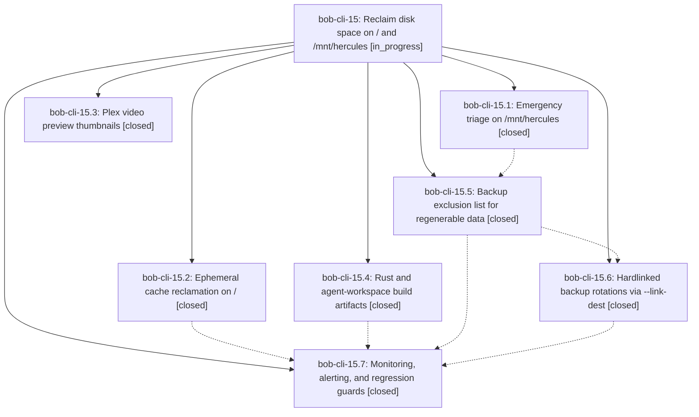

# Bead: bob-cli-15 — Reclaim disk space on / and /mnt/hercules

[Bead Pages](../README.md) / bob-cli-15

**Status:** ◐ in_progress · **Type:** ▸ plan · **Tier:** epic
**Owner:** `bryanbugyi34@gmail.com` · **Created by:** [bbugyi200.athena.0dy](https://github.com/bobs-org/bob-cli--agents/blob/main/agents/bbugyi200.athena.0dy/README.md) · **Assignee:** `bob-cli-15.land`
**Created:** 2026-08-26 08:19:52 EDT
**Plan:** [202608/disk\_space\_reclamation.md](https://github.com/bobs-org/bob-cli--plans/blob/main/202608/disk_space_reclamation.md)

<!-- sase:links:start -->

## Links

| Relation | Artifact | Why |
| --- | --- | --- |
| implemented-by | [plan:202608/disk_space_reclamation.md][1] | derived from the plan's `bead_id:` frontmatter field |

[1]: https://github.com/bobs-org/bob-cli--plans/blob/main/202608/disk_space_reclamation.md

<!-- sase:links:end -->

## Description

Both pressured filesystems return to a healthy steady state with durable headroom: `/` drops below 75% used and `/mnt/hercules` below 80% used, the backup system stops storing redundant full copies of regenerable build artifacts, and monitoring alerts before either filesystem fills again.

## Phases

| Bead | Title | Status | Size | Created | Agents | Commits |
|---|---|---|---|---|---:|---:|
| [bob-cli-15.1](bob-cli-15.1.md) | Emergency triage on /mnt/hercules | ✓ closed | small | 2026-08-26 | 1 | 0 |
| [bob-cli-15.2](bob-cli-15.2.md) | Ephemeral cache reclamation on / | ✓ closed | medium | 2026-08-26 | 1 | 0 |
| [bob-cli-15.3](bob-cli-15.3.md) | Plex video preview thumbnails | ✓ closed | small | 2026-08-26 | 1 | 0 |
| [bob-cli-15.4](bob-cli-15.4.md) | Rust and agent-workspace build artifacts | ✓ closed | medium | 2026-08-26 | 1 | 0 |
| [bob-cli-15.5](bob-cli-15.5.md) | Backup exclusion list for regenerable data | ✓ closed | medium | 2026-08-26 | 1 | 0 |
| [bob-cli-15.6](bob-cli-15.6.md) | Hardlinked backup rotations via --link-dest | ✓ closed | medium | 2026-08-26 | 1 | 0 |
| [bob-cli-15.7](bob-cli-15.7.md) | Monitoring, alerting, and regression guards | ✓ closed | small | 2026-08-26 | 1 | 0 |

## Lineage

## Agents

| Agent | Bead | Commits |
|---|---|---:|
| [bbugyi200.athena.bob-cli-15.1](https://github.com/bobs-org/bob-cli--agents/blob/main/agents/bbugyi200.athena.bob-cli-15.1/README.md) | [bob-cli-15.1](bob-cli-15.1.md) | 0 |
| [bbugyi200.athena.bob-cli-15.2](https://github.com/bobs-org/bob-cli--agents/blob/main/agents/bbugyi200.athena.bob-cli-15.2/README.md) | [bob-cli-15.2](bob-cli-15.2.md) | 0 |
| [bbugyi200.athena.bob-cli-15.3](https://github.com/bobs-org/bob-cli--agents/blob/main/agents/bbugyi200.athena.bob-cli-15.3/README.md) | [bob-cli-15.3](bob-cli-15.3.md) | 0 |
| [bbugyi200.athena.bob-cli-15.4](https://github.com/bobs-org/bob-cli--agents/blob/main/agents/bbugyi200.athena.bob-cli-15.4/README.md) | [bob-cli-15.4](bob-cli-15.4.md) | 0 |
| [bbugyi200.athena.bob-cli-15.5](https://github.com/bobs-org/bob-cli--agents/blob/main/agents/bbugyi200.athena.bob-cli-15.5/README.md) | [bob-cli-15.5](bob-cli-15.5.md) | 0 |
| [bbugyi200.athena.bob-cli-15.6](https://github.com/bobs-org/bob-cli--agents/blob/main/agents/bbugyi200.athena.bob-cli-15.6/README.md) | [bob-cli-15.6](bob-cli-15.6.md) | 0 |
| [bbugyi200.athena.bob-cli-15.7](https://github.com/bobs-org/bob-cli--agents/blob/main/agents/bbugyi200.athena.bob-cli-15.7/README.md) | [bob-cli-15.7](bob-cli-15.7.md) | 0 |
| [bbugyi200.athena.bob-cli-15.land](https://github.com/bobs-org/bob-cli--agents/blob/main/agents/bbugyi200.athena.bob-cli-15.land/README.md) | [bob-cli-15](README.md) | 0 |
