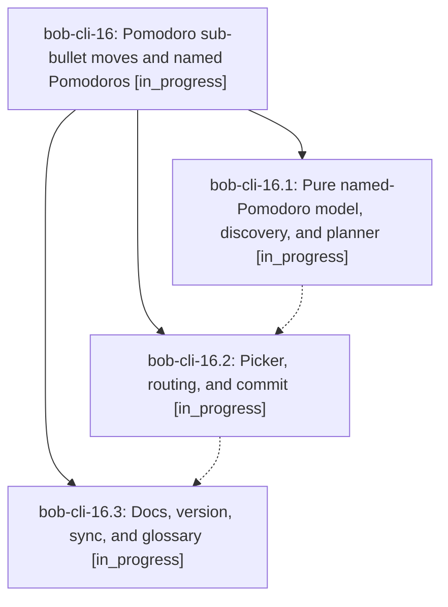

# Bead: bob-cli-16 — Pomodoro sub-bullet moves and named Pomodoros

[Bead Pages](../README.md) / bob-cli-16

**Status:** ◐ in_progress · **Type:** ▸ plan · **Tier:** epic
**Owner:** `bryanbugyi34@gmail.com` · **Created by:** [bbugyi200.athena.0eb](https://github.com/bobs-org/bob-cli--agents/blob/main/families/bbugyi200.athena.0eb.md) · **Assignee:** `bob-cli-16.land`
**Created:** 2026-08-26 10:04:14 EDT
**Plan:** [202608/pomodoro\_bullet\_move.md](https://github.com/bobs-org/bob-cli--plans/blob/main/202608/pomodoro_bullet_move.md)

<!-- sase:links:start -->

## Links

| Relation | Artifact | Why |
| --- | --- | --- |
| implemented-by | [plan:202608/pomodoro_bullet_move.md][1] | derived from the plan's `bead_id:` frontmatter field |

[1]: https://github.com/bobs-org/bob-cli--plans/blob/main/202608/pomodoro_bullet_move.md

<!-- sase:links:end -->

## Description

`<ctrl+shift+m>` on a Pomodoro sub-bullet moves that bullet — and, with a count, the next N sibling bullets — into another open Pomodoro in the same note, or into a new named Pomodoro created just below the current one, and the Pomodoro glossary entry documents named Pomodoros and this keymap.

## Phases

| Bead | Title | Status | Size | Created | Agents | Commits |
|---|---|---|---|---|---:|---:|
| [bob-cli-16.1](bob-cli-16.1.md) | Pure named-Pomodoro model, discovery, and planner | ◐ in_progress | medium | 2026-08-26 | 1 | 1 |
| [bob-cli-16.2](bob-cli-16.2.md) | Picker, routing, and commit | ◐ in_progress | medium | 2026-08-26 | 1 | 0 |
| [bob-cli-16.3](bob-cli-16.3.md) | Docs, version, sync, and glossary | ◐ in_progress | small | 2026-08-26 | 1 | 0 |

## Lineage

## Agents

| Agent | Bead | Commits |
|---|---|---:|
| [bbugyi200.athena.bob-cli-16.1](https://github.com/bobs-org/bob-cli--agents/blob/main/agents/bbugyi200.athena.bob-cli-16.1/README.md) | [bob-cli-16.1](bob-cli-16.1.md) | 1 |
| [bbugyi200.athena.bob-cli-16.2](https://github.com/bobs-org/bob-cli--agents/blob/main/agents/bbugyi200.athena.bob-cli-16.2/README.md) | [bob-cli-16.2](bob-cli-16.2.md) | 0 |
| [bbugyi200.athena.bob-cli-16.3](https://github.com/bobs-org/bob-cli--agents/blob/main/agents/bbugyi200.athena.bob-cli-16.3/README.md) | [bob-cli-16.3](bob-cli-16.3.md) | 0 |
| [bbugyi200.athena.bob-cli-16.land](https://github.com/bobs-org/bob-cli--agents/blob/main/agents/bbugyi200.athena.bob-cli-16.land/README.md) | [bob-cli-16](README.md) | 0 |

## Commits

| Repo | Commit | Subject | Bead | Committed |
|---|---|---|---|---|
| bob-plugins | [`bob-plugins@117e33c`](https://github.com/bobs-org/bob-plugins/commit/117e33c63c45ddc46ac2d78ff214177559f90b30) | feat(bob-navigation-hotkeys): add named-Pomodoro grammar and bullet-move planner | [bob-cli-16.1](bob-cli-16.1.md) | 2026-08-26 10:56:45 EDT |
