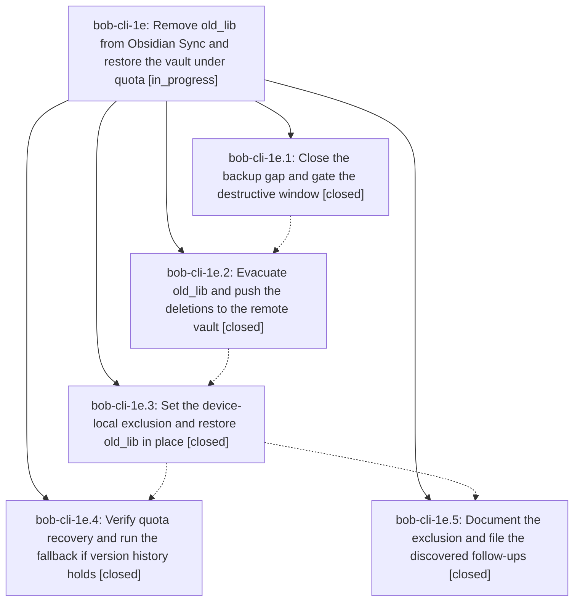

# Bead: bob-cli-1e — Remove old\_lib from Obsidian Sync and restore the vault under quota

[Bead Pages](../README.md) / bob-cli-1e

**Status:** ◐ in_progress · **Type:** ▸ plan · **Tier:** epic
**Owner:** `bryanbugyi34@gmail.com` · **Created by:** [bbugyi200.athena.0en](https://github.com/bobs-org/bob-cli--agents/blob/main/families/bbugyi200.athena.0en.md) · **Assignee:** `bob-cli-1e.land`
**Created:** 2026-08-27 08:13:35 EDT
**Plan:** [202608/unsync\_old\_lib.md](https://github.com/bobs-org/bob-cli--plans/blob/main/202608/unsync_old_lib.md)

<!-- sase:links:start -->

## Links

| Relation | Artifact | Why |
| --- | --- | --- |
| implemented-by | [plan:202608/unsync_old_lib.md][1] | derived from the plan's `bead_id:` frontmatter field |

[1]: https://github.com/bobs-org/bob-cli--plans/blob/main/202608/unsync_old_lib.md

<!-- sase:links:end -->

## Description

The `old_lib/` directory no longer syncs through Obsidian Sync from athena, its 851 MB is gone from the remote vault, every old_lib byte still exists on disk and in a durable backup, and `ob-sync-bob.service` completes sync cycles without `Vault limit exceeded`.

## Notes

[2026-08-27T12:36:20Z · bryanbugyi34@gmail.com] Make sure my macbook's Obsidian is synced properly before closing this epic. My MacBook is accessible over SSH (see the ~/.ssh/config file).

## Phases

| Bead | Title | Status | Size | Created | Agents | Commits |
|---|---|---|---|---|---:|---:|
| [bob-cli-1e.1](bob-cli-1e.1.md) | Close the backup gap and gate the destructive window | ✓ closed | small | 2026-08-27 | 1 | 0 |
| [bob-cli-1e.2](bob-cli-1e.2.md) | Evacuate old\_lib and push the deletions to the remote vault | ✓ closed | medium | 2026-08-27 | 1 | 0 |
| [bob-cli-1e.3](bob-cli-1e.3.md) | Set the device-local exclusion and restore old\_lib in place | ✓ closed | small | 2026-08-27 | 1 | 0 |
| [bob-cli-1e.4](bob-cli-1e.4.md) | Verify quota recovery and run the fallback if version history holds | ✓ closed | medium | 2026-08-27 | 1 | 0 |
| [bob-cli-1e.5](bob-cli-1e.5.md) | Document the exclusion and file the discovered follow-ups | ✓ closed | small | 2026-08-27 | 1 | 1 |

## Lineage

## Agents

| Agent | Bead | Commits |
|---|---|---:|
| [bbugyi200.athena.bob-cli-1e.1](https://github.com/bobs-org/bob-cli--agents/blob/main/families/bbugyi200.athena.bob-cli-1e.1.md) | [bob-cli-1e.1](bob-cli-1e.1.md) | 0 |
| [bbugyi200.athena.bob-cli-1e.2](https://github.com/bobs-org/bob-cli--agents/blob/main/agents/bbugyi200.athena.bob-cli-1e.2/README.md) | [bob-cli-1e.2](bob-cli-1e.2.md) | 0 |
| [bbugyi200.athena.bob-cli-1e.3](https://github.com/bobs-org/bob-cli--agents/blob/main/agents/bbugyi200.athena.bob-cli-1e.3/README.md) | [bob-cli-1e.3](bob-cli-1e.3.md) | 0 |
| [bbugyi200.athena.bob-cli-1e.4](https://github.com/bobs-org/bob-cli--agents/blob/main/families/bbugyi200.athena.bob-cli-1e.4.md) | [bob-cli-1e.4](bob-cli-1e.4.md) | 0 |
| [bbugyi200.athena.bob-cli-1e.5](https://github.com/bobs-org/bob-cli--agents/blob/main/agents/bbugyi200.athena.bob-cli-1e.5/README.md) | [bob-cli-1e.5](bob-cli-1e.5.md) | 1 |
| [bbugyi200.athena.bob-cli-1e.land](https://github.com/bobs-org/bob-cli--agents/blob/main/agents/bbugyi200.athena.bob-cli-1e.land/README.md) | [bob-cli-1e](README.md) | 0 |

## Commits

| Repo | Commit | Subject | Bead | Committed |
|---|---|---|---|---|
| bob-cli | [`9f9049b`](https://github.com/bobs-org/bob-cli/commit/9f9049bad22546e8d949c240ba1c2820842b9b1c) | docs: document obsidian sync exclusions | [bob-cli-1e.5](bob-cli-1e.5.md) | 2026-08-27 08:42:46 EDT |
