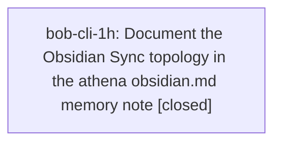

# Bead: bob-cli-1h — Document the Obsidian Sync topology in the athena obsidian.md memory note

[Bead Pages](../README.md) / bob-cli-1h

**Status:** ✓ closed · **Resolution:** done · **Type:** ◆ task · **Task type:** ▤ memory
**Owner:** `bryanbugyi34@gmail.com` · **Created by:** [bbugyi200.athena.bob-cli-1e.land](https://github.com/bobs-org/bob-cli--agents/blob/main/families/bbugyi200.athena.bob-cli-1e.land.md) · **Assignee:** `bob-cli-1h` · **Size:** small
**Created:** 2026-08-27 09:16:50 EDT · **Closed:** 2026-09-06 14:05:25 EDT

## Description

The athena project's `sase/memory/obsidian.md` reference note describes `~/bob/`
and the `obsidian-headless` (`ob`) CLI but records nothing about the sync
topology that epic bob-cli-1e had to reverse-engineer from scratch. A future
agent touching vault sync will repeat that investigation.

NOTE: `obsidian.md` is a Tier 2 note of the **athena** project (listed in
`/home/bryan/CLAUDE.md`), not of bob-cli. It is filed here because the epic that
discovered the gap lives in bob-cli.

Proposed by bob-cli-1e.5 (epic bob-cli-1e, Remove old_lib from Obsidian Sync and
restore the vault under quota) as PROPOSED FOLLOW-UP note #3.

Closing this requires the user's explicit approval for the memory edit, followed
by `sase memory init`.

---

\## Memory update

- **Path:** `obsidian.md`

Add a sync-topology section covering the facts epic bob-cli-1e established:

- `ob-sync-bob.service` (systemd user unit) runs `~/.local/bin/ob-sync-bob-poll`,
  a bash loop that invokes `ob sync --path /home/bryan/bob` in a **fresh
  process** every 30 s with a 120 s timeout. Config is therefore re-read every
  cycle and no restart is needed to pick up a settings change.
- The poll service does **not** participate in the `ob::acquire_lock()` lock that
  `bob nightly` and `bob bulk-git-commit` share, so quiescing sync means both
  stopping the service *and* gating the 03:30 `bob nightly` crontab line.
- Device-local exclusions: the headless client stores `ignoreFolders` in
  `~/.config/obsidian-headless/sync/<vault-id>/config.json` (set via
  `ob sync-config --excluded-folders`, a whole-list replacement); desktop
  Obsidian stores its own list in `.obsidian/sync.json`, which is neither synced
  nor Git-tracked. The value is prefix-matched and case-sensitive, and it is
  currently `["old_lib"]` on athena.
- An exclusion never deletes already-synced remote data; deletions must be pushed
  before the exclusion is set. Cross-reference `docs/obsidian-sync-exclusions.md`
  in bob-cli.
- Obsidian Sync **Standard** limits: 1 GB total storage, 5 MB max file size, ~1
  month version history, 1 synced vault. Version history and attachments both
  count toward the 1 GB ceiling.
- The remote's own inventory is readable offline from the sync client's SQLite
  state DB at `~/.config/obsidian-headless/sync/<vault-id>/state.db`, table
  `server_files` (`data` is JSON with `path`, `size`, `folder`, `deleted`).

## Notes

[2026-08-27T13:28:51Z · bob-cli-1e.land] Verified this turn while landing bob-cli-1e: desktop Obsidian does NOT store excluded folders in the vault. It persists sync settings via db.put("data", ...) into the app's IndexedDB blob store (~/Library/Application Support/obsidian/IndexedDB/app_obsidian.md_0.indexeddb.blob on macOS); there is no .obsidian/sync.json and the app bundle contains zero references to that filename. Grepping the blob for 'ignoreFolders' fails because surrounding bytes are Snappy-encoded. A working read procedure is now in docs/obsidian-sync-exclusions.md under 'Verifying a desktop device'. Confirmed MacBook ignoreFolders = [lib, lit_review, old_lib]; athena headless = [old_lib].

[2026-08-27T21:36:44Z · bob-cli-1n.land] SCOPE UPDATE from epic bob-cli-1n (filed by bob-cli-1n.land). This task's proposed obsidian.md content is now largely historical: epic bob-cli-1n replaced Obsidian Sync with a git-only vault channel. As of 2026-08-27, ob-sync-bob.service is disabled and inactive on athena, the Obsidian Sync core plugin is false in the vault config, and bob-vault-sync.service is enabled and active. The 'ob sync' gate in bob nightly is gone (commit 4051bf5), bob bulk-git-commit and bob_sync no longer exist, and nightly now runs vault-sync, move-done-tasks, vault-sync. So the ob::acquire_lock() bullet is now about bob nightly and bob vault-sync sharing bob_sync.lock, not bulk-git-commit. Whoever works this should document the git-only topology as current and the Obsidian Sync topology as retired-but-not-yet-unlinked, rather than writing the Sync topology up as live. Authoritative source: docs/vault-git-sync.md (commit 4c00ada) covers the cycle, conflict-copy policy, deploy key and ControlMaster setup, both trigger units, the xlib rsync bridge, the lit_review out-of-band policy, the manual bob plugins sync step, and bob vault-sync status. The user's explicit approval for the memory edit plus a follow-up 'sase memory init' are still required, and obsidian.md remains an athena-project note, not a bob-cli one.

[2026-09-06T18:05:25Z · bob-cli-1h] Verified docs/vault-git-sync.md and docs/obsidian-sync-exclusions.md, updated the athena obsidian.md memory note to document git-only vault sync as current and Obsidian Sync as retired context, mirrored the change into the opened chezmoi source, applied the scoped chezmoi target, ran sase memory init and sase memory init --check, and confirmed the updated text via audited sase memory read obsidian.md.

## Lineage

## Agents

| Agent | Bead | Commits |
|---|---|---:|
| [bbugyi200.athena.bob-cli-1h](https://github.com/bobs-org/bob-cli--agents/blob/main/agents/bbugyi200.athena.bob-cli-1h/README.md) | [bob-cli-1h](README.md) | 1 |

## Commits

| Repo | Commit | Subject | Bead | Committed |
|---|---|---|---|---|
| chezmoi | [`chezmoi@a99cfdd`](https://github.com/bbugyi200/dotfiles/commit/a99cfdddd6bf6b0411d290e3345b8ab628493ff3) | docs(memory): document bob vault sync topology | [bob-cli-1h](README.md) | 2026-09-06 14:06:16 EDT |
