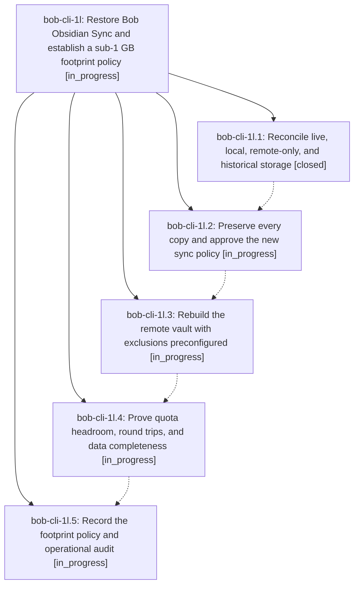

# Bead: bob-cli-1l — Restore Bob Obsidian Sync and establish a sub-1 GB footprint policy

[Bead Pages](../README.md) / bob-cli-1l

**Status:** ◐ in_progress · **Type:** ▸ plan · **Tier:** epic
**Owner:** `bryanbugyi34@gmail.com` · **Created by:** [bbugyi200.athena.0er](https://github.com/bobs-org/bob-cli--agents/blob/main/families/bbugyi200.athena.0er.md) · **Assignee:** `bob-cli-1l.land`
**Created:** 2026-08-27 09:54:57 EDT
**Plan:** [202608/restore\_obsidian\_sync.md](https://github.com/bobs-org/bob-cli--plans/blob/main/202608/restore_obsidian_sync.md)

<!-- sase:links:start -->

## Links

| Relation | Artifact | Why |
| --- | --- | --- |
| implemented-by | [plan:202608/restore_obsidian_sync.md][1] | derived from the plan's `bead_id:` frontmatter field |

[1]: https://github.com/bobs-org/bob-cli--plans/blob/main/202608/restore_obsidian_sync.md

<!-- sase:links:end -->

## Description

Obsidian Sync completes end to end on athena and the MacBook from a fully reconciled, backed-up vault whose charged storage is below the Standard plan's 1 GB limit, with explicit and repeatable decisions about every excluded or unsupported content class.

## Phases

| Bead | Title | Status | Size | Created | Agents | Commits |
|---|---|---|---|---|---:|---:|
| [bob-cli-1l.1](bob-cli-1l.1.md) | Reconcile live, local, remote-only, and historical storage | ✓ closed | medium | 2026-08-27 | 1 | 1 |
| [bob-cli-1l.2](bob-cli-1l.2.md) | Preserve every copy and approve the new sync policy | ◐ in_progress | medium | 2026-08-27 | 1 | 0 |
| [bob-cli-1l.3](bob-cli-1l.3.md) | Rebuild the remote vault with exclusions preconfigured | ◐ in_progress | medium | 2026-08-27 | 1 | 0 |
| [bob-cli-1l.4](bob-cli-1l.4.md) | Prove quota headroom, round trips, and data completeness | ◐ in_progress | medium | 2026-08-27 | 1 | 0 |
| [bob-cli-1l.5](bob-cli-1l.5.md) | Record the footprint policy and operational audit | ◐ in_progress | small | 2026-08-27 | 1 | 0 |

## Lineage

## Agents

| Agent | Bead | Commits |
|---|---|---:|
| [bbugyi200.athena.bob-cli-1l.1](https://github.com/bobs-org/bob-cli--agents/blob/main/agents/bbugyi200.athena.bob-cli-1l.1/README.md) | [bob-cli-1l.1](bob-cli-1l.1.md) | 1 |
| [bbugyi200.athena.bob-cli-1l.2](https://github.com/bobs-org/bob-cli--agents/blob/main/agents/bbugyi200.athena.bob-cli-1l.2/README.md) | [bob-cli-1l.2](bob-cli-1l.2.md) | 0 |
| [bbugyi200.athena.bob-cli-1l.3](https://github.com/bobs-org/bob-cli--agents/blob/main/agents/bbugyi200.athena.bob-cli-1l.3/README.md) | [bob-cli-1l.3](bob-cli-1l.3.md) | 0 |
| [bbugyi200.athena.bob-cli-1l.4](https://github.com/bobs-org/bob-cli--agents/blob/main/agents/bbugyi200.athena.bob-cli-1l.4/README.md) | [bob-cli-1l.4](bob-cli-1l.4.md) | 0 |
| [bbugyi200.athena.bob-cli-1l.5](https://github.com/bobs-org/bob-cli--agents/blob/main/agents/bbugyi200.athena.bob-cli-1l.5/README.md) | [bob-cli-1l.5](bob-cli-1l.5.md) | 0 |
| [bbugyi200.athena.bob-cli-1l.land](https://github.com/bobs-org/bob-cli--agents/blob/main/agents/bbugyi200.athena.bob-cli-1l.land/README.md) | [bob-cli-1l](README.md) | 0 |

## Commits

| Repo | Commit | Subject | Bead | Committed |
|---|---|---|---|---|
| bob-cli--research | [`bob-cli--research@f7717b1`](https://github.com/bobs-org/bob-cli--research/commit/f7717b15abb05a8ae910abf868caf1ff0fb477eb) | docs(sync): add obsidian sync footprint audit | [bob-cli-1l.1](bob-cli-1l.1.md) | 2026-08-27 10:17:06 EDT |
