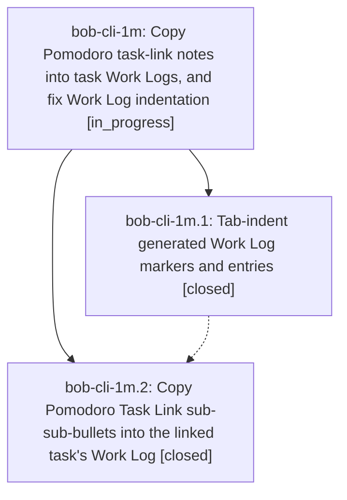

# Bead: bob-cli-1m — Copy Pomodoro task-link notes into task Work Logs, and fix Work Log indentation

[Bead Pages](../README.md) / bob-cli-1m

**Status:** ◐ in_progress · **Type:** ▸ plan · **Tier:** epic
**Owner:** `bryanbugyi34@gmail.com` · **Created by:** [bbugyi200.athena.0ey.f2](https://github.com/bobs-org/bob-cli--agents/blob/main/families/bbugyi200.athena.0ey.f2.md) · **Assignee:** `bob-cli-1m.land`
**Created:** 2026-08-27 12:19:44 EDT
**Plan:** [202608/pomodoro\_work\_log\_notes.md](https://github.com/bobs-org/bob-cli--plans/blob/main/202608/pomodoro_work_log_notes.md)

<!-- sase:links:start -->

## Links

| Relation | Artifact | Why |
| --- | --- | --- |
| implemented-by | [plan:202608/pomodoro_work_log_notes.md][1] | derived from the plan's `bead_id:` frontmatter field |

[1]: https://github.com/bobs-org/bob-cli--plans/blob/main/202608/pomodoro_work_log_notes.md

<!-- sase:links:end -->

## Description

Closing a Pomodoro with Ctrl+Enter copies each task-link sub-bullet's sub-sub-bullets into that task's `🛠️ **WORK LOG**` (creating the log when absent), and newly generated Work Log markers/entries are indented with tabs the way Obsidian indents list items.

## Phases

| Bead | Title | Status | Size | Created | Agents | Commits |
|---|---|---|---|---|---:|---:|
| [bob-cli-1m.1](bob-cli-1m.1.md) | Tab-indent generated Work Log markers and entries | ✓ closed | small | 2026-08-27 | 1 | 1 |
| [bob-cli-1m.2](bob-cli-1m.2.md) | Copy Pomodoro Task Link sub-sub-bullets into the linked task's Work Log | ✓ closed | medium | 2026-08-27 | 1 | 1 |

## Lineage

## Agents

| Agent | Bead | Commits |
|---|---|---:|
| [bbugyi200.athena.bob-cli-1m.1](https://github.com/bobs-org/bob-cli--agents/blob/main/agents/bbugyi200.athena.bob-cli-1m.1/README.md) | [bob-cli-1m.1](bob-cli-1m.1.md) | 1 |
| [bbugyi200.athena.bob-cli-1m.2](https://github.com/bobs-org/bob-cli--agents/blob/main/agents/bbugyi200.athena.bob-cli-1m.2/README.md) | [bob-cli-1m.2](bob-cli-1m.2.md) | 1 |
| [bbugyi200.athena.bob-cli-1m.land](https://github.com/bobs-org/bob-cli--agents/blob/main/agents/bbugyi200.athena.bob-cli-1m.land/README.md) | [bob-cli-1m](README.md) | 0 |

## Commits

| Repo | Commit | Subject | Bead | Committed |
|---|---|---|---|---|
| bob-plugins | [`bob-plugins@f274343`](https://github.com/bobs-org/bob-plugins/commit/f2743439e460a57725023b56c56ff7c6ddddeaf1) | fix(block-id-prompt): tab-indent generated work logs | [bob-cli-1m.1](bob-cli-1m.1.md) | 2026-08-27 12:26:03 EDT |
| bob-plugins | [`bob-plugins@66d97cc`](https://github.com/bobs-org/bob-plugins/commit/66d97ccb7efed313638dbed3adb72b849a434d13) | feat(task-status-cycler): copy Pomodoro Task Link notes into task Work Logs | [bob-cli-1m.2](bob-cli-1m.2.md) | 2026-08-27 12:50:40 EDT |
