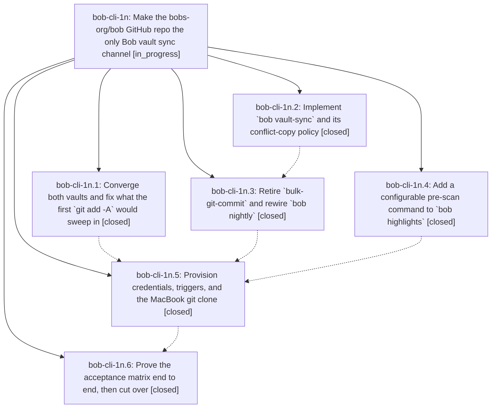

# Bead: bob-cli-1n — Make the bobs-org/bob GitHub repo the only Bob vault sync channel

[Bead Pages](../README.md) / bob-cli-1n

**Status:** ◐ in_progress · **Type:** ▸ plan · **Tier:** epic
**Owner:** `bryanbugyi34@gmail.com` · **Created by:** [bbugyi200.athena.0ez](https://github.com/bobs-org/bob-cli--agents/blob/main/families/bbugyi200.athena.0ez.md) · **Assignee:** `bob-cli-1n.land`
**Created:** 2026-08-27 12:48:58 EDT
**Plan:** [202608/vault\_git\_sync.md](https://github.com/bobs-org/bob-cli--plans/blob/main/202608/vault_git_sync.md)

<!-- sase:links:start -->

## Links

| Relation | Artifact | Why |
| --- | --- | --- |
| implemented-by | [plan:202608/vault_git_sync.md][1] | derived from the plan's `bead_id:` frontmatter field |

[1]: https://github.com/bobs-org/bob-cli--plans/blob/main/202608/vault_git_sync.md

<!-- sase:links:end -->

## Description

The Bob Obsidian vault stays converged between athena and the MacBook through git alone, driven by a new `bob vault-sync` command that pulls, merges, commits, and pushes unattended without ever leaving conflict markers or a halted merge; Obsidian Sync is switched off on both devices; and large PDF trees that must not enter the repo reach the MacBook over an explicit rsync bridge invoked by a new configurable `bob highlights` pre-scan command.

## Notes

[2026-08-27T21:37:00Z · bob-cli-1n.land] DISCOVERED ISSUE: the cutover left ~86 vault content files with no off-machine copy and no cross-machine propagation. Reproduced on athena 2026-08-27 ~17:30 EDT: `git -C ~/bob ls-files -o -i --exclude-standard`, filtered to drop the deliberate policy exclusions (lit_review/, xlib/, .obsidian/plugins/bob-*, .sase/, .trash/, machine-local Obsidian state, the two over-100-MiB old_lib PDFs, editor/OS junk), still returns 86 real vault files: 22 _zorg_templates/zot/*.zot, 20 xmind/*.xmind, 23 _meta/migration/reports/*.tsv, _meta/migration/inventory.json, 6 _meta/migration/tools/*.py, gkeep_gdocs_inbox_dump.txt, needs_attn_notes.txt, puml/3b_ts.puml, lib/docs/gastown_readme.textbundle/{info.json,text.markdown}, lib/docs/sase_INSTALL, and sdd/beads/*. ~/bob/.gitignore still ignores '*' and re-includes a fixed extension allowlist that contains none of .zot, .xmind, .tsv, .py, .puml, .markdown, or non-.obsidian .json. This is pre-existing task bob-cli-1g, but this epic materially worsened it: bob-cli-1g's premise was 'Obsidian Sync is their only off-machine copy', and the cutover disabled Obsidian Sync while git still ignores every one of these paths, so they now have NO off-machine copy and no longer propagate between athena and the MacBook. The plan's cutover phase anticipated this ('Re-evaluate bob-cli-1g; reconcile should have closed the underlying gap') but the reconcile phase committed its 206-path backlog without widening the allowlist, so the gap is untouched. Corroborated on bob-cli-1g with a +1. Recorded by bob-cli-1n.land.

[2026-08-27T21:38:48Z · bob-cli-1n.land] ACCEPTANCE #18 (athena half), independent re-measurement by bob-cli-1n.land on 2026-08-27 ~17:38 EDT. Measured bob-vault-sync.service with systemd cgroup CPU accounting rather than process sampling: CPUUsageNSec = 12.97 CPU-seconds over 2431 wall-seconds active (service ActiveEnterTimestamp 2026-08-27 16:57:34 EDT), i.e. 0.533% of one core during live operation on a 64-core box. That is under the plan's ~1.5% ceiling and far under ob-sync-bob.service's measured 4% baseline, and it independently corroborates the 0.588% bob-cli-1n.6 obtained by sampling. athena passes #18. The MacBook half remains unverified: the machine was asleep and unreachable during this landing (repeated BatchMode SSH to kellys-macbook-pro.tail297af1.ts.net timed out from ~17:31 EDT onward), so its reported 1.875% average could not be re-measured. Recorded by bob-cli-1n.land.

[2026-08-27T21:39:01Z · bob-cli-1n.land] ACCEPTANCE #14 (athena half), structural verification by bob-cli-1n.land on 2026-08-27 ~17:35 EDT. A real athena reboot was not performed — this land agent runs on athena and rebooting the user's home server is the user's call, not a landing action — so #14 is verified structurally instead. All four preconditions for unattended resume after boot hold: (1) loginctl show-user bryan reports Linger=yes, so the systemd user manager starts at boot without an interactive login; (2) bob-vault-sync.service is enabled with WantedBy=default.target and reports active; (3) the unit sets Restart=always with RestartSec=10, so a crashed watcher self-heals; (4) git access needs no warm ssh-agent, proven by running the runbook's cold-environment check successfully just now: 'env -i HOME=/home/bryan PATH=/usr/bin:/bin git -C /home/bryan/bob ls-remote origin master' returned 2d23b813 with exit 0, satisfying the plan's explicit warning not to accept a pass that relied on a warm ssh-agent. What remains unproven is the boot path end to end, which only an actual reboot can show. The MacBook half is also unproven: the machine slept partway through this landing and stayed unreachable, which is itself the sleep event #14 wants tested, but nothing could confirm the post-wake resume. Recorded by bob-cli-1n.land.

## Phases

| Bead | Title | Status | Size | Created | Agents | Commits |
|---|---|---|---|---|---:|---:|
| [bob-cli-1n.1](bob-cli-1n.1.md) | Converge both vaults and fix what the first \`git add -A\` would sweep in | ✓ closed | medium | 2026-08-27 | 1 | 0 |
| [bob-cli-1n.2](bob-cli-1n.2.md) | Implement \`bob vault-sync\` and its conflict-copy policy | ✓ closed | medium | 2026-08-27 | 1 | 1 |
| [bob-cli-1n.3](bob-cli-1n.3.md) | Retire \`bulk-git-commit\` and rewire \`bob nightly\` | ✓ closed | small | 2026-08-27 | 1 | 1 |
| [bob-cli-1n.4](bob-cli-1n.4.md) | Add a configurable pre-scan command to \`bob highlights\` | ✓ closed | medium | 2026-08-27 | 1 | 1 |
| [bob-cli-1n.5](bob-cli-1n.5.md) | Provision credentials, triggers, and the MacBook git clone | ✓ closed | medium | 2026-08-27 | 1 | 0 |
| [bob-cli-1n.6](bob-cli-1n.6.md) | Prove the acceptance matrix end to end, then cut over | ✓ closed | medium | 2026-08-27 | 1 | 1 |

## Lineage

## Agents

| Agent | Bead | Commits |
|---|---|---:|
| [bbugyi200.athena.bob-cli-1n.1](https://github.com/bobs-org/bob-cli--agents/blob/main/families/bbugyi200.athena.bob-cli-1n.1.md) | [bob-cli-1n.1](bob-cli-1n.1.md) | 0 |
| [bbugyi200.athena.bob-cli-1n.2](https://github.com/bobs-org/bob-cli--agents/blob/main/agents/bbugyi200.athena.bob-cli-1n.2/README.md) | [bob-cli-1n.2](bob-cli-1n.2.md) | 1 |
| [bbugyi200.athena.bob-cli-1n.3](https://github.com/bobs-org/bob-cli--agents/blob/main/agents/bbugyi200.athena.bob-cli-1n.3/README.md) | [bob-cli-1n.3](bob-cli-1n.3.md) | 1 |
| [bbugyi200.athena.bob-cli-1n.4](https://github.com/bobs-org/bob-cli--agents/blob/main/agents/bbugyi200.athena.bob-cli-1n.4/README.md) | [bob-cli-1n.4](bob-cli-1n.4.md) | 1 |
| [bbugyi200.athena.bob-cli-1n.5](https://github.com/bobs-org/bob-cli--agents/blob/main/agents/bbugyi200.athena.bob-cli-1n.5/README.md) | [bob-cli-1n.5](bob-cli-1n.5.md) | 0 |
| [bbugyi200.athena.bob-cli-1n.6](https://github.com/bobs-org/bob-cli--agents/blob/main/families/bbugyi200.athena.bob-cli-1n.6.md) | [bob-cli-1n.6](bob-cli-1n.6.md) | 1 |
| [bbugyi200.athena.bob-cli-1n.land](https://github.com/bobs-org/bob-cli--agents/blob/main/agents/bbugyi200.athena.bob-cli-1n.land/README.md) | [bob-cli-1n](README.md) | 1 |

## Commits

| Repo | Commit | Subject | Bead | Committed |
|---|---|---|---|---|
| bob-cli | [`86bff41`](https://github.com/bobs-org/bob-cli/commit/86bff4105b7ac7de2d8b60d4b2241ff3204db9b9) | feat(highlights): add scan pre-scan hook | [bob-cli-1n.4](bob-cli-1n.4.md) | 2026-08-27 13:04:01 EDT |
| bob-cli | [`eee290a`](https://github.com/bobs-org/bob-cli/commit/eee290ab546820b615de952f9c086f3935cb1f5c) | feat(vault-sync): add git reconcile command | [bob-cli-1n.2](bob-cli-1n.2.md) | 2026-08-27 13:14:12 EDT |
| bob-cli | [`4051bf5`](https://github.com/bobs-org/bob-cli/commit/4051bf520dc308eef50721187ae042952fab3d8e) | feat(cli): retire bulk git commit | [bob-cli-1n.3](bob-cli-1n.3.md) | 2026-08-27 13:31:35 EDT |
| bob-cli | [`4c00ada`](https://github.com/bobs-org/bob-cli/commit/4c00adadd155660957544c32ac00ef0cf26e360e) | docs(vault-sync): add Bob vault Git sync runbook | [bob-cli-1n.6](bob-cli-1n.6.md) | 2026-08-27 17:23:25 EDT |
| bob-cli | [`f567500`](https://github.com/bobs-org/bob-cli/commit/f56750097aa7e47c498b4e0bf536523f009fcb76) | docs: mark the Obsidian Sync exclusion runbook historical | [bob-cli-1n](README.md) | 2026-08-27 17:43:24 EDT |
