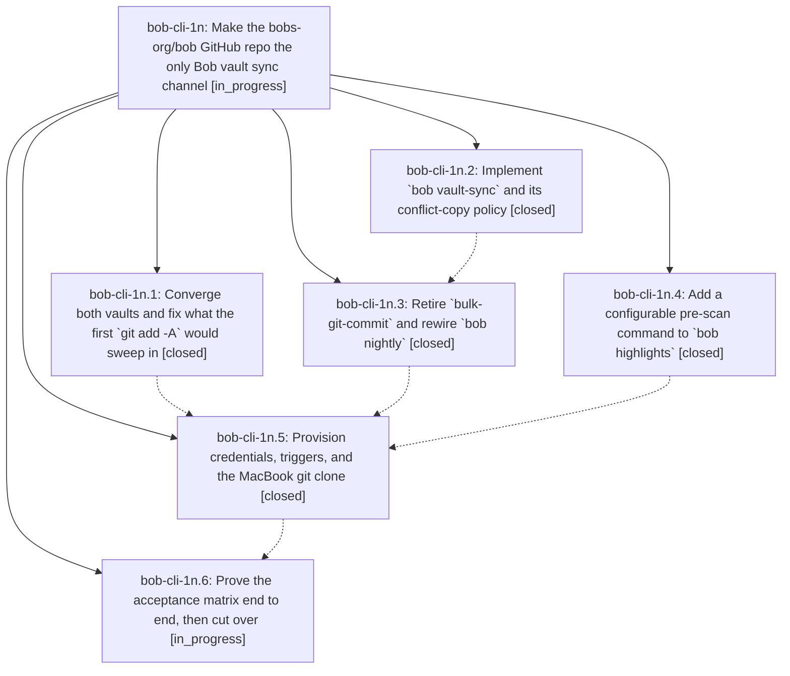

# Bead: bob-cli-1n — Make the bobs-org/bob GitHub repo the only Bob vault sync channel

[Bead Pages](../README.md) / bob-cli-1n

**Status:** ◐ in_progress · **Type:** ▸ plan · **Tier:** epic
**Owner:** `bryanbugyi34@gmail.com` · **Created by:** [bbugyi200.athena.0ez](https://github.com/bobs-org/bob-cli--agents/blob/main/families/bbugyi200.athena.0ez.md) · **Assignee:** `bob-cli-1n.land`
**Created:** 2026-08-27 12:48:58 EDT
**Plan:** [202608/vault\_git\_sync.md](https://github.com/bobs-org/bob-cli--plans/blob/main/202608/vault_git_sync.md)

<!-- sase:links:start -->

## Links

| Relation | Artifact | Why |
| --- | --- | --- |
| implemented-by | [plan:202608/vault_git_sync.md][1] | derived from the plan's `bead_id:` frontmatter field |

[1]: https://github.com/bobs-org/bob-cli--plans/blob/main/202608/vault_git_sync.md

<!-- sase:links:end -->

## Description

The Bob Obsidian vault stays converged between athena and the MacBook through git alone, driven by a new `bob vault-sync` command that pulls, merges, commits, and pushes unattended without ever leaving conflict markers or a halted merge; Obsidian Sync is switched off on both devices; and large PDF trees that must not enter the repo reach the MacBook over an explicit rsync bridge invoked by a new configurable `bob highlights` pre-scan command.

## Phases

| Bead | Title | Status | Size | Created | Agents | Commits |
|---|---|---|---|---|---:|---:|
| [bob-cli-1n.1](bob-cli-1n.1.md) | Converge both vaults and fix what the first \`git add -A\` would sweep in | ✓ closed | medium | 2026-08-27 | 1 | 0 |
| [bob-cli-1n.2](bob-cli-1n.2.md) | Implement \`bob vault-sync\` and its conflict-copy policy | ✓ closed | medium | 2026-08-27 | 1 | 1 |
| [bob-cli-1n.3](bob-cli-1n.3.md) | Retire \`bulk-git-commit\` and rewire \`bob nightly\` | ✓ closed | small | 2026-08-27 | 1 | 1 |
| [bob-cli-1n.4](bob-cli-1n.4.md) | Add a configurable pre-scan command to \`bob highlights\` | ✓ closed | medium | 2026-08-27 | 1 | 1 |
| [bob-cli-1n.5](bob-cli-1n.5.md) | Provision credentials, triggers, and the MacBook git clone | ✓ closed | medium | 2026-08-27 | 1 | 1 |
| [bob-cli-1n.6](bob-cli-1n.6.md) | Prove the acceptance matrix end to end, then cut over | ◐ in_progress | medium | 2026-08-27 | 1 | 1 |

## Lineage

## Agents

| Agent | Bead | Commits |
|---|---|---:|
| [bbugyi200.athena.bob-cli-1n.1](https://github.com/bobs-org/bob-cli--agents/blob/main/families/bbugyi200.athena.bob-cli-1n.1.md) | [bob-cli-1n.1](bob-cli-1n.1.md) | 0 |
| [bbugyi200.athena.bob-cli-1n.2](https://github.com/bobs-org/bob-cli--agents/blob/main/agents/bbugyi200.athena.bob-cli-1n.2/README.md) | [bob-cli-1n.2](bob-cli-1n.2.md) | 1 |
| [bbugyi200.athena.bob-cli-1n.3](https://github.com/bobs-org/bob-cli--agents/blob/main/agents/bbugyi200.athena.bob-cli-1n.3/README.md) | [bob-cli-1n.3](bob-cli-1n.3.md) | 1 |
| [bbugyi200.athena.bob-cli-1n.4](https://github.com/bobs-org/bob-cli--agents/blob/main/agents/bbugyi200.athena.bob-cli-1n.4/README.md) | [bob-cli-1n.4](bob-cli-1n.4.md) | 1 |
| [bbugyi200.athena.bob-cli-1n.5](https://github.com/bobs-org/bob-cli--agents/blob/main/agents/bbugyi200.athena.bob-cli-1n.5/README.md) | [bob-cli-1n.5](bob-cli-1n.5.md) | 1 |
| [bbugyi200.athena.bob-cli-1n.6](https://github.com/bobs-org/bob-cli--agents/blob/main/families/bbugyi200.athena.bob-cli-1n.6.md) | [bob-cli-1n.6](bob-cli-1n.6.md) | 1 |
| [bbugyi200.athena.bob-cli-1n.land](https://github.com/bobs-org/bob-cli--agents/blob/main/agents/bbugyi200.athena.bob-cli-1n.land/README.md) | [bob-cli-1n](README.md) | 0 |

## Commits

| Repo | Commit | Subject | Bead | Committed |
|---|---|---|---|---|
| bob-cli | [`86bff41`](https://github.com/bobs-org/bob-cli/commit/86bff4105b7ac7de2d8b60d4b2241ff3204db9b9) | feat(highlights): add scan pre-scan hook | [bob-cli-1n.4](bob-cli-1n.4.md) | 2026-08-27 13:04:01 EDT |
| bob-cli | [`eee290a`](https://github.com/bobs-org/bob-cli/commit/eee290ab546820b615de952f9c086f3935cb1f5c) | feat(vault-sync): add git reconcile command | [bob-cli-1n.2](bob-cli-1n.2.md) | 2026-08-27 13:14:12 EDT |
| bob-cli | [`4051bf5`](https://github.com/bobs-org/bob-cli/commit/4051bf520dc308eef50721187ae042952fab3d8e) | feat(cli): retire bulk git commit | [bob-cli-1n.3](bob-cli-1n.3.md) | 2026-08-27 13:31:35 EDT |
| chezmoi | [`chezmoi@defc756`](https://github.com/bbugyi200/dotfiles/commit/defc756815cd03e8560f4dab5c072c0a5ad2bacf) | feat(chezmoi): provision bob vault sync machines | [bob-cli-1n.5](bob-cli-1n.5.md) | 2026-08-27 14:37:12 EDT |
| bob-cli | [`4c00ada`](https://github.com/bobs-org/bob-cli/commit/4c00adadd155660957544c32ac00ef0cf26e360e) | docs(vault-sync): add Bob vault Git sync runbook | [bob-cli-1n.6](bob-cli-1n.6.md) | 2026-08-27 17:23:25 EDT |
