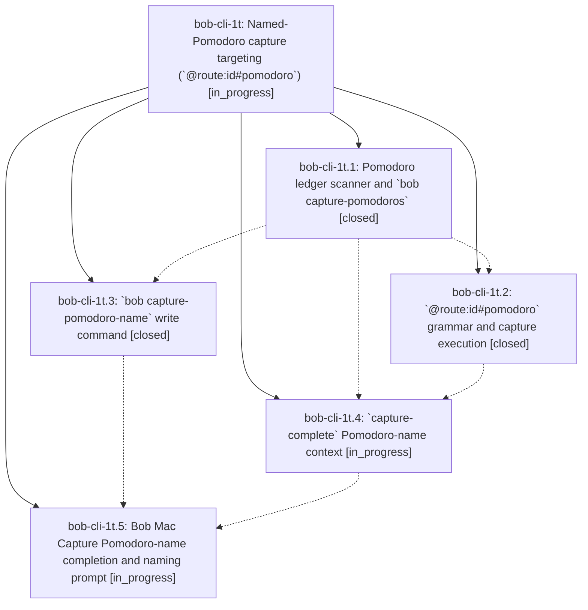

# Bead: bob-cli-1t — Named-Pomodoro capture targeting (\`@route:id#pomodoro\`)

[Bead Pages](../README.md) / bob-cli-1t

**Status:** ◐ in_progress · **Type:** ▸ plan · **Tier:** epic
**Owner:** `bryanbugyi34@gmail.com` · **Created by:** [bbugyi200.athena.0fk](https://github.com/bobs-org/bob-cli--agents/blob/main/families/bbugyi200.athena.0fk.md) · **Assignee:** `bob-cli-1t.land`
**Created:** 2026-08-28 12:37:06 EDT
**Plan:** [202608/capture\_named\_pomodoro.md](https://github.com/bobs-org/bob-cli--plans/blob/main/202608/capture_named_pomodoro.md)

<!-- sase:links:start -->

## Links

| Relation | Artifact | Why |
| --- | --- | --- |
| implemented-by | [plan:202608/capture_named_pomodoro.md][1] | derived from the plan's `bead_id:` frontmatter field |

[1]: https://github.com/bobs-org/bob-cli--plans/blob/main/202608/capture_named_pomodoro.md

<!-- sase:links:end -->

## Description

A capture can name exactly which Pomodoro in today's daily note receives its task link, using a typeable slug that supports multi-word names, with excellent Bob Mac Capture completion that also offers unnamed Pomodoros and names them in place.

## Phases

| Bead | Title | Status | Size | Created | Agents | Commits |
|---|---|---|---|---|---:|---:|
| [bob-cli-1t.1](bob-cli-1t.1.md) | Pomodoro ledger scanner and \`bob capture-pomodoros\` | ✓ closed | medium | 2026-08-28 | 1 | 1 |
| [bob-cli-1t.2](bob-cli-1t.2.md) | \`@route:id#pomodoro\` grammar and capture execution | ✓ closed | medium | 2026-08-28 | 1 | 1 |
| [bob-cli-1t.3](bob-cli-1t.3.md) | \`bob capture-pomodoro-name\` write command | ✓ closed | medium | 2026-08-28 | 1 | 0 |
| [bob-cli-1t.4](bob-cli-1t.4.md) | \`capture-complete\` Pomodoro-name context | ◐ in_progress | medium | 2026-08-28 | 1 | 0 |
| [bob-cli-1t.5](bob-cli-1t.5.md) | Bob Mac Capture Pomodoro-name completion and naming prompt | ◐ in_progress | medium | 2026-08-28 | 1 | 0 |

## Lineage

## Agents

| Agent | Bead | Commits |
|---|---|---:|
| [bbugyi200.athena.bob-cli-1t.1](https://github.com/bobs-org/bob-cli--agents/blob/main/agents/bbugyi200.athena.bob-cli-1t.1/README.md) | [bob-cli-1t.1](bob-cli-1t.1.md) | 1 |
| [bbugyi200.athena.bob-cli-1t.2](https://github.com/bobs-org/bob-cli--agents/blob/main/agents/bbugyi200.athena.bob-cli-1t.2/README.md) | [bob-cli-1t.2](bob-cli-1t.2.md) | 1 |
| [bbugyi200.athena.bob-cli-1t.3](https://github.com/bobs-org/bob-cli--agents/blob/main/agents/bbugyi200.athena.bob-cli-1t.3/README.md) | [bob-cli-1t.3](bob-cli-1t.3.md) | 0 |
| [bbugyi200.athena.bob-cli-1t.4](https://github.com/bobs-org/bob-cli--agents/blob/main/agents/bbugyi200.athena.bob-cli-1t.4/README.md) | [bob-cli-1t.4](bob-cli-1t.4.md) | 0 |
| [bbugyi200.athena.bob-cli-1t.5](https://github.com/bobs-org/bob-cli--agents/blob/main/agents/bbugyi200.athena.bob-cli-1t.5/README.md) | [bob-cli-1t.5](bob-cli-1t.5.md) | 0 |
| [bbugyi200.athena.bob-cli-1t.land](https://github.com/bobs-org/bob-cli--agents/blob/main/agents/bbugyi200.athena.bob-cli-1t.land/README.md) | [bob-cli-1t](README.md) | 0 |

## Commits

| Repo | Commit | Subject | Bead | Committed |
|---|---|---|---|---|
| bob-cli | [`cc4c9a3`](https://github.com/bobs-org/bob-cli/commit/cc4c9a38684e2ed70af7c65df745029a03aa6503) | feat(capture): list pomodoro ledger entries | [bob-cli-1t.1](bob-cli-1t.1.md) | 2026-08-28 12:55:02 EDT |
| bob-cli | [`9b7282d`](https://github.com/bobs-org/bob-cli/commit/9b7282d8b2bba90c798ce0143c55c988e615a841) | feat(capture): add @route:id#pomodoro named targeting | [bob-cli-1t.2](bob-cli-1t.2.md) | 2026-08-28 13:16:57 EDT |
