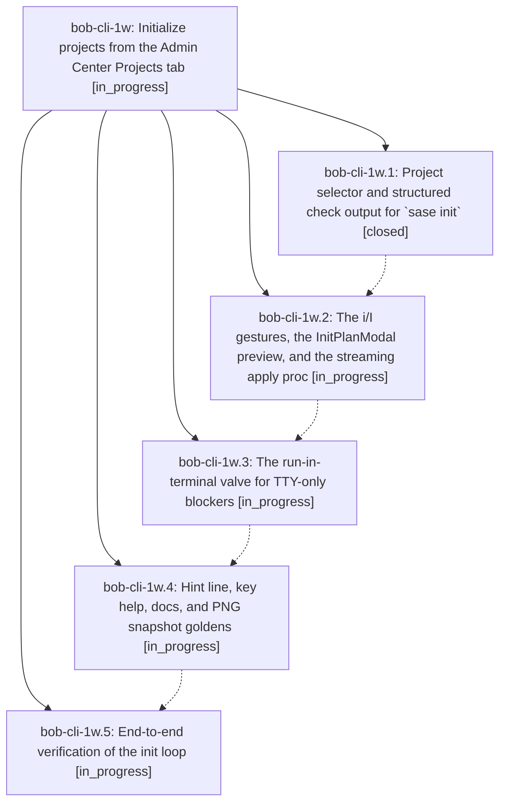

# Bead: bob-cli-1w — Initialize projects from the Admin Center Projects tab

[Bead Pages](../README.md) / bob-cli-1w

**Status:** ◐ in_progress · **Type:** ▸ plan · **Tier:** epic
**Owner:** `bryanbugyi34@gmail.com` · **Created by:** [bbugyi200.apollo.e](https://github.com/bobs-org/bob-cli--agents/blob/main/families/bbugyi200.apollo.e.md) · **Assignee:** `bob-cli-1w.land`
**Created:** 2026-09-03 17:42:11 EDT
**Plan:** [202609/projects\_tab\_init.md](https://github.com/bobs-org/bob-cli--plans/blob/main/202609/projects_tab_init.md)

<!-- sase:links:start -->

## Links

| Relation | Artifact | Why |
| --- | --- | --- |
| implemented-by | [plan:202609/projects_tab_init.md][1] | derived from the plan's `bead_id:` frontmatter field |

[1]: https://github.com/bobs-org/bob-cli--plans/blob/main/202609/projects_tab_init.md

<!-- sase:links:end -->

## Description

On the Admin Center Projects sub-tab, `i` initializes the marked or highlighted projects and `I` initializes every enabled project: each gesture plans off-thread via `sase init … --check --json`, shows a preview modal with the exact argv, per-planner rows, warnings, blockers, and full diffs, and on confirm streams exactly one `sase init … --yes` proc into the Procs tab — with an honest "Run in terminal" valve for TTY-only steps.

## Phases

| Bead | Title | Status | Size | Created | Agents | Commits |
|---|---|---|---|---|---:|---:|
| [bob-cli-1w.1](bob-cli-1w.1.md) | Project selector and structured check output for \`sase init\` | ✓ closed | medium | 2026-09-03 | 1 | 0 |
| [bob-cli-1w.2](bob-cli-1w.2.md) | The i/I gestures, the InitPlanModal preview, and the streaming apply proc | ◐ in_progress | large | 2026-09-03 | 1 | 0 |
| [bob-cli-1w.3](bob-cli-1w.3.md) | The run-in-terminal valve for TTY-only blockers | ◐ in_progress | small | 2026-09-03 | 1 | 0 |
| [bob-cli-1w.4](bob-cli-1w.4.md) | Hint line, key help, docs, and PNG snapshot goldens | ◐ in_progress | medium | 2026-09-03 | 1 | 0 |
| [bob-cli-1w.5](bob-cli-1w.5.md) | End-to-end verification of the init loop | ◐ in_progress | small | 2026-09-03 | 1 | 0 |

## Lineage

## Agents

| Agent | Bead | Commits |
|---|---|---:|
| [bbugyi200.apollo.bob-cli-1w.1](https://github.com/bobs-org/bob-cli--agents/blob/main/agents/bbugyi200.apollo.bob-cli-1w.1/README.md) | [bob-cli-1w.1](bob-cli-1w.1.md) | 0 |
| [bbugyi200.apollo.bob-cli-1w.2](https://github.com/bobs-org/bob-cli--agents/blob/main/agents/bbugyi200.apollo.bob-cli-1w.2/README.md) | [bob-cli-1w.2](bob-cli-1w.2.md) | 0 |
| [bbugyi200.apollo.bob-cli-1w.3](https://github.com/bobs-org/bob-cli--agents/blob/main/agents/bbugyi200.apollo.bob-cli-1w.3/README.md) | [bob-cli-1w.3](bob-cli-1w.3.md) | 0 |
| [bbugyi200.apollo.bob-cli-1w.4](https://github.com/bobs-org/bob-cli--agents/blob/main/agents/bbugyi200.apollo.bob-cli-1w.4/README.md) | [bob-cli-1w.4](bob-cli-1w.4.md) | 0 |
| [bbugyi200.apollo.bob-cli-1w.5](https://github.com/bobs-org/bob-cli--agents/blob/main/agents/bbugyi200.apollo.bob-cli-1w.5/README.md) | [bob-cli-1w.5](bob-cli-1w.5.md) | 0 |
| [bbugyi200.apollo.bob-cli-1w.land](https://github.com/bobs-org/bob-cli--agents/blob/main/agents/bbugyi200.apollo.bob-cli-1w.land/README.md) | [bob-cli-1w](README.md) | 0 |
