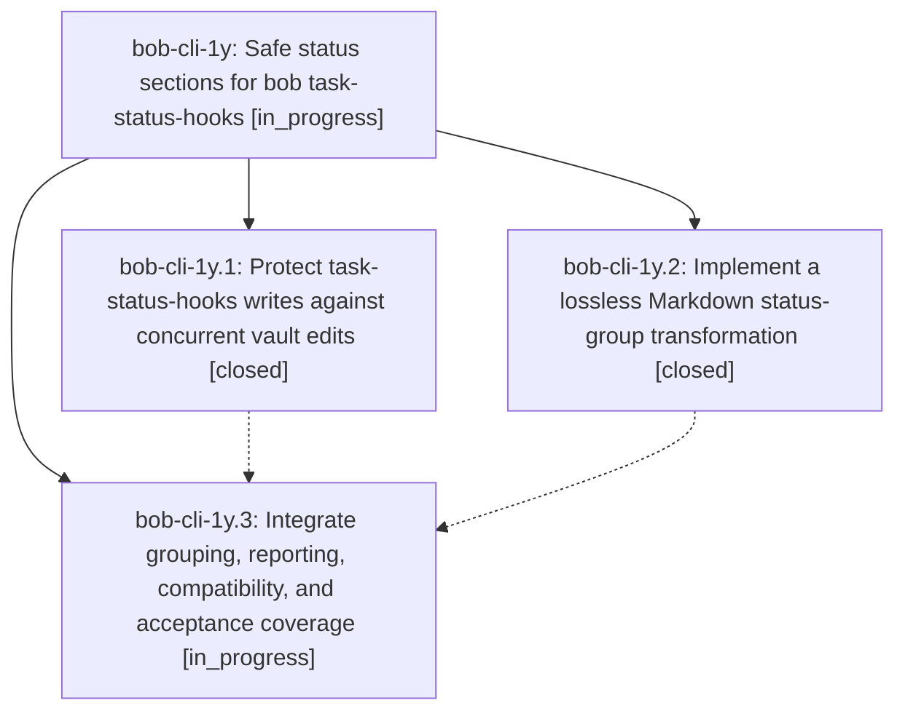

# Bead: bob-cli-1y — Safe status sections for bob task-status-hooks

[Bead Pages](../README.md) / bob-cli-1y

**Status:** ◐ in_progress · **Type:** ▸ plan · **Tier:** epic
**Owner:** `bryanbugyi34@gmail.com` · **Created by:** [bbugyi200.athena.0if](https://github.com/bobs-org/bob-cli--agents/blob/main/families/bbugyi200.athena.0if.md) · **Assignee:** `bob-cli-1y.land`
**Created:** 2026-09-10 11:32:32 EDT
**Plan:** [202609/task\_status\_groups.md](https://github.com/bobs-org/bob-cli--plans/blob/main/202609/task_status_groups.md)

<!-- sase:links:start -->

## Links

| Relation | Artifact | Why |
| --- | --- | --- |
| implemented-by | [plan:202609/task_status_groups.md][1] | derived from the plan's `bead_id:` frontmatter field |

[1]: https://github.com/bobs-org/bob-cli--plans/blob/main/202609/task_status_groups.md

<!-- sase:links:end -->

## Description

Group project and area Tasks sections by final task status while preserving authored context and minimizing concurrent-edit risk through guarded, recoverable note writes.

## Phases

| Bead | Title | Status | Size | Created | Agents | Commits |
|---|---|---|---|---|---:|---:|
| [bob-cli-1y.1](bob-cli-1y.1.md) | Protect task-status-hooks writes against concurrent vault edits | ✓ closed | medium | 2026-09-10 | 1 | 1 |
| [bob-cli-1y.2](bob-cli-1y.2.md) | Implement a lossless Markdown status-group transformation | ✓ closed | medium | 2026-09-10 | 1 | 1 |
| [bob-cli-1y.3](bob-cli-1y.3.md) | Integrate grouping, reporting, compatibility, and acceptance coverage | ◐ in_progress | medium | 2026-09-10 | 1 | 0 |

## Lineage

## Agents

| Agent | Bead | Commits |
|---|---|---:|
| [bbugyi200.athena.bob-cli-1y.1](https://github.com/bobs-org/bob-cli--agents/blob/main/agents/bbugyi200.athena.bob-cli-1y.1/README.md) | [bob-cli-1y.1](bob-cli-1y.1.md) | 1 |
| [bbugyi200.athena.bob-cli-1y.2](https://github.com/bobs-org/bob-cli--agents/blob/main/agents/bbugyi200.athena.bob-cli-1y.2/README.md) | [bob-cli-1y.2](bob-cli-1y.2.md) | 1 |
| [bbugyi200.athena.bob-cli-1y.3](https://github.com/bobs-org/bob-cli--agents/blob/main/agents/bbugyi200.athena.bob-cli-1y.3/README.md) | [bob-cli-1y.3](bob-cli-1y.3.md) | 0 |
| [bbugyi200.athena.bob-cli-1y.land](https://github.com/bobs-org/bob-cli--agents/blob/main/agents/bbugyi200.athena.bob-cli-1y.land/README.md) | [bob-cli-1y](README.md) | 0 |

## Commits

| Repo | Commit | Subject | Bead | Committed |
|---|---|---|---|---|
| bob-cli | [`3b07627`](https://github.com/bobs-org/bob-cli/commit/3b07627fb35c92e4440a77a985aa2b7528346054) | feat(task-status-hooks): guard live note writes against concurrent vault edits | [bob-cli-1y.1](bob-cli-1y.1.md) | 2026-09-10 12:08:46 EDT |
| bob-cli | [`f7cf10f`](https://github.com/bobs-org/bob-cli/commit/f7cf10f0a5326f14c22cbda660c8ea33cf281717) | feat(task-status-hooks): add lossless Markdown status-group transform | [bob-cli-1y.2](bob-cli-1y.2.md) | 2026-09-10 12:12:36 EDT |
