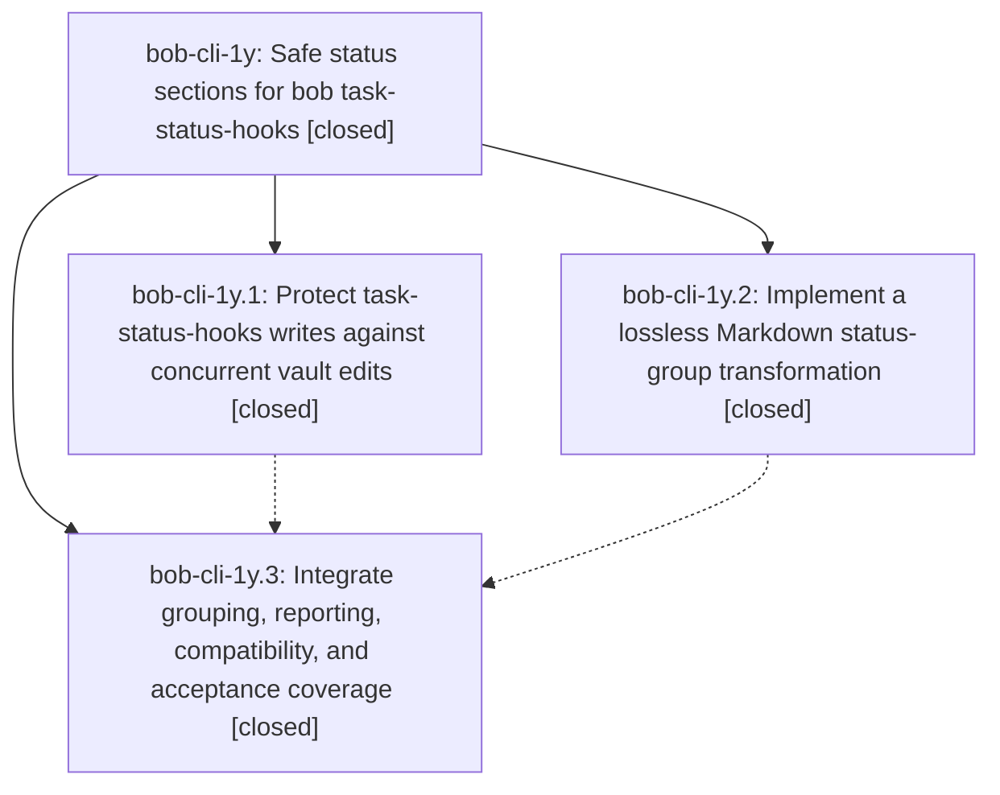

# Bead: bob-cli-1y — Safe status sections for bob task-status-hooks

[Bead Pages](../README.md) / bob-cli-1y

**Status:** ✓ closed · **Resolution:** done · **Type:** ▸ plan · **Tier:** epic
**Owner:** `bryanbugyi34@gmail.com` · **Created by:** [bbugyi200.athena.0if](https://github.com/bobs-org/bob-cli--agents/blob/main/families/bbugyi200.athena.0if.md) · **Assignee:** `bob-cli-1y.land`
**Created:** 2026-09-10 11:32:32 EDT · **Closed:** 2026-09-10 12:57:20 EDT
**Plan:** [202609/task\_status\_groups.md](https://github.com/bobs-org/bob-cli--plans/blob/main/202609/task_status_groups.md)

<!-- sase:links:start -->

## Links

| Relation | Artifact | Why |
| --- | --- | --- |
| implemented-by | [plan:202609/task_status_groups.md][1] | derived from the plan's `bead_id:` frontmatter field |

[1]: https://github.com/bobs-org/bob-cli--plans/blob/main/202609/task_status_groups.md

<!-- sase:links:end -->

## Description

Group project and area Tasks sections by final task status while preserving authored context and minimizing concurrent-edit risk through guarded, recoverable note writes.

## Notes

[2026-09-10T16:57:20Z · bob-cli-1y.land] Land verification: reviewed all three phase notes and the linked plan (plan:202609/task_status_groups.md) against commits 3b07627 (guarded writes), f7cf10f (status-group transform), 2744266 (integration). Confirmed src/native/task_status_hooks_write.rs implements the snapshot/read-set, shared ob.rs maintenance lock, exclusive staging, recovery records under XDG_STATE_HOME/bob-cli/task-status-hooks/<vault-hash>/<run-id>/ with 30-day retention and 0700/0600 modes, the bounded 2s quiet period on real filesystem time, and partial-apply reporting; src/native/task_status_groups.rs implements the pure byte-range transform with the three canonical groups, ownership markers, adoption/collision fail-closed rules, H6 and ordered-list diagnostics; task_status_hooks.rs composes grouping after status and daily edits, gates on area/project note kind while excluding canonical/current/previous dailies, and emits grouped_task_sections, grouping_warnings, applied_files, deferred_files, recovery_directory plus the reason-coded failure envelope. just all (fmt, clippy, cargo test) passes. Empirically verified on a disposable fixture vault: dry-run/apply/no-op sequence, capture into intake, promotion into Next & In Progress, and bob move-done-tasks correctly archiving whole task subtrees out of a grouped note while retaining the empty managed group headings, converging to a byte-stable note on the next run. Integration: no non-epic commits landed between the epic's first commit and HEAD, so there was nothing to reconcile on master; verified capture.rs remains the only other Tasks-section writer and that highlights/projects writers are excluded by the area/project gate; confirmed vault_sync.rs was deduplicated onto the new bob_env::bob_cli_state_dir helper and nightly still uses run_cycle_with_existing_lock so the new hooks lock cannot self-contend. Land fixes applied in this turn: removed the epic's leftover dead-code suppressions now that phase 3 integrated the modules - deleted #![allow(dead_code)] from task_status_groups.rs and 7 #[allow(dead_code)] attributes in markdown.rs (all helpers are live), gated the test-only TaskClassification::standard/with_symbol builders behind cfg(test), deleted the unused GroupingSkipCode::fails_closed method and its self-referential assertions, and deleted the never-read FileIdentity.path, WritePlan.vault_root, ApplyError.remaining_files (a pure duplicate of deferred_files) and LockAcquireError::Contended.path fields; clippy now reports zero dead-code warnings and only the 7 pre-existing style lints that were present before the epic. Also closed a documentation gap the epic opened: docs/vault-git-sync.md and README.md now list live task-status-hooks runs as a bob_sync.lock participant alongside vault-sync and nightly, and docs/task-status-hooks.md now states that contention, changed inputs, quiet-period deferral, and partial apply all exit 1 and are retryable. No PROPOSED FOLLOW-UP notes were recorded on any child bead, and sase bead epic-symbols bob-cli-1y reports no --epic-symbol entries. just symvision is not available in this repo (no such justfile recipe). Note for the record: while checking move-done-tasks compatibility I ran it once without BOB_DIR set, so it executed against the real ~/bob vault and made its ordinary archive commit 96fda1c1 (the same operation bob nightly performs); the vault is consistent and pushed, and the check was redone correctly against the fixture vault.

## Phases

| Bead | Title | Status | Size | Created | Agents | Commits |
|---|---|---|---|---|---:|---:|
| [bob-cli-1y.1](bob-cli-1y.1.md) | Protect task-status-hooks writes against concurrent vault edits | ✓ closed | medium | 2026-09-10 | 1 | 1 |
| [bob-cli-1y.2](bob-cli-1y.2.md) | Implement a lossless Markdown status-group transformation | ✓ closed | medium | 2026-09-10 | 1 | 1 |
| [bob-cli-1y.3](bob-cli-1y.3.md) | Integrate grouping, reporting, compatibility, and acceptance coverage | ✓ closed | medium | 2026-09-10 | 1 | 1 |

## Lineage

## Agents

| Agent | Bead | Commits |
|---|---|---:|
| [bbugyi200.athena.bob-cli-1y.1](https://github.com/bobs-org/bob-cli--agents/blob/main/agents/bbugyi200.athena.bob-cli-1y.1/README.md) | [bob-cli-1y.1](bob-cli-1y.1.md) | 1 |
| [bbugyi200.athena.bob-cli-1y.2](https://github.com/bobs-org/bob-cli--agents/blob/main/agents/bbugyi200.athena.bob-cli-1y.2/README.md) | [bob-cli-1y.2](bob-cli-1y.2.md) | 1 |
| [bbugyi200.athena.bob-cli-1y.3](https://github.com/bobs-org/bob-cli--agents/blob/main/agents/bbugyi200.athena.bob-cli-1y.3/README.md) | [bob-cli-1y.3](bob-cli-1y.3.md) | 1 |
| [bbugyi200.athena.bob-cli-1y.land](https://github.com/bobs-org/bob-cli--agents/blob/main/agents/bbugyi200.athena.bob-cli-1y.land/README.md) | [bob-cli-1y](README.md) | 1 |

## Commits

| Repo | Commit | Subject | Bead | Committed |
|---|---|---|---|---|
| bob-cli | [`3b07627`](https://github.com/bobs-org/bob-cli/commit/3b07627fb35c92e4440a77a985aa2b7528346054) | feat(task-status-hooks): guard live note writes against concurrent vault edits | [bob-cli-1y.1](bob-cli-1y.1.md) | 2026-09-10 12:08:46 EDT |
| bob-cli | [`f7cf10f`](https://github.com/bobs-org/bob-cli/commit/f7cf10f0a5326f14c22cbda660c8ea33cf281717) | feat(task-status-hooks): add lossless Markdown status-group transform | [bob-cli-1y.2](bob-cli-1y.2.md) | 2026-09-10 12:12:36 EDT |
| bob-cli | [`2744266`](https://github.com/bobs-org/bob-cli/commit/274426600558d1aa1d917f94b8137aae97657477) | feat(task-status-hooks): group task sections | [bob-cli-1y.3](bob-cli-1y.3.md) | 2026-09-10 12:41:22 EDT |
| bob-cli | [`86e6394`](https://github.com/bobs-org/bob-cli/commit/86e6394d60234227fe5e65a23e0101adbc968756) | refactor(task-status-hooks): retire status-group dead code | [bob-cli-1y](README.md) | 2026-09-10 12:58:25 EDT |
