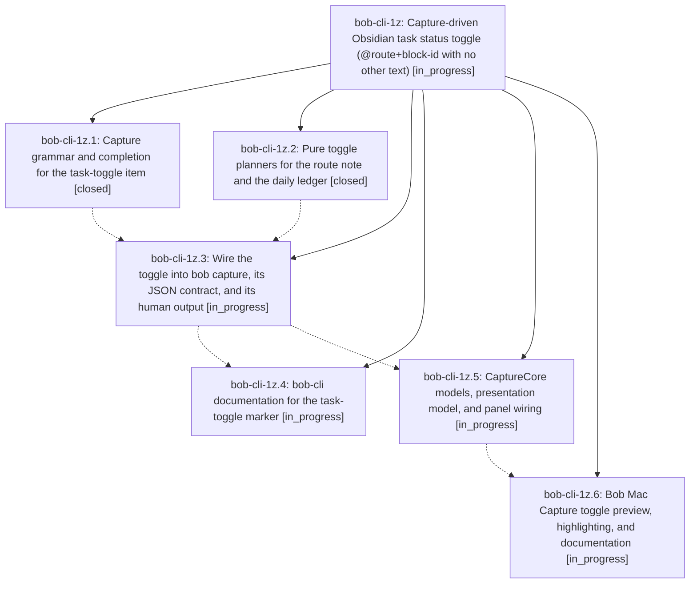

# Bead: bob-cli-1z — Capture-driven Obsidian task status toggle (@route+block-id with no other text)

[Bead Pages](../README.md) / bob-cli-1z

**Status:** ◐ in_progress · **Type:** ▸ plan · **Tier:** epic
**Owner:** `bryanbugyi34@gmail.com` · **Created by:** [bbugyi200.athena.0ir](https://github.com/bobs-org/bob-cli--agents/blob/main/families/bbugyi200.athena.0ir.md) · **Assignee:** `bob-cli-1z.land`
**Created:** 2026-09-10 13:19:08 EDT
**Plan:** [202609/capture\_task\_toggle.md](https://github.com/bobs-org/bob-cli--plans/blob/main/202609/capture_task_toggle.md)

<!-- sase:links:start -->

## Links

| Relation | Artifact | Why |
| --- | --- | --- |
| implemented-by | [plan:202609/capture_task_toggle.md][1] | derived from the plan's `bead_id:` frontmatter field |

[1]: https://github.com/bobs-org/bob-cli--plans/blob/main/202609/capture_task_toggle.md

<!-- sase:links:end -->

## Description

Submitting a capture draft that is exactly `@route+block-id` (optionally `@route+block-id#pomodoro`) toggles that existing Obsidian task between Ready `[ ]` and Next `[*]` and adds or removes its Pomodoro task link, matching the Obsidian `<ctrl+shift+enter>` keymap's semantics. The `@route+block-id` completion and Add block ID prompt behave exactly as they already do for sub-bullet capture, and Bob Mac Capture makes the mode, the target task, and the exact before/after change obvious before the user commits it.

## Phases

| Bead | Title | Status | Size | Created | Agents | Commits |
|---|---|---|---|---|---:|---:|
| [bob-cli-1z.1](bob-cli-1z.1.md) | Capture grammar and completion for the task-toggle item | ✓ closed | medium | 2026-09-10 | 1 | 1 |
| [bob-cli-1z.2](bob-cli-1z.2.md) | Pure toggle planners for the route note and the daily ledger | ✓ closed | medium | 2026-09-10 | 1 | 1 |
| [bob-cli-1z.3](bob-cli-1z.3.md) | Wire the toggle into bob capture, its JSON contract, and its human output | ◐ in_progress | medium | 2026-09-10 | 1 | 0 |
| [bob-cli-1z.4](bob-cli-1z.4.md) | bob-cli documentation for the task-toggle marker | ◐ in_progress | small | 2026-09-10 | 1 | 0 |
| [bob-cli-1z.5](bob-cli-1z.5.md) | CaptureCore models, presentation model, and panel wiring | ◐ in_progress | medium | 2026-09-10 | 1 | 0 |
| [bob-cli-1z.6](bob-cli-1z.6.md) | Bob Mac Capture toggle preview, highlighting, and documentation | ◐ in_progress | medium | 2026-09-10 | 1 | 0 |

## Lineage

## Agents

| Agent | Bead | Commits |
|---|---|---:|
| [bbugyi200.athena.bob-cli-1z.1](https://github.com/bobs-org/bob-cli--agents/blob/main/agents/bbugyi200.athena.bob-cli-1z.1/README.md) | [bob-cli-1z.1](bob-cli-1z.1.md) | 1 |
| [bbugyi200.athena.bob-cli-1z.2](https://github.com/bobs-org/bob-cli--agents/blob/main/agents/bbugyi200.athena.bob-cli-1z.2/README.md) | [bob-cli-1z.2](bob-cli-1z.2.md) | 1 |
| [bbugyi200.athena.bob-cli-1z.3](https://github.com/bobs-org/bob-cli--agents/blob/main/agents/bbugyi200.athena.bob-cli-1z.3/README.md) | [bob-cli-1z.3](bob-cli-1z.3.md) | 0 |
| [bbugyi200.athena.bob-cli-1z.4](https://github.com/bobs-org/bob-cli--agents/blob/main/agents/bbugyi200.athena.bob-cli-1z.4/README.md) | [bob-cli-1z.4](bob-cli-1z.4.md) | 0 |
| [bbugyi200.athena.bob-cli-1z.5](https://github.com/bobs-org/bob-cli--agents/blob/main/agents/bbugyi200.athena.bob-cli-1z.5/README.md) | [bob-cli-1z.5](bob-cli-1z.5.md) | 0 |
| [bbugyi200.athena.bob-cli-1z.6](https://github.com/bobs-org/bob-cli--agents/blob/main/agents/bbugyi200.athena.bob-cli-1z.6/README.md) | [bob-cli-1z.6](bob-cli-1z.6.md) | 0 |
| [bbugyi200.athena.bob-cli-1z.land](https://github.com/bobs-org/bob-cli--agents/blob/main/agents/bbugyi200.athena.bob-cli-1z.land/README.md) | [bob-cli-1z](README.md) | 0 |

## Commits

| Repo | Commit | Subject | Bead | Committed |
|---|---|---|---|---|
| bob-cli | [`fda8627`](https://github.com/bobs-org/bob-cli/commit/fda8627d7181e20457ea5e299e2033d5c0a8744d) | feat(capture): add task\_toggle capture grammar phase | [bob-cli-1z.1](bob-cli-1z.1.md) | 2026-09-10 14:10:12 EDT |
| bob-cli | [`ce9d984`](https://github.com/bobs-org/bob-cli/commit/ce9d98419a797eb5d03cfaa293667352b1ac6e70) | feat(capture-task-toggle): add pure route-note and Pomodoro-ledger toggle planners | [bob-cli-1z.2](bob-cli-1z.2.md) | 2026-09-10 14:47:02 EDT |
