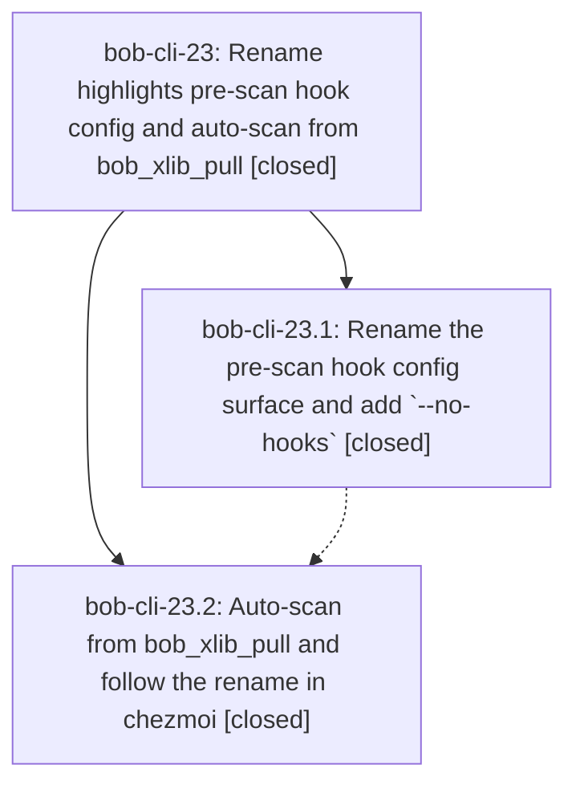

# Bead: bob-cli-23 — Rename highlights pre-scan hook config and auto-scan from bob\_xlib\_pull

[Bead Pages](../README.md) / bob-cli-23

**Status:** ✓ closed · **Resolution:** done · **Type:** ▸ plan · **Tier:** epic
**Owner:** `bryanbugyi34@gmail.com` · **Created by:** [bbugyi200.apollo.16](https://github.com/bobs-org/bob-cli--agents/blob/main/families/bbugyi200.apollo.16.md) · **Assignee:** `bob-cli-23.land`
**Created:** 2026-09-20 15:38:36 EDT · **Closed:** 2026-09-20 16:17:43 EDT
**Plan:** [202609/highlights\_pre\_scan\_hook.md](https://github.com/bobs-org/bob-cli--plans/blob/main/202609/highlights_pre_scan_hook.md)

## Description

`bob highlights` reads the hook from `highlights.pre_scan_hook`, a new `-n|--no-hooks` flag ignores it, and `bob_xlib_pull` runs `bob highlights --no-hooks scan -w` itself on macOS so freshly pulled PDFs sync immediately instead of waiting for the 15-minute cron.

## Notes

[2026-09-20T20:17:43Z · bob-cli-23.land] Verified both phases against the plan, the source, and the commits, then integrated and landed.

PHASE 23.1 (bob-cli 8d19926) — CONFIRMED. src/native/config.rs: RawHighlights.pre_scan_hook with a
detection-only pre_scan_command: Option<serde_yaml::Value>, and parse_highlights_config returns
ConfigError::Invalid naming the file and the new spelling. src/native/highlights_ref/mod.rs:
ENV_PRE_SCAN_HOOK=BOB_HIGHLIGHTS_PRE_SCAN_HOOK, ENV_LEGACY_PRE_SCAN_COMMAND rejected on presence,
PreScanHook/configured_pre_scan_hook/run_pre_scan_hook/check_pre_scan_hook renamed, every stdout
label now pre_scan_hook:, hook child gets .env("BOB_HIGHLIGHTS_IN_PRE_SCAN_HOOK", "1"). no_hooks_arg()
(-n/--no-hooks) registered on the root command, inside with_scan_args in alphabetical position, and
directly on doctor — deliberately not on with_config_args, so marker/create/sync stay clean;
no_hooks_flag() ORs root and subcommand matches and threads into scan_library and doctor_vault, which
prints "pre_scan_hook: skipped (--no-hooks)" without recording a failure. Docs match the code:
README.md, docs/highlights-ref-sync.md, docs/vault-git-sync.md all carry -n|--no-hooks, pre_scan_hook,
BOB_HIGHLIGHTS_PRE_SCAN_HOOK, and the exported marker. Grep confirms every surviving occurrence of the
legacy spelling is an intentional rejection path or its doc/test.

PHASE 23.2 (chezmoi 475626a5, bob-cli 92042e9) — CONFIRMED in the linked chezmoi checkout.
home/dot_config/bob/config.yml renamed to highlights.pre_scan_hook; maybe_bob_highlights_sync renames
pre_scan_hook_configured, reads BOB_HIGHLIGHTS_PRE_SCAN_HOOK with the same set-but-empty semantics, and
awk-matches pre_scan_hook:. bob_xlib_pull gained run_scan() after both handle_host calls: returns early
on BOB_HIGHLIGHTS_IN_PRE_SCAN_HOOK, then takes the shared maybe_bob_highlights_sync.lock and returns
early if held, resolves bob via command -v then $HOME/.cargo/bin/bob (exit 1 + stderr if missing), runs
it through run_waited so the existing child-tracking and signal handling apply, and reports a non-zero
scan as exit 1. I traced the lock release: scan_lock_held is set only by the process that created the
lock and cleanup() rmdirs it, and cleanup is reached on normal exit via `trap 'cleanup' 0` as well as
through on_signal for 1/2/3/15 — so the lock cannot leak either way. Both scripts carry the shared-lock
comment. docs/vault-git-sync.md describes the auto-scan, both skip conditions, and the cron fallback.

TESTS RUN. bob-cli `just test`: 879 lib + 457 cli + 27 + 31 + 1 pass, 0 failed. `just lint` (clippy
--all-targets --all-features) exits 0 with only the 9 pre-existing warnings tracked by bob-cli-v; none
are in this epic's files. chezmoi `just test-bash`: 213/213 tests, 633/633 assertions pass, including
the 11 new bob_xlib_pull scan tests. `cargo test --test cli highlights` re-run after my own edit: 88
passed.

INTEGRATION (step 2) — nothing to integrate, verified rather than assumed. The epic opened 2026-09-20
19:38 UTC; its commits are 8d19926 (19:48) and 92042e9 (20:04). The newest non-epic bob-cli commit is
1d3373f from 2026-09-18, and the newest non-epic chezmoi commit is 68d82347 from 2026-09-20 13:49 UTC,
both predating the epic, so no post-start work could have missed this feature. master is level with
origin/master in both repos; there is no PR base branch. I also swept for surfaces that should now use
the new flag or that still duplicate it: the only other `bob highlights` caller anywhere is
`bob highlights create --include-id` in chezmoi home/dot_config/sase/sase.yml, and create never consults
the pre-scan hook, so it correctly needs no change. bob-mac-capture is capture-only and has no local
checkout (`sase repo open` reports the primary workspace directory absent), matching the plan's non-goal.

EPIC-CAUSED ISSUE FOUND AND FIXED. While checking formatting I found the epic's own new test,
tests/cli.rs highlights_ref_scan_rejects_legacy_pre_scan_command_key, was written with a hand-wrapped
write_file(...) call that rustfmt collapses to one line under this repo's actual style. Fixed in this
landing and re-verified: zero rustfmt diffs tree-wide, and the highlights cli tests still pass.

FOLLOW-UPS. The child phases recorded no PROPOSED FOLLOW-UP entries (confirmed on 23, 23.1 and 23.2).
Two issues that I found myself and that this epic did not cause were routed through /sase_new_task:
 - Created bob-cli-24 (task(ci), small): `just fmt` fails repo-wide because bob-cli has no tracked
   rustfmt.toml, so cargo fmt falls back to max_width=100 and style_edition=2024 while the source is
   written at max_width=80 / style_edition=2021. Not caused by this epic — I reproduced 2529 diff hunks
   across 54 files on a clean worktree of the pre-epic commit 1d3373f, including files untouched for
   weeks, and bisected the config to prove max_width=80 + style_edition="2021" brings the tree to zero
   diffs. `just all` therefore dies on its first recipe; `just lint` and `just test` both pass, which is
   why I gated this epic on those two directly.
 - Corroborated bob-cli-21 with `sase bead +1` (independent reproduction) rather than filing a
   duplicate: `sase artifact link add` still fails project-wide with the same fixed operation_id
   de29d2e25c1cfb4381f223c44d576f8c, 10 days after the original report, on a bead pair never linked
   before. It blocked the related-link step of /sase_new_task, so bob-cli-24's relation to bob-cli-v was
   recorded as a bead note instead.
No proposal was declined. `sase bead epic-symbols bob-cli-23` reports no --epic-symbol entries, and this
repo's justfile has no symvision recipe, so there was no whitelist to retire or re-key.

ROLLOUT REMINDER for the user, from the plan: on the MacBook apply the chezmoi change BEFORE installing
the new bob binary. In that order the worst case is a short window where an old bob ignores pre_scan_hook
and skips the pull; in the opposite order a new bob hard-fails every cron scan until
`chezmoi update -a --force` runs.

## Phases

| Bead | Title | Status | Size | Created | Agents | Commits |
|---|---|---|---|---|---:|---:|
| [bob-cli-23.1](bob-cli-23.1.md) | Rename the pre-scan hook config surface and add \`--no-hooks\` | ✓ closed | medium | 2026-09-20 | 1 | 1 |
| [bob-cli-23.2](bob-cli-23.2.md) | Auto-scan from bob\_xlib\_pull and follow the rename in chezmoi | ✓ closed | medium | 2026-09-20 | 1 | 2 |

## Lineage

## Agents

| Agent | Bead | Commits |
|---|---|---:|
| [bbugyi200.apollo.bob-cli-23.1](https://github.com/bobs-org/bob-cli--agents/blob/main/agents/bbugyi200.apollo.bob-cli-23.1/README.md) | [bob-cli-23.1](bob-cli-23.1.md) | 1 |
| [bbugyi200.apollo.bob-cli-23.2](https://github.com/bobs-org/bob-cli--agents/blob/main/agents/bbugyi200.apollo.bob-cli-23.2/README.md) | [bob-cli-23.2](bob-cli-23.2.md) | 2 |
| [bbugyi200.apollo.bob-cli-23.land](https://github.com/bobs-org/bob-cli--agents/blob/main/agents/bbugyi200.apollo.bob-cli-23.land/README.md) | [bob-cli-23](README.md) | 1 |

## Commits

| Repo | Commit | Subject | Bead | Committed |
|---|---|---|---|---|
| bob-cli | [`8d19926`](https://github.com/bobs-org/bob-cli/commit/8d19926d6fa6bb82d4ed7eea10c0f24939cd18c6) | feat(highlights): rename pre-scan hook config and add --no-hooks | [bob-cli-23.1](bob-cli-23.1.md) | 2026-09-20 15:48:59 EDT |
| bob-cli | [`92042e9`](https://github.com/bobs-org/bob-cli/commit/92042e9c0cd74fa5aac9eab339b4d389b9e90109) | docs(highlights): describe bob\_xlib\_pull auto-scan | [bob-cli-23.2](bob-cli-23.2.md) | 2026-09-20 16:04:07 EDT |
| chezmoi | [`chezmoi@475626a`](https://github.com/bbugyi200/dotfiles/commit/475626a5cce33485df5d4874db001049311de4ca) | feat(bob): auto-scan from bob\_xlib\_pull and follow pre\_scan\_hook rename | [bob-cli-23.2](bob-cli-23.2.md) | 2026-09-20 16:04:44 EDT |
| bob-cli | [`d7ce1c3`](https://github.com/bobs-org/bob-cli/commit/d7ce1c34701744511b52d176e9364e4d6e30f2e6) | style(highlights): unwrap the legacy pre-scan-hook test's write\_file call | [bob-cli-23](README.md) | 2026-09-20 16:19:16 EDT |
