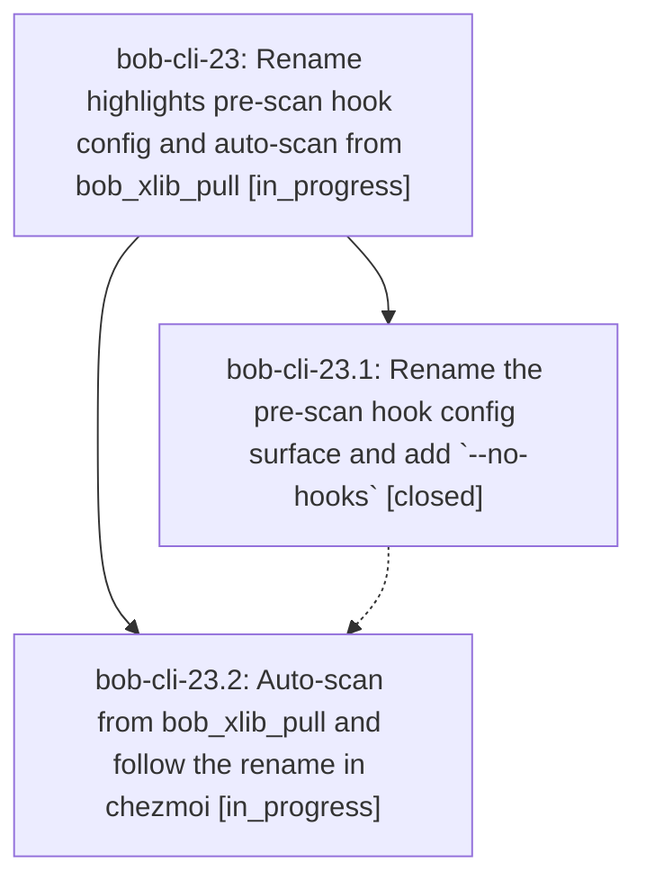

# Bead: bob-cli-23 — Rename highlights pre-scan hook config and auto-scan from bob\_xlib\_pull

[Bead Pages](../README.md) / bob-cli-23

**Status:** ◐ in_progress · **Type:** ▸ plan · **Tier:** epic
**Owner:** `bryanbugyi34@gmail.com` · **Created by:** [bbugyi200.apollo.16](https://github.com/bobs-org/bob-cli--agents/blob/main/families/bbugyi200.apollo.16.md) · **Assignee:** `bob-cli-23.land`
**Created:** 2026-09-20 15:38:36 EDT
**Plan:** [202609/highlights\_pre\_scan\_hook.md](https://github.com/bobs-org/bob-cli--plans/blob/main/202609/highlights_pre_scan_hook.md)

## Description

`bob highlights` reads the hook from `highlights.pre_scan_hook`, a new `-n|--no-hooks` flag ignores it, and `bob_xlib_pull` runs `bob highlights --no-hooks scan -w` itself on macOS so freshly pulled PDFs sync immediately instead of waiting for the 15-minute cron.

## Phases

| Bead | Title | Status | Size | Created | Agents | Commits |
|---|---|---|---|---|---:|---:|
| [bob-cli-23.1](bob-cli-23.1.md) | Rename the pre-scan hook config surface and add \`--no-hooks\` | ✓ closed | medium | 2026-09-20 | 1 | 1 |
| [bob-cli-23.2](bob-cli-23.2.md) | Auto-scan from bob\_xlib\_pull and follow the rename in chezmoi | ◐ in_progress | medium | 2026-09-20 | 1 | 0 |

## Lineage

## Agents

| Agent | Bead | Commits |
|---|---|---:|
| [bbugyi200.apollo.bob-cli-23.1](https://github.com/bobs-org/bob-cli--agents/blob/main/agents/bbugyi200.apollo.bob-cli-23.1/README.md) | [bob-cli-23.1](bob-cli-23.1.md) | 1 |
| [bbugyi200.apollo.bob-cli-23.2](https://github.com/bobs-org/bob-cli--agents/blob/main/agents/bbugyi200.apollo.bob-cli-23.2/README.md) | [bob-cli-23.2](bob-cli-23.2.md) | 0 |
| [bbugyi200.apollo.bob-cli-23.land](https://github.com/bobs-org/bob-cli--agents/blob/main/agents/bbugyi200.apollo.bob-cli-23.land/README.md) | [bob-cli-23](README.md) | 0 |

## Commits

| Repo | Commit | Subject | Bead | Committed |
|---|---|---|---|---|
| bob-cli | [`8d19926`](https://github.com/bobs-org/bob-cli/commit/8d19926d6fa6bb82d4ed7eea10c0f24939cd18c6) | feat(highlights): rename pre-scan hook config and add --no-hooks | [bob-cli-23.1](bob-cli-23.1.md) | 2026-09-20 15:48:59 EDT |
