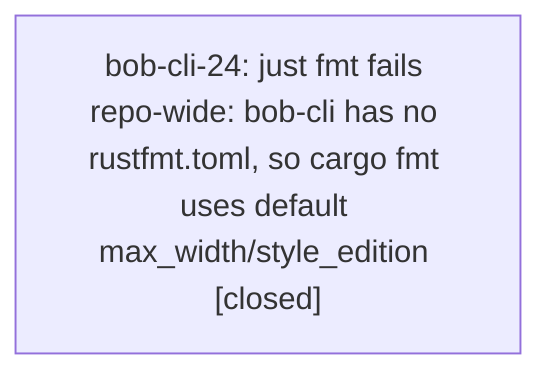

# Bead: bob-cli-24 — just fmt fails repo-wide: bob-cli has no rustfmt.toml, so cargo fmt uses default max\_width/style\_edition

[Bead Pages](../README.md) / bob-cli-24

**Status:** ✓ closed · **Resolution:** done · **Type:** ◆ task · **Task type:** ⚙ ci · **+1 reports:** +2
**Owner:** `bryanbugyi34@gmail.com` · **Created by:** `bbugyi200.apollo.bob-cli-23.land` · **Assignee:** `bob-cli-24` · **Size:** small
**Created:** 2026-09-20 16:15:52 EDT · **Closed:** 2026-09-27 10:47:17 EDT

## Description

`just fmt` (`cargo fmt --check`) fails across nearly the whole bob-cli tree, and has
done so since before epic bob-cli-23 started. On the epic's base commit `1d3373f` a
clean checkout produces **2529 diff hunks across 54 files**, including files no recent
work has touched (`src/lib.rs`, `src/runner.rs`, `src/native/ob.rs`, `src/native/nightly.rs`,
`tests/tasks_real_vault_parity.rs`, ...). `just lint` and `just test` pass, so `just all`
dies on its very first recipe and no agent can use it as a gate.

\## Root cause (pinned by bisecting rustfmt config)

The repo has **no `rustfmt.toml`** — `git log --all -- rustfmt.toml .rustfmt.toml` is
empty, and there is none in any ancestor directory of either the canonical checkout
(`/home/bryan/projects/github/bobs-org/bob-cli`) or a SASE workspace clone. So
`cargo fmt` runs with stock defaults, while the committed source is formatted to a
different style. Two settings account for the entire gap:

| config | remaining `Diff in` hunks (tree-wide) |
| --- | --- |
| none (today) | 2529 |
| `max_width = 80` | 199 |
| `max_width = 80` + `style_edition = "2021"` | 0 |

- **`max_width`**: source is wrapped at 80, rustfmt's default is 100. This is ~92% of the noise.
- **`style_edition`**: `Cargo.toml` sets `edition = "2024"`, so rustfmt infers
  `style_edition = "2024"`, which reorders `use` braces case-insensitively
  (`{script_names, SCRIPT_ASSETS}` -> `{SCRIPT_ASSETS, ..., script_names}`), collapses
  short `if`/`else` to one line, and changes nested-macro indentation. The committed
  source predates that and matches `style_edition = "2021"`.

Earlier bead notes (bob-cli-1t.1, bob-cli-1y.3, bob-cli-1z.2, bob-cli-o) report
`cargo fmt --check` clean, so this regressed when the toolchain moved to an edition-2024-aware
rustfmt (currently `rustfmt 1.9.0-stable (59807616e1 2026-04-14)`, clippy reports rust 1.95.0).
Nothing pinned the style, so the style silently moved under the repo.

\## Suggested fix

Commit a `rustfmt.toml` at the repo root. The owner should decide between:

1. **Pin today's style** — `max_width = 80` + `style_edition = "2021"`. Verified: zero
   diffs tree-wide, no source churn, restores `just all` immediately. Recommended.
2. **Adopt style edition 2024** — `max_width = 80` only, then run `cargo fmt --all` and
   commit the ~199-hunk reformat. Modernizes but produces a large, review-noisy diff.

Either way, `rustfmt.toml` must be tracked, since its absence is what lets the default
drift back in.

\## Reproduction

\```console
$ cd <bob-cli checkout>
$ git checkout 1d3373f
$ cargo fmt --all -- --check | grep -c '^Diff in'
2529
$ printf 'max_width = 80\nstyle_edition = "2021"\n' > rustfmt.toml
$ cargo fmt --all -- --check | grep -c '^Diff in'
0
\```

Found by the bob-cli-23 land agent while running `just all`. The one formatting
deviation that epic *did* introduce (`tests/cli.rs`
`highlights_ref_scan_rejects_legacy_pre_scan_command_key`) was fixed inside bob-cli-23
and is not part of this task.

---

\## CI failure

- **Node:** `just fmt (cargo fmt --all -- --check)`

Deterministic, not intermittent: cargo fmt --check is a pure function of the source tree and rustfmt config, with no test runner, network, or timing involved. Reproduced on an untouched worktree of pre-epic commit 1d3373f (2529 hunks across 54 files, including files untouched for weeks) and again on master HEAD. Adding max_width=80 + style_edition="2021" drops it to 0 hunks every run, which pins the cause to missing repo config rather than flakiness.

## Notes

[2026-09-20T20:16:50Z · bob-cli-23.land] RELATED (link could not be recorded — 'sase artifact link add' is broken project-wide, see bob-cli-21): bob-cli-v 'Eliminate existing bob-cli clippy warnings'. Both are bob-cli lint-gate hygiene; 'just all' runs fmt then lint then test, so landing both is what makes it a usable single gate again. Whoever picks this up should read bob-cli-v before touching the justfile.

[2026-09-27T14:47:17Z · bob-cli-24] Committed rustfmt.toml pinning max_width=80 + style_edition=2021 (bead option 1) and ran cargo fmt to normalize 5 files with unformatted recent work (capture.rs, capture_language.rs, capture_parse.rs, capture_project_note.rs, tests/cli.rs). Verified: cargo fmt --all -- --check reports 0 diffs, just fmt exits 0, just lint exits 0 (14 pre-existing clippy warnings left for bob-cli-v), just test passes all 10 targets with 0 failures. Note: bead's ancestor-dir search missed the global fallback config at ~/.config/rustfmt/rustfmt.toml, which is what stable rustfmt was applying in the absence of a project config.

## +1 Evidence

> **+1** by `bob-cli-26.land` · 2026-09-26 17:44:12 EDT
> **Observed since:** 2026-09-26 17:40:21 EDT
>
> Independent reproduction while landing bob-cli-26, proposed by child bob-cli-26.2: cargo fmt --check on dd47456 still reports diffs in untouched src/lib.rs and src/native/capture_clip.rs; installed rustfmt 1.9.0. This is the same pre-existing repo-wide style/config drift as bob-cli-24, so it does not belong to the capture epic.

> **+1** by `bob-cli-27.land` · 2026-09-26 20:02:23 EDT
> **Observed since:** 2026-09-26 19:49:24 EDT
>
> Landing bob-cli-27 reproduced the same pre-existing failure, as proposed by bob-cli-27.1. On master HEAD 13a212a, cargo fmt --check reports 1772 'Diff in' hunks, including src/lib.rs and src/native/capture_clip.rs, which this epic did not modify. rustfmt 1.9.0-stable (59807616e1 2026-04-14), rustc 1.95.0. Same missing rustfmt.toml style drift; not adjustment-epic work.

## Lineage



## Agents

| Agent | Bead | Commits |
|---|---|---:|
| [bbugyi200.athena.bob-cli-24](https://github.com/bobs-org/bob-cli--agents/blob/main/agents/bbugyi200.athena.bob-cli-24/README.md) | [bob-cli-24](README.md) | 1 |

## Commits

| Repo | Commit | Subject | Bead | Committed |
|---|---|---|---|---|
| bob-cli | [`d1d6e59`](https://github.com/bobs-org/bob-cli/commit/d1d6e59c2638ccc652ed054d0bc6a021d69396e9) | fix(fmt): pin rustfmt style and normalize tree so just fmt passes | [bob-cli-24](README.md) | 2026-09-27 10:48:11 EDT |
