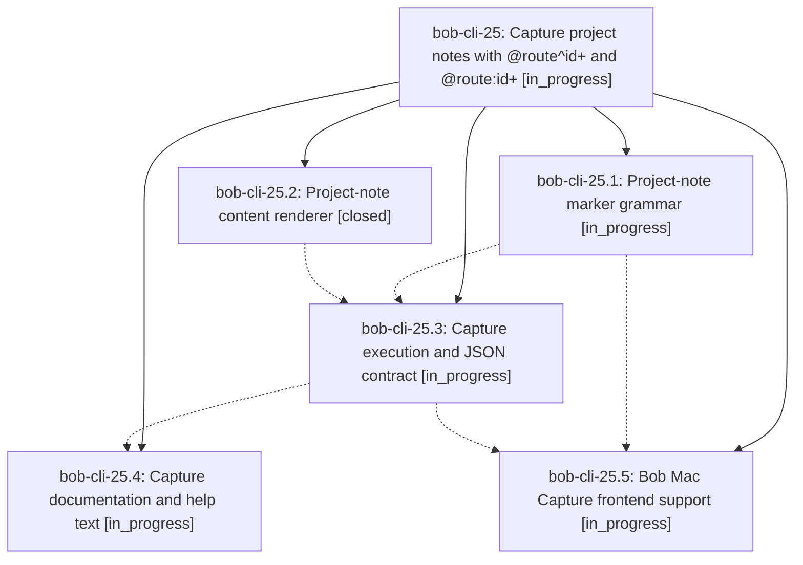

# Bead: bob-cli-25 — Capture project notes with @route^id+ and @route:id+

[Bead Pages](../README.md) / bob-cli-25

**Status:** ◐ in_progress · **Type:** ▸ plan · **Tier:** epic
**Owner:** `bryanbugyi34@gmail.com` · **Created by:** [bbugyi200.apollo.1a](https://github.com/bobs-org/bob-cli--agents/blob/main/families/bbugyi200.apollo.1a.md) · **Assignee:** `bob-cli-25.land`
**Created:** 2026-09-20 18:07:12 EDT
**Plan:** [202609/capture\_project\_notes.md](https://github.com/bobs-org/bob-cli--plans/blob/main/202609/capture_project_notes.md)

## Description

`bob capture` can create a new sub-project note `<route>_<block_id>.md` — with a `parent` wikilink back to `<route>.md`, a seeded `^prj` lifecycle task, authored child tasks under `## Tasks`, and authored ALL-CAPS sections as `##` headers — from the new `@<route>^<block-id>+` and `@<route>:<block-id>+[#<pomodoro>]` markers, and Bob Mac Capture highlights and reports the new family correctly.

## Phases

| Bead | Title | Status | Size | Created | Agents | Commits |
|---|---|---|---|---|---:|---:|
| [bob-cli-25.1](bob-cli-25.1.md) | Project-note marker grammar | ◐ in_progress | medium | 2026-09-20 | 1 | 0 |
| [bob-cli-25.2](bob-cli-25.2.md) | Project-note content renderer | ✓ closed | medium | 2026-09-20 | 1 | 1 |
| [bob-cli-25.3](bob-cli-25.3.md) | Capture execution and JSON contract | ◐ in_progress | medium | 2026-09-20 | 1 | 0 |
| [bob-cli-25.4](bob-cli-25.4.md) | Capture documentation and help text | ◐ in_progress | small | 2026-09-20 | 1 | 0 |
| [bob-cli-25.5](bob-cli-25.5.md) | Bob Mac Capture frontend support | ◐ in_progress | small | 2026-09-20 | 1 | 0 |

## Lineage

## Agents

| Agent | Bead | Commits |
|---|---|---:|
| [bbugyi200.apollo.bob-cli-25.1](https://github.com/bobs-org/bob-cli--agents/blob/main/agents/bbugyi200.apollo.bob-cli-25.1/README.md) | [bob-cli-25.1](bob-cli-25.1.md) | 0 |
| [bbugyi200.apollo.bob-cli-25.2](https://github.com/bobs-org/bob-cli--agents/blob/main/agents/bbugyi200.apollo.bob-cli-25.2/README.md) | [bob-cli-25.2](bob-cli-25.2.md) | 1 |
| [bbugyi200.apollo.bob-cli-25.3](https://github.com/bobs-org/bob-cli--agents/blob/main/agents/bbugyi200.apollo.bob-cli-25.3/README.md) | [bob-cli-25.3](bob-cli-25.3.md) | 0 |
| [bbugyi200.apollo.bob-cli-25.4](https://github.com/bobs-org/bob-cli--agents/blob/main/agents/bbugyi200.apollo.bob-cli-25.4/README.md) | [bob-cli-25.4](bob-cli-25.4.md) | 0 |
| [bbugyi200.apollo.bob-cli-25.5](https://github.com/bobs-org/bob-cli--agents/blob/main/agents/bbugyi200.apollo.bob-cli-25.5/README.md) | [bob-cli-25.5](bob-cli-25.5.md) | 0 |
| [bbugyi200.apollo.bob-cli-25.land](https://github.com/bobs-org/bob-cli--agents/blob/main/agents/bbugyi200.apollo.bob-cli-25.land/README.md) | [bob-cli-25](README.md) | 0 |

## Commits

| Repo | Commit | Subject | Bead | Committed |
|---|---|---|---|---|
| bob-cli | [`2393e8a`](https://github.com/bobs-org/bob-cli/commit/2393e8a65317167fd539e92bf1a3235654bac191) | feat(capture): add project-note content renderer | [bob-cli-25.2](bob-cli-25.2.md) | 2026-09-20 18:26:50 EDT |
