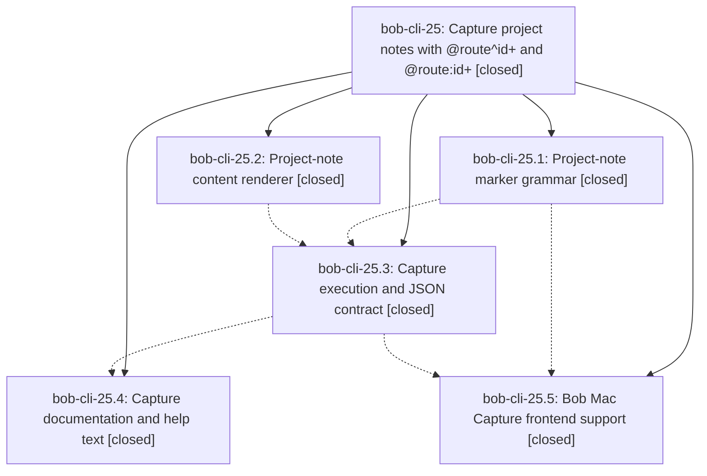

# Bead: bob-cli-25 — Capture project notes with @route^id+ and @route:id+

[Bead Pages](../README.md) / bob-cli-25

**Status:** ✓ closed · **Resolution:** done · **Type:** ▸ plan · **Tier:** epic
**Owner:** `bryanbugyi34@gmail.com` · **Created by:** [bbugyi200.apollo.1a](https://github.com/bobs-org/bob-cli--agents/blob/main/families/bbugyi200.apollo.1a.md) · **Assignee:** `bob-cli-25.land`
**Created:** 2026-09-20 18:07:12 EDT · **Closed:** 2026-09-20 19:22:17 EDT
**Plan:** [202609/capture\_project\_notes.md](https://github.com/bobs-org/bob-cli--plans/blob/main/202609/capture_project_notes.md)

## Description

`bob capture` can create a new sub-project note `<route>_<block_id>.md` — with a `parent` wikilink back to `<route>.md`, a seeded `^prj` lifecycle task, authored child tasks under `## Tasks`, and authored ALL-CAPS sections as `##` headers — from the new `@<route>^<block-id>+` and `@<route>:<block-id>+[#<pomodoro>]` markers, and Bob Mac Capture highlights and reports the new family correctly.

## Notes

[2026-09-20T23:22:17Z · bob-cli-25.land] Land verification for the @route^id+ / @route:id+ project-note family.

VERIFIED (step 1). All 5 phases closed with notes; every note's claim re-checked against source and the 4 epic commits (2393e8a renderer, 4e738fd grammar, a702261 execute, 984024a docs) plus bob-mac-capture 54861b3. No PROPOSED FOLLOW-UP entries on any child bead, so no task beads were filed.

- Grammar (25.1): the todo!/unreachable arms it left behind are gone — capture.rs now routes CaptureKind::ProjectNote to plan_project_note_item, and 'grep -rn todo!|unimplemented! src/' is empty. Live capture-parse confirms mode project_note for @cash^goog-exit+, pomodoro_project_note for @cash:goog-exit+ and @cash:goog-exit+#bugs (section=bugs), a single-byte project_note_marker span at the '+', route/block spans unchanged, needs=['route'] for @^id+ and @:id+, invalid_project_note_marker naming the ':' form for @cash^goog-exit+#bugs, invalid_global_destination for @@cash^goog-exit+, and the key regression guard: @sase:deep-fix#bugs+ still parses as pomodoro_task with Pomodoro name 'bugs+'.
- Renderer (25.2): capture_project_note.rs is pure (no fs/clock); created stamp resolves the offset from the passed NaiveDateTime so BOB_NOW controls it.
- Execute (25.3): live scratch-vault runs reproduce the documented note byte-for-byte; @cash:goog-exit+#bugs stages the note and the daily ledger together with [[cash_goog_exit#^prj]] under BUGS; parent validation rejects missing/non-area/done parents; collision rejects an existing note; --clip and trailing %/%header are rejected with the documented messages; --dry-run writes nothing; a missing daily note rolls the new file back (nothing left on disk).
- Docs (25.4): docs/capture.md grammar rows, # disambiguation, Project notes section, JSON contract, capture-parse modes/spans/diagnostics, and the projects.md cross-ref all match observed behavior.
- Mac (25.5): project_note_marker -> .explicitToggle and friendlyKindLabel -> Project, both covered by tests; bob-mac-capture CI run 35543603537 for that commit is green on macOS (the phase could not run Swift locally). completionSpanKinds/routeSpanKinds are unchanged and behave exactly as for the pre-existing ^/: families; verified live that bob capture-complete still offers route completion for @^id+, @:id+, @ca^id+ and Pomodoro-name completion for @cash:id+#b.
- Beyond the phase notes: authored-children mapping verified live end-to-end — two FUTURE WORK bullets merge into one ## Future Work in source order, API DESIGN renders ## Api Design, an authored TASKS section merges into ## Tasks, an authored [x] checkbox is preserved, nested bullets render tab-indented, and s:3 lands as frontmatter 'scheduled: 2026-09-23' with a [?] ^prj checkbox. 'bob projects list' sees the new note as a wip sub-project and 'bob projects sync' adds the parent's Sub-projects line.

INTEGRATED (step 2). Nothing to integrate: the epic's first commit is 2393e8a (2026-09-20 22:26 UTC) and no non-epic commit landed on bob-cli master or bob-mac-capture master after the epic started (last pre-epic commits d7ce1c3 at 20:19 UTC and 8080011 on 2026-09-19). Master equals origin/master and the tree is clean in both repos. Checked the adjacent recently-landed work for conflicts anyway: 338c90a (allow + in Pomodoro names) is the one real collision risk and is pinned green by the @sase:deep-fix#bugs+ check above; the task-toggle / Ensure Next family (a72b355, 9aaeb9e, 1d3373f) is untouched because ! stays reserved and @route+id keeps routing to sub_bullet. CaptureKind and EditorMode are matched on only in capture.rs, capture_language.rs, and capture_parse.rs, all exhaustive, so no other subcommand silently missed the new variants; capture-rewrite, capture-complete, and capture-targets need no change and were exercised live.

VALIDATION. cargo clippy --all-targets --all-features: exit 0, 9 warnings, all pre-existing (the two capture.rs too-many-arguments warnings are on plan_capture_item and insert_named_pomodoro_child_block, both unchanged since d7ce1c3). cargo test: 898 lib + 464 cli + 27 + 31 + 1, all passing, 0 failures. cargo fmt --check still fails tree-wide; that is the pre-existing baseline break already filed as bob-cli-24 (no rustfmt.toml), not epic work. This repo has no 'just check', 'just check-full', or 'just symvision' recipe; 'just all' is fmt+lint+test. sase bead epic-symbols bob-cli-25 reports no entries.

## Phases

| Bead | Title | Status | Size | Created | Agents | Commits |
|---|---|---|---|---|---:|---:|
| [bob-cli-25.1](bob-cli-25.1.md) | Project-note marker grammar | ✓ closed | medium | 2026-09-20 | 1 | 1 |
| [bob-cli-25.2](bob-cli-25.2.md) | Project-note content renderer | ✓ closed | medium | 2026-09-20 | 1 | 1 |
| [bob-cli-25.3](bob-cli-25.3.md) | Capture execution and JSON contract | ✓ closed | medium | 2026-09-20 | 1 | 1 |
| [bob-cli-25.4](bob-cli-25.4.md) | Capture documentation and help text | ✓ closed | small | 2026-09-20 | 1 | 1 |
| [bob-cli-25.5](bob-cli-25.5.md) | Bob Mac Capture frontend support | ✓ closed | small | 2026-09-20 | 1 | 0 |

## Lineage

## Agents

| Agent | Bead | Commits |
|---|---|---:|
| [bbugyi200.apollo.bob-cli-25.1](https://github.com/bobs-org/bob-cli--agents/blob/main/agents/bbugyi200.apollo.bob-cli-25.1/README.md) | [bob-cli-25.1](bob-cli-25.1.md) | 1 |
| [bbugyi200.apollo.bob-cli-25.2](https://github.com/bobs-org/bob-cli--agents/blob/main/agents/bbugyi200.apollo.bob-cli-25.2/README.md) | [bob-cli-25.2](bob-cli-25.2.md) | 1 |
| [bbugyi200.apollo.bob-cli-25.3](https://github.com/bobs-org/bob-cli--agents/blob/main/agents/bbugyi200.apollo.bob-cli-25.3/README.md) | [bob-cli-25.3](bob-cli-25.3.md) | 1 |
| [bbugyi200.apollo.bob-cli-25.4](https://github.com/bobs-org/bob-cli--agents/blob/main/agents/bbugyi200.apollo.bob-cli-25.4/README.md) | [bob-cli-25.4](bob-cli-25.4.md) | 1 |
| [bbugyi200.apollo.bob-cli-25.5](https://github.com/bobs-org/bob-cli--agents/blob/main/agents/bbugyi200.apollo.bob-cli-25.5/README.md) | [bob-cli-25.5](bob-cli-25.5.md) | 0 |
| [bbugyi200.apollo.bob-cli-25.land](https://github.com/bobs-org/bob-cli--agents/blob/main/agents/bbugyi200.apollo.bob-cli-25.land/README.md) | [bob-cli-25](README.md) | 1 |

## Commits

| Repo | Commit | Subject | Bead | Committed |
|---|---|---|---|---|
| bob-cli | [`2393e8a`](https://github.com/bobs-org/bob-cli/commit/2393e8a65317167fd539e92bf1a3235654bac191) | feat(capture): add project-note content renderer | [bob-cli-25.2](bob-cli-25.2.md) | 2026-09-20 18:26:50 EDT |
| bob-cli | [`4e738fd`](https://github.com/bobs-org/bob-cli/commit/4e738fd9ab1307ad131e3395bdc911a6217138c6) | feat(capture): add project-note marker grammar | [bob-cli-25.1](bob-cli-25.1.md) | 2026-09-20 18:44:47 EDT |
| bob-cli | [`a702261`](https://github.com/bobs-org/bob-cli/commit/a702261918d69095f3b200f529ac8cfd30399f3e) | feat(capture): wire project-note execution and JSON contract | [bob-cli-25.3](bob-cli-25.3.md) | 2026-09-20 18:59:51 EDT |
| bob-cli | [`984024a`](https://github.com/bobs-org/bob-cli/commit/984024acad345e505ffd3eea794bc50c0a64d8cf) | docs(capture): document @route^id+ project-note family | [bob-cli-25.4](bob-cli-25.4.md) | 2026-09-20 19:10:18 EDT |
| bob-cli--plans | [`bob-cli--plans@68d7e0a`](https://github.com/bobs-org/bob-cli--plans/commit/68d7e0afe72685aaaabe2013d95b1059e21feff7) | docs(plans): mark capture project-notes plan done | [bob-cli-25](README.md) | 2026-09-20 19:23:35 EDT |
