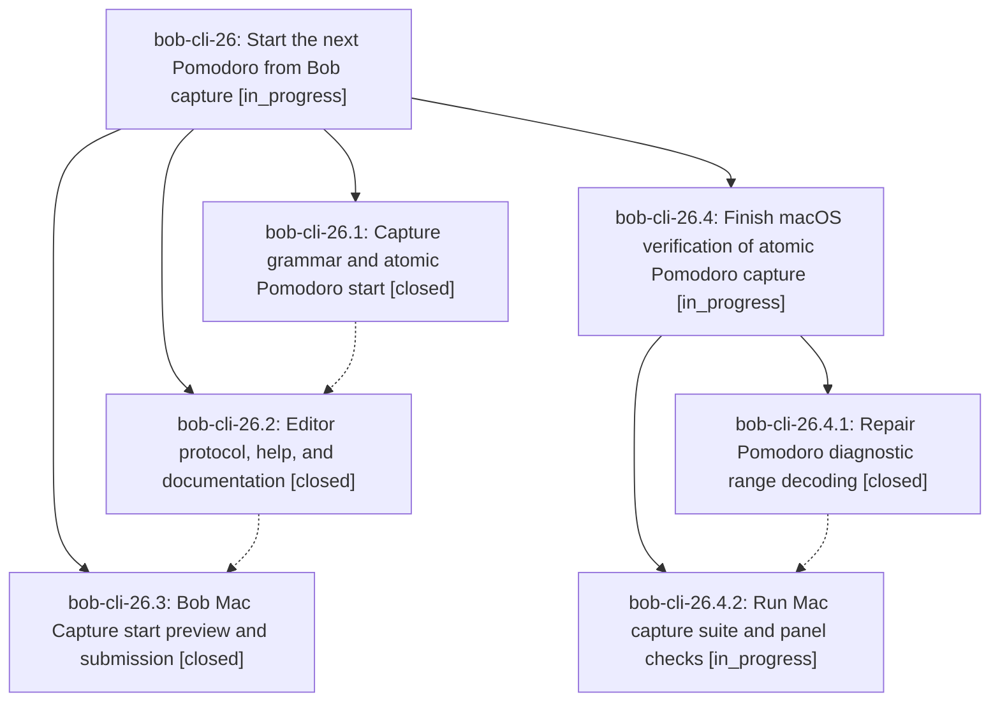

# Bead: bob-cli-26 — Start the next Pomodoro from Bob capture

[Bead Pages](../README.md) / bob-cli-26

**Status:** ◐ in_progress · **Type:** ▸ plan · **Tier:** epic
**Owner:** `bryanbugyi34@gmail.com` · **Created by:** [bbugyi200.apollo.20](https://github.com/bobs-org/bob-cli--agents/blob/main/agents/bbugyi200.apollo.20/README.md) · **Assignee:** `bob-cli-26.land`
**Created:** 2026-09-26 16:50:55 EDT
**Plan:** [202609/capture\_start\_pomodoro.md](https://github.com/bobs-org/bob-cli--plans/blob/main/202609/capture_start_pomodoro.md)

## Description

New Pomodoro-linked capture tasks can atomically start a session with se-compatible timing, and Bob Mac Capture previews and submits that behavior accurately.

## Notes

[2026-09-26T21:43:34Z · bryanbugyi34@gmail.com] That caused the bob-mac-capture app to fail (see the ~/tmp/bob_mac_capture_error.txt file.

[2026-09-26T21:44:06Z · bryanbugyi34@gmail.com] Attempt to serialize file: @/home/bryan/tmp/bob_mac_capture_error.txt

[2026-09-26T21:44:58Z · bryanbugyi34@gmail.com] bob-mac-capture on  master via 🐦 v6.3.2
❯ just install
./Scripts/install.sh --target "~/Applications" --identity "-"
[1/1] Planning build
Building for production...
/Users/bbugyi/projects/github/bbugyi200/bob-mac-capture/Sources/CaptureCore/BobExecutableResolver.swift:4:16: warning: stored property 'fileManager' of 'Sendable'-conforming struct 'BobExecutableResolver' has non-Sendable type 'FileManager'; this is an error in the Swift 6 language mode
 2 |
 3 | public struct BobExecutableResolver: Sendable {
 4 |     public let fileManager: FileManager
   |                `- warning: stored property 'fileManager' of 'Sendable'-conforming struct 'BobExecutableResolver' has non-Sendable type 'FileManager'; this is an error in the Swift 6 language mode
 5 |     public let homeDirectory: URL
 6 |     public let candidates: [String]

/Library/Developer/CommandLineTools/SDKs/MacOSX.sdk/System/Library/Frameworks/Foundation.framework/Headers/NSFileManager.h:96:12: note: class 'FileManager' does not conform to the 'Sendable' protocol
 94 | extern NSNotificationName const NSUbiquityIdentityDidChangeNotification API_AVAILABLE(macos(10.8), ios(6.0), watchos(2.0), tvos(9.0));
 95 |
 96 | @interface NSFileManager : NSObject
    |            `- note: class 'FileManager' does not conform to the 'Sendable' protocol
 97 |
 98 | /* Returns the default singleton instance.

/Users/bbugyi/projects/github/bbugyi200/bob-mac-capture/Sources/CaptureCore/CanceledDraftStashStore.swift:46:17: warning: stored property 'fileManager' of 'Sendable'-conforming struct 'FileCanceledDraftStashStore' has non-Sendable type 'FileManager'; this is an error in the Swift 6 language mode
 44 |
 45 |     private let fileURL: URL
 46 |     private let fileManager: FileManager
    |                 `- warning: stored property 'fileManager' of 'Sendable'-conforming struct 'FileCanceledDraftStashStore' has non-Sendable type 'FileManager'; this is an error in the Swift 6 language mode
 47 |     private let onError: @Sendable (String) -> Void
 48 |

/Library/Developer/CommandLineTools/SDKs/MacOSX.sdk/System/Library/Frameworks/Foundation.framework/Headers/NSFileManager.h:96:12: note: class 'FileManager' does not conform to the 'Sendable' protocol
 94 | extern NSNotificationName const NSUbiquityIdentityDidChangeNotification API_AVAILABLE(macos(10.8), ios(6.0), watchos(2.0), tvos(9.0));
 95 |
 96 | @interface NSFileManager : NSObject
    |            `- note: class 'FileManager' does not conform to the 'Sendable' protocol
 97 |
 98 | /* Returns the default singleton instance.

/Users/bbugyi/projects/github/bbugyi200/bob-mac-capture/Sources/CaptureCore/CaptureModels.swift:256:19: error: initializer for conditional binding must have Optional type, not '[Int]'
 254 |             range = object
 255 |         } else if let pair = try? container.decodeIfPresent([Int].self, forKey: .range),
 256 |                   let pair,
     |                   `- error: initializer for conditional binding must have Optional type, not '[Int]'
 257 |                   pair.count == 2
 258 |         {

/Users/bbugyi/projects/github/bbugyi200/bob-mac-capture/Sources/CaptureCore/CaptureModels.swift:252:12: error: initializer for conditional binding must have Optional type, not 'CaptureRange'
 250 |         // `invalid_pomodoro_start` diagnostic never breaks parse decoding.
 251 |         if let object = try? container.decodeIfPresent(CaptureRange.self, forKey: .range),
 252 |            let object
     |            `- error: initializer for conditional binding must have Optional type, not 'CaptureRange'
 253 |         {
 254 |             range = object

error: recipe `install` failed on line 22 with exit code 1

[2026-09-26T21:46:28Z · bob-cli-26.land] LAND AUDIT: Reviewed all child notes, Rust commits a9a3465/dd47456, Mac commit 7fae3fd, implementation and linked plan; no unrelated post-start commits in either checkout. Seven focused Rust capture_pomodoro_start integration tests pass. macOS Swift 6.3.2 runner is reachable, but swift test fails to compile the new CaptureModels.swift diagnostic range decoder at lines 252/256 (redundant optional bindings). This is remaining epic work; preparing a nested child epic to fix and verify before closure. PROPOSED FOLLOW-UP from bob-cli-26.2 (repo-wide cargo fmt drift) duplicates ready task bob-cli-24; independent reproduction recorded as +1 there. PROPOSED FOLLOW-UP from bob-cli-26.3 (macOS Swift/UI verification) is in scope of this epic and is being addressed by the child plan.

## Phases

| Bead | Title | Status | Size | Created | Agents | Commits |
|---|---|---|---|---|---:|---:|
| [bob-cli-26.1](bob-cli-26.1.md) | Capture grammar and atomic Pomodoro start | ✓ closed | medium | 2026-09-26 | 1 | 1 |
| [bob-cli-26.2](bob-cli-26.2.md) | Editor protocol, help, and documentation | ✓ closed | medium | 2026-09-26 | 1 | 1 |
| [bob-cli-26.3](bob-cli-26.3.md) | Bob Mac Capture start preview and submission | ✓ closed | medium | 2026-09-26 | 1 | 0 |

## Lineage

## Agents

| Agent | Bead | Commits |
|---|---|---:|
| [bbugyi200.apollo.bob-cli-26.1](https://github.com/bobs-org/bob-cli--agents/blob/main/agents/bbugyi200.apollo.bob-cli-26.1/README.md) | [bob-cli-26.1](bob-cli-26.1.md) | 1 |
| [bbugyi200.apollo.bob-cli-26.2](https://github.com/bobs-org/bob-cli--agents/blob/main/agents/bbugyi200.apollo.bob-cli-26.2/README.md) | [bob-cli-26.2](bob-cli-26.2.md) | 1 |
| [bbugyi200.apollo.bob-cli-26.3](https://github.com/bobs-org/bob-cli--agents/blob/main/agents/bbugyi200.apollo.bob-cli-26.3/README.md) | [bob-cli-26.3](bob-cli-26.3.md) | 0 |
| [bbugyi200.apollo.bob-cli-26.4.1](https://github.com/bobs-org/bob-cli--agents/blob/main/agents/bbugyi200.apollo.bob-cli-26.4.1/README.md) | [bob-cli-26.4.1](bob-cli-26.4.1.md) | 0 |
| [bbugyi200.apollo.bob-cli-26.4.2](https://github.com/bobs-org/bob-cli--agents/blob/main/agents/bbugyi200.apollo.bob-cli-26.4.2/README.md) | [bob-cli-26.4.2](bob-cli-26.4.2.md) | 0 |
| [bbugyi200.apollo.bob-cli-26.4.land](https://github.com/bobs-org/bob-cli--agents/blob/main/agents/bbugyi200.apollo.bob-cli-26.4.land/README.md) | [bob-cli-26.4](bob-cli-26.4.md) | 0 |
| [bbugyi200.apollo.bob-cli-26.land](https://github.com/bobs-org/bob-cli--agents/blob/main/sessions/bbugyi200.apollo.bob-cli-26.land.md) | [bob-cli-26](README.md) | 0 |

## Commits

| Repo | Commit | Subject | Bead | Committed |
|---|---|---|---|---|
| bob-cli | [`a9a3465`](https://github.com/bobs-org/bob-cli/commit/a9a3465326af6b5415a95cf1804081c404f4fdcc) | feat(capture): atomic Pomodoro start via se\<X\> suffix | [bob-cli-26.1](bob-cli-26.1.md) | 2026-09-26 17:08:17 EDT |
| bob-cli | [`dd47456`](https://github.com/bobs-org/bob-cli/commit/dd474564c17bccee8f652c2d54706f3a4e0a935d) | feat(capture): expose atomic-start editor contract, help, and docs | [bob-cli-26.2](bob-cli-26.2.md) | 2026-09-26 17:26:00 EDT |
