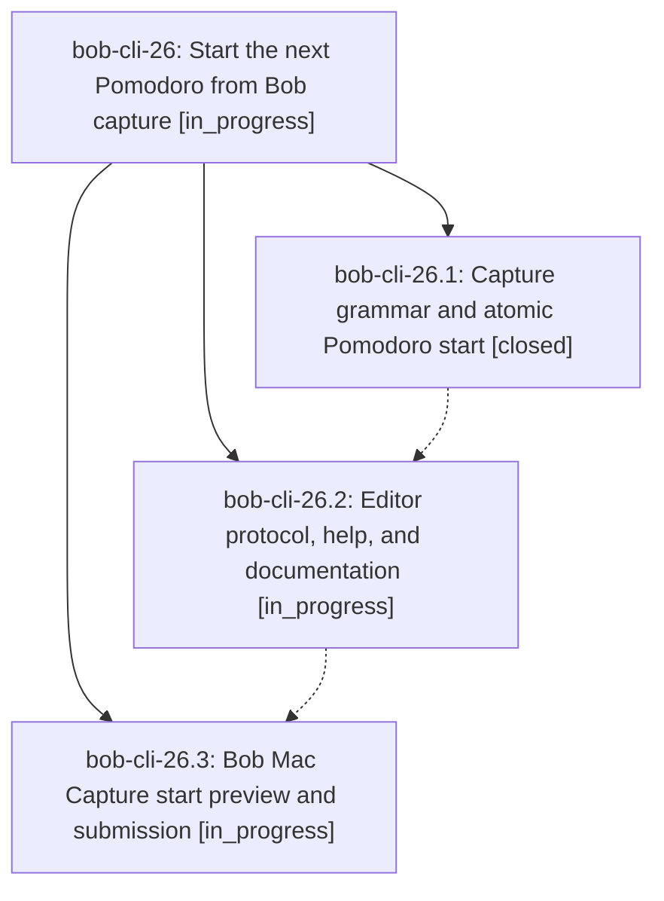

# Bead: bob-cli-26 — Start the next Pomodoro from Bob capture

[Bead Pages](../README.md) / bob-cli-26

**Status:** ◐ in_progress · **Type:** ▸ plan · **Tier:** epic
**Owner:** `bryanbugyi34@gmail.com` · **Created by:** [bbugyi200.apollo.20](https://github.com/bobs-org/bob-cli--agents/blob/main/agents/bbugyi200.apollo.20/README.md) · **Assignee:** `bob-cli-26.land`
**Created:** 2026-09-26 16:50:55 EDT
**Plan:** [202609/capture\_start\_pomodoro.md](https://github.com/bobs-org/bob-cli--plans/blob/main/202609/capture_start_pomodoro.md)

## Description

New Pomodoro-linked capture tasks can atomically start a session with se-compatible timing, and Bob Mac Capture previews and submits that behavior accurately.

## Phases

| Bead | Title | Status | Size | Created | Agents | Commits |
|---|---|---|---|---|---:|---:|
| [bob-cli-26.1](bob-cli-26.1.md) | Capture grammar and atomic Pomodoro start | ✓ closed | medium | 2026-09-26 | 1 | 1 |
| [bob-cli-26.2](bob-cli-26.2.md) | Editor protocol, help, and documentation | ◐ in_progress | medium | 2026-09-26 | 1 | 0 |
| [bob-cli-26.3](bob-cli-26.3.md) | Bob Mac Capture start preview and submission | ◐ in_progress | medium | 2026-09-26 | 1 | 0 |

## Lineage

## Agents

| Agent | Bead | Commits |
|---|---|---:|
| [bbugyi200.apollo.bob-cli-26.1](https://github.com/bobs-org/bob-cli--agents/blob/main/agents/bbugyi200.apollo.bob-cli-26.1/README.md) | [bob-cli-26.1](bob-cli-26.1.md) | 1 |
| [bbugyi200.apollo.bob-cli-26.2](https://github.com/bobs-org/bob-cli--agents/blob/main/agents/bbugyi200.apollo.bob-cli-26.2/README.md) | [bob-cli-26.2](bob-cli-26.2.md) | 0 |
| [bbugyi200.apollo.bob-cli-26.3](https://github.com/bobs-org/bob-cli--agents/blob/main/agents/bbugyi200.apollo.bob-cli-26.3/README.md) | [bob-cli-26.3](bob-cli-26.3.md) | 0 |
| [bbugyi200.apollo.bob-cli-26.land](https://github.com/bobs-org/bob-cli--agents/blob/main/agents/bbugyi200.apollo.bob-cli-26.land/README.md) | [bob-cli-26](README.md) | 0 |

## Commits

| Repo | Commit | Subject | Bead | Committed |
|---|---|---|---|---|
| bob-cli | [`a9a3465`](https://github.com/bobs-org/bob-cli/commit/a9a3465326af6b5415a95cf1804081c404f4fdcc) | feat(capture): atomic Pomodoro start via se\<X\> suffix | [bob-cli-26.1](bob-cli-26.1.md) | 2026-09-26 17:08:17 EDT |
