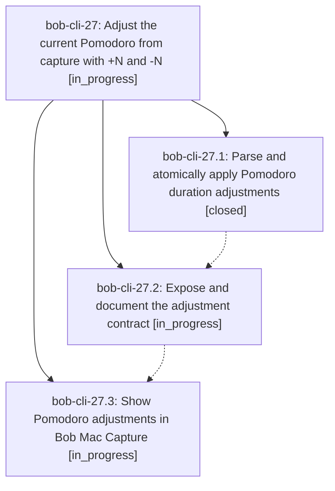

# Bead: bob-cli-27 — Adjust the current Pomodoro from capture with +N and -N

[Bead Pages](../README.md) / bob-cli-27

**Status:** ◐ in_progress · **Type:** ▸ plan · **Tier:** epic
**Owner:** `bryanbugyi34@gmail.com` · **Created by:** [bbugyi200.apollo.21](https://github.com/bobs-org/bob-cli--agents/blob/main/sessions/bbugyi200.apollo.21.md) · **Assignee:** `bob-cli-27.land`
**Created:** 2026-09-26 19:06:51 EDT
**Plan:** [202609/adjust\_pomodoro\_duration.md](https://github.com/bobs-org/bob-cli--plans/blob/main/202609/adjust_pomodoro_duration.md)

## Description

Whole-item +N and -N captures adjust the current Pomodoro reliably in Bob CLI and Bob Mac Capture, with accurate previews and atomic bulk behavior.

## Phases

| Bead | Title | Status | Size | Created | Agents | Commits |
|---|---|---|---|---|---:|---:|
| [bob-cli-27.1](bob-cli-27.1.md) | Parse and atomically apply Pomodoro duration adjustments | ✓ closed | medium | 2026-09-26 | 1 | 1 |
| [bob-cli-27.2](bob-cli-27.2.md) | Expose and document the adjustment contract | ◐ in_progress | medium | 2026-09-26 | 1 | 0 |
| [bob-cli-27.3](bob-cli-27.3.md) | Show Pomodoro adjustments in Bob Mac Capture | ◐ in_progress | medium | 2026-09-26 | 1 | 0 |

## Lineage

## Agents

| Agent | Bead | Commits |
|---|---|---:|
| [bbugyi200.apollo.bob-cli-27.1](https://github.com/bobs-org/bob-cli--agents/blob/main/agents/bbugyi200.apollo.bob-cli-27.1/README.md) | [bob-cli-27.1](bob-cli-27.1.md) | 1 |
| [bbugyi200.apollo.bob-cli-27.2](https://github.com/bobs-org/bob-cli--agents/blob/main/agents/bbugyi200.apollo.bob-cli-27.2/README.md) | [bob-cli-27.2](bob-cli-27.2.md) | 0 |
| [bbugyi200.apollo.bob-cli-27.3](https://github.com/bobs-org/bob-cli--agents/blob/main/agents/bbugyi200.apollo.bob-cli-27.3/README.md) | [bob-cli-27.3](bob-cli-27.3.md) | 0 |
| [bbugyi200.apollo.bob-cli-27.land](https://github.com/bobs-org/bob-cli--agents/blob/main/agents/bbugyi200.apollo.bob-cli-27.land/README.md) | [bob-cli-27](README.md) | 0 |

## Commits

| Repo | Commit | Subject | Bead | Committed |
|---|---|---|---|---|
| bob-cli | [`5ce5039`](https://github.com/bobs-org/bob-cli/commit/5ce5039aa68199b3a2da8f3bbcee7ac035c0d376) | feat(capture): parse and atomically apply Pomodoro duration adjustments | [bob-cli-27.1](bob-cli-27.1.md) | 2026-09-26 19:22:51 EDT |
