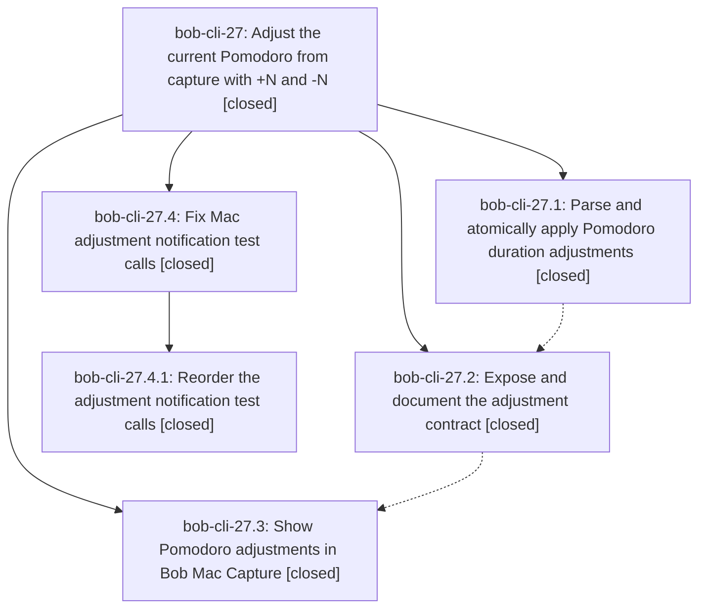

# Bead: bob-cli-27 — Adjust the current Pomodoro from capture with +N and -N

[Bead Pages](../README.md) / bob-cli-27

**Status:** ✓ closed · **Resolution:** done · **Type:** ▸ plan · **Tier:** epic
**Owner:** `bryanbugyi34@gmail.com` · **Created by:** [bbugyi200.apollo.21](https://github.com/bobs-org/bob-cli--agents/blob/main/sessions/bbugyi200.apollo.21.md) · **Assignee:** `bob-cli-27.land`
**Created:** 2026-09-26 19:06:51 EDT · **Closed:** 2026-09-26 20:23:27 EDT
**Plan:** [202609/adjust\_pomodoro\_duration.md](https://github.com/bobs-org/bob-cli--plans/blob/main/202609/adjust_pomodoro_duration.md)

## Description

Whole-item +N and -N captures adjust the current Pomodoro reliably in Bob CLI and Bob Mac Capture, with accurate previews and atomic bulk behavior.

## Notes

[2026-09-27T00:02:30Z · bob-cli-27.land] Landing paused for a child epic. CLI phases match the plan: commits 5ce5039 (bob-cli-27.1) and 13a212a (bob-cli-27.2); no non-epic commits landed on bob-cli after 2026-09-26 23:06Z. Mac phase commit 3c9fe83 is on bob-mac-capture master, but macOS CI run 36280594092 fails to compile NotificationServiceTests because the two new capture() calls pass relativeTarget before target. PROPOSED FOLLOW-UP from bob-cli-27.1 (cargo fmt --check) is the existing bob-cli-24 defect and was corroborated with +1. No --epic-symbol entries on bob-cli-27.

[2026-09-27T00:23:27Z · bob-cli-27.4.land] Rechecked all descendants and notes: phases 27.1/27.2 implement and document exact +N/-N parsing, staged atomic adjustment, JSON/editor contracts and tests (CLI commits 5ce5039, 13a212a); phase 27.3 supplies Mac decoding, preview, panel, accessibility and notification behavior (3c9fe83); child 27.4 fixed the Mac test compile and mixed-preview assertion (07cf3cb, 1856699). Mac CI 36281769085 at 1856699 passed 525 tests and full workflow. CLI just test and just lint pass; just check and symvision recipes are unavailable in this checkout. No unrelated CLI/Mac commits landed after parent epic started; no integration changes were needed. Both linked plans validate with zero warnings, all descendants are closed, no parent epic-symbol entries or blocked issues remain. Proposed rustfmt follow-up from 27.1 was already corroborated on existing task bob-cli-24 (+1), not duplicated here. Repository-wide plan-link/doctor errors concern older unrelated plans/beads, not these linked plans.

## Phases

| Bead | Title | Status | Size | Created | Agents | Commits |
|---|---|---|---|---|---:|---:|
| [bob-cli-27.1](bob-cli-27.1.md) | Parse and atomically apply Pomodoro duration adjustments | ✓ closed | medium | 2026-09-26 | 1 | 1 |
| [bob-cli-27.2](bob-cli-27.2.md) | Expose and document the adjustment contract | ✓ closed | medium | 2026-09-26 | 1 | 1 |
| [bob-cli-27.3](bob-cli-27.3.md) | Show Pomodoro adjustments in Bob Mac Capture | ✓ closed | medium | 2026-09-26 | 1 | 0 |

## Lineage

## Agents

| Agent | Bead | Commits |
|---|---|---:|
| [bbugyi200.apollo.bob-cli-27.1](https://github.com/bobs-org/bob-cli--agents/blob/main/agents/bbugyi200.apollo.bob-cli-27.1/README.md) | [bob-cli-27.1](bob-cli-27.1.md) | 1 |
| [bbugyi200.apollo.bob-cli-27.2](https://github.com/bobs-org/bob-cli--agents/blob/main/agents/bbugyi200.apollo.bob-cli-27.2/README.md) | [bob-cli-27.2](bob-cli-27.2.md) | 1 |
| [bbugyi200.apollo.bob-cli-27.3](https://github.com/bobs-org/bob-cli--agents/blob/main/agents/bbugyi200.apollo.bob-cli-27.3/README.md) | [bob-cli-27.3](bob-cli-27.3.md) | 0 |
| [bbugyi200.apollo.bob-cli-27.4.1](https://github.com/bobs-org/bob-cli--agents/blob/main/agents/bbugyi200.apollo.bob-cli-27.4.1/README.md) | [bob-cli-27.4.1](bob-cli-27.4.1.md) | 0 |
| [bbugyi200.apollo.bob-cli-27.4.land](https://github.com/bobs-org/bob-cli--agents/blob/main/agents/bbugyi200.apollo.bob-cli-27.4.land/README.md) | [bob-cli-27.4](bob-cli-27.4.md) | 1 |
| [bbugyi200.apollo.bob-cli-27.land](https://github.com/bobs-org/bob-cli--agents/blob/main/sessions/bbugyi200.apollo.bob-cli-27.land.md) | [bob-cli-27](README.md) | 0 |

## Commits

| Repo | Commit | Subject | Bead | Committed |
|---|---|---|---|---|
| bob-cli | [`5ce5039`](https://github.com/bobs-org/bob-cli/commit/5ce5039aa68199b3a2da8f3bbcee7ac035c0d376) | feat(capture): parse and atomically apply Pomodoro duration adjustments | [bob-cli-27.1](bob-cli-27.1.md) | 2026-09-26 19:22:51 EDT |
| bob-cli | [`13a212a`](https://github.com/bobs-org/bob-cli/commit/13a212a1a9faa4a550baa1cd90c1c62a863c4013) | feat(capture): expose and document Pomodoro adjustment contract | [bob-cli-27.2](bob-cli-27.2.md) | 2026-09-26 19:36:47 EDT |
| bob-cli--plans | [`bob-cli--plans@c5ba4c0`](https://github.com/bobs-org/bob-cli--plans/commit/c5ba4c0e98ef1d1b04ef7061035b3b6d81fc0bbd) | docs(plans): mark Pomodoro adjustment epics done | [bob-cli-27.4](bob-cli-27.4.md) | 2026-09-26 20:24:39 EDT |
