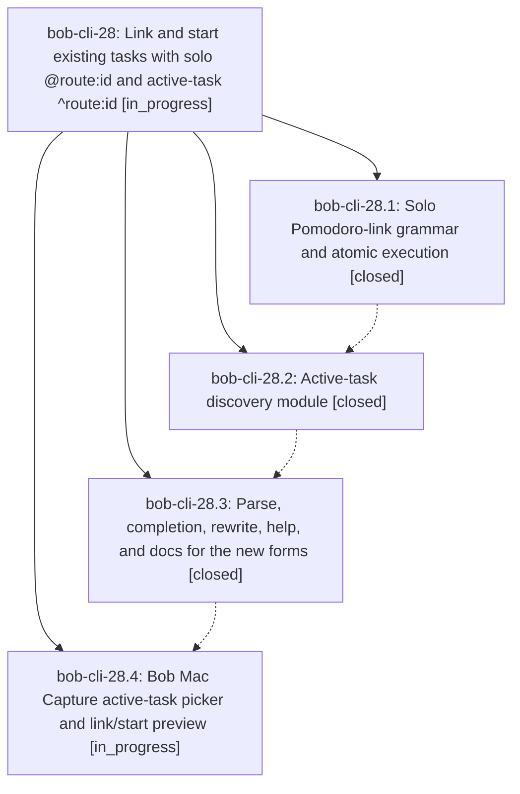

# Bead: bob-cli-28 — Link and start existing tasks with solo @route:id and active-task ^route:id

[Bead Pages](../README.md) / bob-cli-28

**Status:** ◐ in_progress · **Type:** ▸ plan · **Tier:** epic
**Owner:** `bryanbugyi34@gmail.com` · **Created by:** [bbugyi200.athena.0t3](https://github.com/bobs-org/bob-cli--agents/blob/main/sessions/bbugyi200.athena.0t3.md) · **Assignee:** `bob-cli-28.land`
**Created:** 2026-09-27 10:38:08 EDT
**Plan:** [202609/active\_task\_link.md](https://github.com/bobs-org/bob-cli--plans/blob/main/202609/active_task_link.md)

## Description

A capture item that is only `@route:block-id[#pomodoro][=<X>]` or `^route:block-id[#pomodoro][=<X>]` links an existing task into today's Pomodoro ledger (and optionally starts that session) atomically, and typing `^` in Bob CLI completion and Bob Mac Capture offers only In Progress and Next tasks, inserting the full `route:block-id` in one accept.

## Phases

| Bead | Title | Status | Size | Created | Agents | Commits |
|---|---|---|---|---|---:|---:|
| [bob-cli-28.1](bob-cli-28.1.md) | Solo Pomodoro-link grammar and atomic execution | ✓ closed | medium | 2026-09-27 | 1 | 1 |
| [bob-cli-28.2](bob-cli-28.2.md) | Active-task discovery module | ✓ closed | small | 2026-09-27 | 1 | 1 |
| [bob-cli-28.3](bob-cli-28.3.md) | Parse, completion, rewrite, help, and docs for the new forms | ✓ closed | medium | 2026-09-27 | 1 | 1 |
| [bob-cli-28.4](bob-cli-28.4.md) | Bob Mac Capture active-task picker and link/start preview | ◐ in_progress | medium | 2026-09-27 | 1 | 0 |

## Lineage

## Agents

| Agent | Bead | Commits |
|---|---|---:|
| [bbugyi200.athena.bob-cli-28.1](https://github.com/bobs-org/bob-cli--agents/blob/main/agents/bbugyi200.athena.bob-cli-28.1/README.md) | [bob-cli-28.1](bob-cli-28.1.md) | 1 |
| [bbugyi200.athena.bob-cli-28.2](https://github.com/bobs-org/bob-cli--agents/blob/main/agents/bbugyi200.athena.bob-cli-28.2/README.md) | [bob-cli-28.2](bob-cli-28.2.md) | 1 |
| [bbugyi200.athena.bob-cli-28.3](https://github.com/bobs-org/bob-cli--agents/blob/main/agents/bbugyi200.athena.bob-cli-28.3/README.md) | [bob-cli-28.3](bob-cli-28.3.md) | 1 |
| [bbugyi200.athena.bob-cli-28.4](https://github.com/bobs-org/bob-cli--agents/blob/main/agents/bbugyi200.athena.bob-cli-28.4/README.md) | [bob-cli-28.4](bob-cli-28.4.md) | 0 |
| [bbugyi200.athena.bob-cli-28.land](https://github.com/bobs-org/bob-cli--agents/blob/main/agents/bbugyi200.athena.bob-cli-28.land/README.md) | [bob-cli-28](README.md) | 0 |

## Commits

| Repo | Commit | Subject | Bead | Committed |
|---|---|---|---|---|
| bob-cli | [`22abed4`](https://github.com/bobs-org/bob-cli/commit/22abed47e7e882182f8b544333cf45a3a43d5da9) | feat(capture): solo Pomodoro-link grammar and atomic execution | [bob-cli-28.1](bob-cli-28.1.md) | 2026-09-27 11:17:29 EDT |
| bob-cli | [`a75c176`](https://github.com/bobs-org/bob-cli/commit/a75c17601ff776add39b3b1769c4814249bf2319) | feat(capture): add active-task discovery module | [bob-cli-28.2](bob-cli-28.2.md) | 2026-09-27 11:37:32 EDT |
| bob-cli | [`a819093`](https://github.com/bobs-org/bob-cli/commit/a81909326b42061370d27c1ec9ded5221866f93c) | feat(capture): solo pomodoro links for existing tasks | [bob-cli-28.3](bob-cli-28.3.md) | 2026-09-27 12:20:55 EDT |
