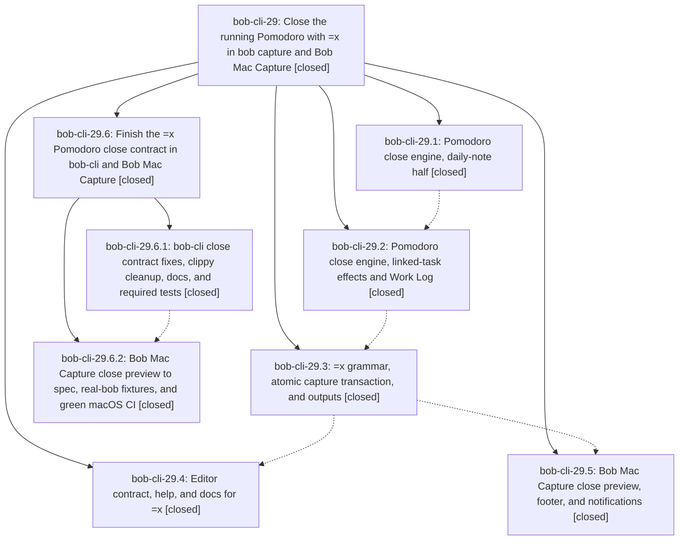

# Bead: bob-cli-29 — Close the running Pomodoro with =x in bob capture and Bob Mac Capture

[Bead Pages](../README.md) / bob-cli-29

**Status:** ✓ closed · **Resolution:** done · **Type:** ▸ plan · **Tier:** epic
**Owner:** `bryanbugyi34@gmail.com` · **Created by:** [bbugyi200.apollo.2i](https://github.com/bobs-org/bob-cli--agents/blob/main/sessions/bbugyi200.apollo.2i.md) · **Assignee:** `bob-cli-29.land`
**Created:** 2026-09-28 06:24:49 EDT · **Closed:** 2026-09-28 10:19:40 EDT
**Plan:** [202609/capture\_pomodoro\_close.md](https://github.com/bobs-org/bob-cli--plans/blob/main/202609/capture_pomodoro_close.md)

## Description

A capture item `=x` closes today's running Pomodoro exactly the way Obsidian's Pomodoro completion does, and also shortens a session stopped early. The forms `@route:block-id=x`, `^route:block-id=x`, and `<text> @route:block-id=x` first put that task into the running session. Every close is atomic. A missing, ambiguous, or malformed target gives an actionable diagnostic. Bob Mac Capture shows a rich, accurate preview of the session about to close.

## Notes

[2026-09-28T12:59:05Z · bob-cli-29.land] LAND AUDIT (before child plan), master 24ba977 + bob-mac-capture 4351e1c:
- Read all 5 closed phases, their notes, the plan and the epic commits 6b22585/25b2bf1/1f640e1/24ba977 (bob-cli) and 4351e1c (bob-mac-capture).
- cargo fmt --check is clean and cargo test is green (967 lib + 495 cli + 27 + 31 + 1). The TAB worked example produces a daily note, bob.md and sase.md byte-identical to the plan. Grammar, editor contract, rows and atomicity are largely correct.
- REMAINING EPIC WORK, bob-cli:
  (a) With a relative -b, the close skips every task effect: SnapshotCloseVault joins bob_dir twice.
  (b) pomodoro_close.raw is 'x' on link and body forms.
  (c) tasks[].carried is true for struck and other non-carried rows, because write_logs registers them with carried=true.
  (d) Link-form diagnostics drop 'next up', use the old missing-day-file and missing-section text, give post-link multiple-entry line numbers, and a wrong body-form hint.
  (e) The human header names the route note instead of the day file on link forms. Task rows print a duplicated 'note ^id · note · ^id' locator.
  (f) Link forms change placement to 'closed'. Null fields are omitted instead of emitted as null. Embedded and subtask text keeps the '#task ' prefix.
  (g) 12 new clippy warnings in epic code, including dead code VaultLinkResolver::root.
  (h) docs/capture.md is missing its Contents entry and the worked example.
  (i) Many tests the plan required are missing: a TAB byte-for-byte fixture, file post-images for the rows, diagnostics, transitions, task-note CRLF, dry-run JSON equality, and CLI protocol tests for capture-parse/complete/rewrite.
- REMAINING EPIC WORK, bob-mac-capture: the macOS CI run 36423095861 on 4351e1c FAILED. testRealBobWorkedCloseFixture... asserts a 'Work Log · ' prefix that notificationBody never emits. The presentation, card, palette mapping, notifications (the 'Close' label and batch suffix), failed-dry-run stale-card clearing, re-presentation refresh, fixtures (=, no-running, moved, diagnostic, -2/=x batch) and tests fall well short of the plan's mac-close-preview spec.
- DECLINED: the plan's 'created: false' for =x. The existing schema emits a date string for every kind, +N included, and Swift decodes it as a string, so the landed value is kept deliberately.
- INTEGRATION: no bob-cli commits since the epic started other than its own. bob-plugins has no commits since then. The one unrelated bob-mac-capture commit, 395545c (bob-cli-1u process signals), needs no integration.
- FOLLOW-UP TRIAGE:
  - bob-cli-29.1/.2/.3 PROPOSED FOLLOW-UP 'clippy fails at tests/cli.rs:30684 || true': caused by active epic bob-cli-28 (22abed4, bob-cli-28.1). Its land agent already scoped the fix into its closeout child plan, so I recorded a DISCOVERED ISSUE corroboration on bob-cli-28 and created no task. It is not a duplicate of bob-cli-v, which covers warnings only.
  - bob-cli-29.5 PROPOSED FOLLOW-UP 'run format-lint/build/test on macOS CI': caused by this epic, so it is absorbed into the child plan's mac phase rather than filed as a task.
- sase bead epic-symbols bob-cli-29: none.

[2026-09-28T14:19:40Z · bob-cli-29.6.land] Rechecked prior land audit, all five phase scopes/notes, child epic bob-cli-29.6 and both child phase notes, and both linked plans. Child 29.6 closed every remaining contract, test, docs, clippy-on-epic-lines, and Mac presentation/CI gap from the prior audit. bob-cli commits 6b22585/25b2bf1/1f640e1/24ba977/ec31329 and Mac commits 4351e1c/aa4e156/67e1498 match source and tests; no later unrelated commits need integration. cargo fmt --check and cargo test --quiet pass (967+498+27+31+1); macOS CI 36433589389 succeeded on 67e1498. The sole clippy error is the preexisting bob-cli-28 || true assertion, already triaged on bob-cli-28; older warnings are outside this epic. Parent proposals were resolved in prior land note: bob-cli-29.1/.2/.3 clippy report attached to bob-cli-28, and bob-cli-29.5 Mac CI request completed by child 29.6.2, so no new task is warranted. Descendants are all closed, both plan files validate with zero warnings, and epic-symbols has no entries. Global plan-link validation only reports older 202607 prompt archive errors, unrelated to these plans; just check and just symvision recipes are absent.

## Phases

| Bead | Title | Status | Size | Created | Agents | Commits |
|---|---|---|---|---|---:|---:|
| [bob-cli-29.1](bob-cli-29.1.md) | Pomodoro close engine, daily-note half | ✓ closed | medium | 2026-09-28 | 1 | 1 |
| [bob-cli-29.2](bob-cli-29.2.md) | Pomodoro close engine, linked-task effects and Work Log | ✓ closed | medium | 2026-09-28 | 1 | 1 |
| [bob-cli-29.3](bob-cli-29.3.md) | =x grammar, atomic capture transaction, and outputs | ✓ closed | medium | 2026-09-28 | 1 | 1 |
| [bob-cli-29.4](bob-cli-29.4.md) | Editor contract, help, and docs for =x | ✓ closed | medium | 2026-09-28 | 1 | 1 |
| [bob-cli-29.5](bob-cli-29.5.md) | Bob Mac Capture close preview, footer, and notifications | ✓ closed | medium | 2026-09-28 | 1 | 0 |

## Lineage

## Agents

| Agent | Bead | Commits |
|---|---|---:|
| [bbugyi200.apollo.bob-cli-29.1](https://github.com/bobs-org/bob-cli--agents/blob/main/agents/bbugyi200.apollo.bob-cli-29.1/README.md) | [bob-cli-29.1](bob-cli-29.1.md) | 1 |
| [bbugyi200.apollo.bob-cli-29.2](https://github.com/bobs-org/bob-cli--agents/blob/main/sessions/bbugyi200.apollo.bob-cli-29.2.md) | [bob-cli-29.2](bob-cli-29.2.md) | 1 |
| [bbugyi200.apollo.bob-cli-29.3](https://github.com/bobs-org/bob-cli--agents/blob/main/agents/bbugyi200.apollo.bob-cli-29.3/README.md) | [bob-cli-29.3](bob-cli-29.3.md) | 1 |
| [bbugyi200.apollo.bob-cli-29.4](https://github.com/bobs-org/bob-cli--agents/blob/main/agents/bbugyi200.apollo.bob-cli-29.4/README.md) | [bob-cli-29.4](bob-cli-29.4.md) | 1 |
| [bbugyi200.apollo.bob-cli-29.5](https://github.com/bobs-org/bob-cli--agents/blob/main/agents/bbugyi200.apollo.bob-cli-29.5/README.md) | [bob-cli-29.5](bob-cli-29.5.md) | 0 |
| [bbugyi200.apollo.bob-cli-29.6.1](https://github.com/bobs-org/bob-cli--agents/blob/main/agents/bbugyi200.apollo.bob-cli-29.6.1/README.md) | [bob-cli-29.6.1](bob-cli-29.6.1.md) | 1 |
| [bbugyi200.apollo.bob-cli-29.6.2](https://github.com/bobs-org/bob-cli--agents/blob/main/agents/bbugyi200.apollo.bob-cli-29.6.2/README.md) | [bob-cli-29.6.2](bob-cli-29.6.2.md) | 0 |
| [bbugyi200.apollo.bob-cli-29.6.land](https://github.com/bobs-org/bob-cli--agents/blob/main/agents/bbugyi200.apollo.bob-cli-29.6.land/README.md) | [bob-cli-29.6](bob-cli-29.6.md) | 1 |
| [bbugyi200.apollo.bob-cli-29.land](https://github.com/bobs-org/bob-cli--agents/blob/main/sessions/bbugyi200.apollo.bob-cli-29.land.md) | [bob-cli-29](README.md) | 0 |

## Commits

| Repo | Commit | Subject | Bead | Committed |
|---|---|---|---|---|
| bob-cli | [`6b22585`](https://github.com/bobs-org/bob-cli/commit/6b225852b657e1ad72c425a2b4c88df3d07d7c8e) | feat(capture): add pure Pomodoro close-ledger planner | [bob-cli-29.1](bob-cli-29.1.md) | 2026-09-28 06:51:29 EDT |
| bob-cli | [`25b2bf1`](https://github.com/bobs-org/bob-cli/commit/25b2bf16cba0fd3c21df120a835f771f63f2c71f) | feat(capture): add Pomodoro linked task close effects | [bob-cli-29.2](bob-cli-29.2.md) | 2026-09-28 07:33:44 EDT |
| bob-cli | [`1f640e1`](https://github.com/bobs-org/bob-cli/commit/1f640e13f2e6cef55f06b641f2aebe92bc2412ae) | feat(capture): close running Pomodoro with =x grammar and atomic transaction | [bob-cli-29.3](bob-cli-29.3.md) | 2026-09-28 08:09:11 EDT |
| bob-cli | [`24ba977`](https://github.com/bobs-org/bob-cli/commit/24ba977d2d1198019e2af3543e6375ae2357cba2) | feat(capture): expose and document Pomodoro close editor contract | [bob-cli-29.4](bob-cli-29.4.md) | 2026-09-28 08:30:54 EDT |
| bob-cli | [`ec31329`](https://github.com/bobs-org/bob-cli/commit/ec3132963f89f15aef1344f3bbef954793325c06) | fix(capture): close-contract fixes for =x Pomodoro close, clippy cleanup, docs, and required tests | [bob-cli-29.6.1](bob-cli-29.6.1.md) | 2026-09-28 09:40:15 EDT |
| bob-cli--plans | [`bob-cli--plans@d5f9dd0`](https://github.com/bobs-org/bob-cli--plans/commit/d5f9dd094181919e279f40589d147d1c36163b52) | docs(plan): mark Pomodoro close epics done | [bob-cli-29.6](bob-cli-29.6.md) | 2026-09-28 10:20:42 EDT |
