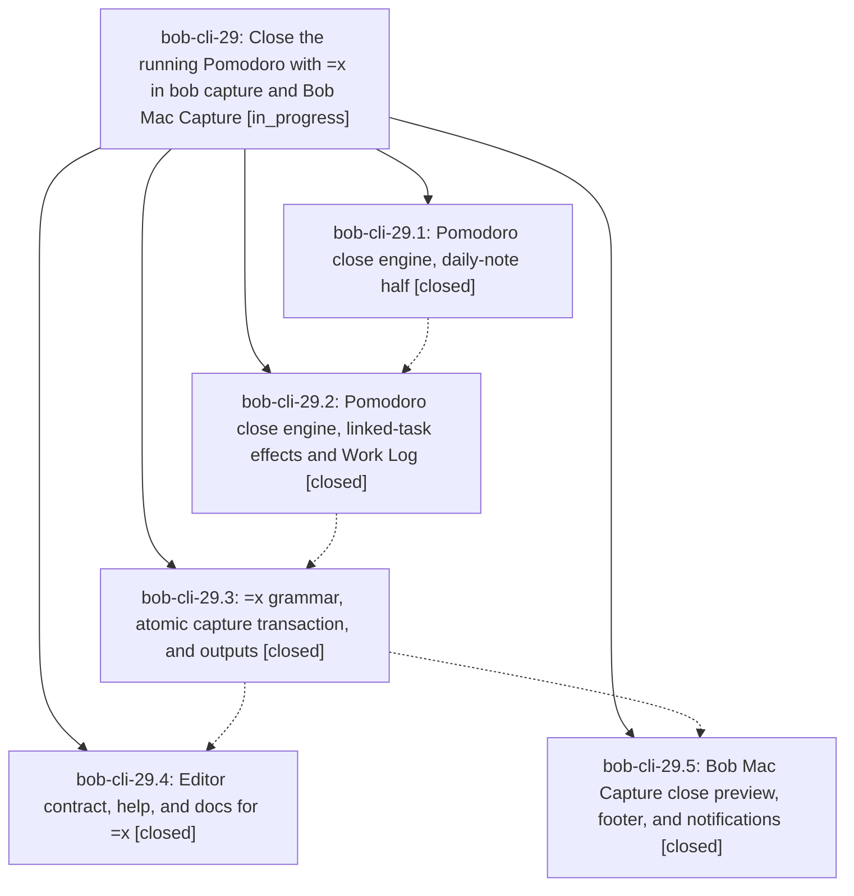

# Bead: bob-cli-29 — Close the running Pomodoro with =x in bob capture and Bob Mac Capture

[Bead Pages](../README.md) / bob-cli-29

**Status:** ◐ in_progress · **Type:** ▸ plan · **Tier:** epic
**Owner:** `bryanbugyi34@gmail.com` · **Created by:** [bbugyi200.apollo.2i](https://github.com/bobs-org/bob-cli--agents/blob/main/sessions/bbugyi200.apollo.2i.md) · **Assignee:** `bob-cli-29.land`
**Created:** 2026-09-28 06:24:49 EDT
**Plan:** [202609/capture\_pomodoro\_close.md](https://github.com/bobs-org/bob-cli--plans/blob/main/202609/capture_pomodoro_close.md)

## Description

A capture item `=x` closes today's running Pomodoro exactly the way Obsidian's Pomodoro completion does, and also shortens a session stopped early. The forms `@route:block-id=x`, `^route:block-id=x`, and `<text> @route:block-id=x` first put that task into the running session. Every close is atomic. A missing, ambiguous, or malformed target gives an actionable diagnostic. Bob Mac Capture shows a rich, accurate preview of the session about to close.

## Phases

| Bead | Title | Status | Size | Created | Agents | Commits |
|---|---|---|---|---|---:|---:|
| [bob-cli-29.1](bob-cli-29.1.md) | Pomodoro close engine, daily-note half | ✓ closed | medium | 2026-09-28 | 1 | 1 |
| [bob-cli-29.2](bob-cli-29.2.md) | Pomodoro close engine, linked-task effects and Work Log | ✓ closed | medium | 2026-09-28 | 1 | 1 |
| [bob-cli-29.3](bob-cli-29.3.md) | =x grammar, atomic capture transaction, and outputs | ✓ closed | medium | 2026-09-28 | 1 | 1 |
| [bob-cli-29.4](bob-cli-29.4.md) | Editor contract, help, and docs for =x | ✓ closed | medium | 2026-09-28 | 1 | 0 |
| [bob-cli-29.5](bob-cli-29.5.md) | Bob Mac Capture close preview, footer, and notifications | ✓ closed | medium | 2026-09-28 | 1 | 0 |

## Lineage

## Agents

| Agent | Bead | Commits |
|---|---|---:|
| [bbugyi200.apollo.bob-cli-29.1](https://github.com/bobs-org/bob-cli--agents/blob/main/agents/bbugyi200.apollo.bob-cli-29.1/README.md) | [bob-cli-29.1](bob-cli-29.1.md) | 1 |
| [bbugyi200.apollo.bob-cli-29.2](https://github.com/bobs-org/bob-cli--agents/blob/main/sessions/bbugyi200.apollo.bob-cli-29.2.md) | [bob-cli-29.2](bob-cli-29.2.md) | 1 |
| [bbugyi200.apollo.bob-cli-29.3](https://github.com/bobs-org/bob-cli--agents/blob/main/agents/bbugyi200.apollo.bob-cli-29.3/README.md) | [bob-cli-29.3](bob-cli-29.3.md) | 1 |
| [bbugyi200.apollo.bob-cli-29.4](https://github.com/bobs-org/bob-cli--agents/blob/main/agents/bbugyi200.apollo.bob-cli-29.4/README.md) | [bob-cli-29.4](bob-cli-29.4.md) | 0 |
| [bbugyi200.apollo.bob-cli-29.5](https://github.com/bobs-org/bob-cli--agents/blob/main/agents/bbugyi200.apollo.bob-cli-29.5/README.md) | [bob-cli-29.5](bob-cli-29.5.md) | 0 |
| [bbugyi200.apollo.bob-cli-29.land](https://github.com/bobs-org/bob-cli--agents/blob/main/agents/bbugyi200.apollo.bob-cli-29.land/README.md) | [bob-cli-29](README.md) | 0 |

## Commits

| Repo | Commit | Subject | Bead | Committed |
|---|---|---|---|---|
| bob-cli | [`6b22585`](https://github.com/bobs-org/bob-cli/commit/6b225852b657e1ad72c425a2b4c88df3d07d7c8e) | feat(capture): add pure Pomodoro close-ledger planner | [bob-cli-29.1](bob-cli-29.1.md) | 2026-09-28 06:51:29 EDT |
| bob-cli | [`25b2bf1`](https://github.com/bobs-org/bob-cli/commit/25b2bf16cba0fd3c21df120a835f771f63f2c71f) | feat(capture): add Pomodoro linked task close effects | [bob-cli-29.2](bob-cli-29.2.md) | 2026-09-28 07:33:44 EDT |
| bob-cli | [`1f640e1`](https://github.com/bobs-org/bob-cli/commit/1f640e13f2e6cef55f06b641f2aebe92bc2412ae) | feat(capture): close running Pomodoro with =x grammar and atomic transaction | [bob-cli-29.3](bob-cli-29.3.md) | 2026-09-28 08:09:11 EDT |
