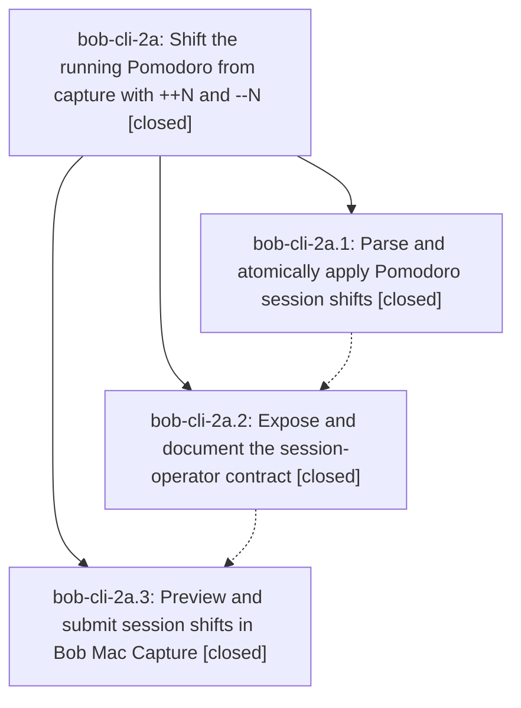

# Bead: bob-cli-2a — Shift the running Pomodoro from capture with ++N and --N

[Bead Pages](../README.md) / bob-cli-2a

**Status:** ✓ closed · **Resolution:** done · **Type:** ▸ plan · **Tier:** epic
**Owner:** `bryanbugyi34@gmail.com` · **Created by:** [bbugyi200.apollo.2k](https://github.com/bobs-org/bob-cli--agents/blob/main/sessions/bbugyi200.apollo.2k.md) · **Assignee:** `bob-cli-2a.land`
**Created:** 2026-09-28 10:35:57 EDT · **Closed:** 2026-09-28 12:01:34 EDT
**Plan:** [202609/pomodoro\_shift\_operators.md](https://github.com/bobs-org/bob-cli--plans/blob/main/202609/pomodoro_shift_operators.md)

## Description

A whole capture item `++[N]` / `--[N]` moves today's running Pomodoro N five-minute units later / earlier exactly like Obsidian's `N\o` / `N\O`, every Pomodoro session operator's count is optional and defaults to 1 (so `+`, `-`, `++`, and `--` all work), and Bob CLI and Bob Mac Capture preview and apply these operators with identical, atomic results.

## Notes

[2026-09-28T15:58:29Z · bob-cli-2a.land] FOLLOW-UP TRIAGE (before the remaining-work tale): bob-cli-2a.1 and bob-cli-2a.2 both proposed the pre-existing clippy deny overly_complex_bool_expr on `|| true` in tests/cli.rs (line 31815 on master 0dfbc55). Same defect, and it is not caused by this epic. Declined as a new task: no task bead matches overly_complex_bool_expr or `|| true`; last-week task sweep was empty; bob-cli-v is warnings-only and is not this deny. The assertion was introduced by in-progress epic bob-cli-28 (22abed4, phase bob-cli-28.1). That epic already records it as remaining closeout work (note #1) and as a DISCOVERED ISSUE (note #3, from bob-cli-29.land). Appended a corroborating DISCOVERED ISSUE on bob-cli-28 with the current line. bob-cli-2a.3 proposed no follow-ups. This epic had no notes of its own.

[2026-09-28T16:01:34Z · bob-cli-2a.land] Verified bob-cli-2a against phases 2a.1, 2a.2, and 2a.3, plan plan:202609/pomodoro_shift_operators.md, and the source.

CLI commits fe2c0b8 (bob-cli-2a.1) and 0dfbc55 (bob-cli-2a.2): session-operator lexer (one sign resizes, two signs shift, omitted count is 1), PomodoroShift kind, staged planner translates both endpoints with Euclidean mod 1440 and keeps duration, matching bob-plugins offsetPomodoroLineRange. JSON pomodoro_shift, human shifted/would-shift output, capture-parse mode/span/spec and invalid_pomodoro_shift, @@/completion/rewrite skip operators, and help text are in place. CLI tests cover JSON, bare defaults, both midnight wraps, metadata/CRLF/children, stopwatch and range-span fallbacks, the canonical ++3 line, ordered batches, dry-run rollback, errors, prose non-matches, and the --3/-/--1 argv spellings. The land agent re-ran `cargo test --test cli shift` on 0dfbc55: 10 passed, 0 failed.

Mac commit 794f06a on bob-mac-capture (bob-cli-2a.3): tolerant shift decode, double-chevron presentation, Shift and Adjust footer titles, notification and palette mapping, smart dashes disabled with the Tab em-dash note, and real-bob fixtures. GitHub Actions run 36444782814 succeeded on that SHA.

Integration: after fe2c0b8 the only non-epic bob-cli commits are b4b51ea and f17339d (bob-cli-2b randomize). They do not touch capture operator files. No bob-mac-capture commit other than 794f06a landed after the epic started. No integration edit was required.

Docs: replaced the shift example's bare `bob capture --` with `bob capture --1`, because a bare `--` submits no text.

Follow-ups: bob-cli-2a.1 and bob-cli-2a.2 proposed the pre-existing tests/cli.rs `|| true` clippy deny (line 31815 on 0dfbc55). Not caused by this epic. No task bead matches it. bob-cli-v covers warnings only. It belongs to in-progress bob-cli-28 (22abed4); corroborated with a DISCOVERED ISSUE on that epic. bob-cli-2a.3 proposed nothing. No parent bead. epic-symbols: none.

[2026-09-28T16:01:47Z · bob-cli-2a.land] just symvision: recipe absent in this checkout's justfile, so no symvision run was possible.

## Phases

| Bead | Title | Status | Size | Created | Agents | Commits |
|---|---|---|---|---|---:|---:|
| [bob-cli-2a.1](bob-cli-2a.1.md) | Parse and atomically apply Pomodoro session shifts | ✓ closed | medium | 2026-09-28 | 1 | 1 |
| [bob-cli-2a.2](bob-cli-2a.2.md) | Expose and document the session-operator contract | ✓ closed | medium | 2026-09-28 | 1 | 1 |
| [bob-cli-2a.3](bob-cli-2a.3.md) | Preview and submit session shifts in Bob Mac Capture | ✓ closed | medium | 2026-09-28 | 1 | 0 |

## Lineage

## Agents

| Agent | Bead | Commits |
|---|---|---:|
| [bbugyi200.apollo.bob-cli-2a.1](https://github.com/bobs-org/bob-cli--agents/blob/main/agents/bbugyi200.apollo.bob-cli-2a.1/README.md) | [bob-cli-2a.1](bob-cli-2a.1.md) | 1 |
| [bbugyi200.apollo.bob-cli-2a.2](https://github.com/bobs-org/bob-cli--agents/blob/main/agents/bbugyi200.apollo.bob-cli-2a.2/README.md) | [bob-cli-2a.2](bob-cli-2a.2.md) | 1 |
| [bbugyi200.apollo.bob-cli-2a.3](https://github.com/bobs-org/bob-cli--agents/blob/main/agents/bbugyi200.apollo.bob-cli-2a.3/README.md) | [bob-cli-2a.3](bob-cli-2a.3.md) | 0 |
| [bbugyi200.apollo.bob-cli-2a.land](https://github.com/bobs-org/bob-cli--agents/blob/main/sessions/bbugyi200.apollo.bob-cli-2a.land.md) | [bob-cli-2a](README.md) | 2 |

## Commits

| Repo | Commit | Subject | Bead | Committed |
|---|---|---|---|---|
| bob-cli | [`fe2c0b8`](https://github.com/bobs-org/bob-cli/commit/fe2c0b81d29eb38ef92d8a3824980ae65738733b) | feat(capture): add pomodoro shift operator with staged planner | [bob-cli-2a.1](bob-cli-2a.1.md) | 2026-09-28 11:00:22 EDT |
| bob-cli | [`0dfbc55`](https://github.com/bobs-org/bob-cli/commit/0dfbc55dad5a21faeb988e6d180fa007d312ddea) | feat(capture): expose and document the Pomodoro shift editor contract | [bob-cli-2a.2](bob-cli-2a.2.md) | 2026-09-28 11:19:35 EDT |
| bob-cli | [`b10b45e`](https://github.com/bobs-org/bob-cli/commit/b10b45ec8eb91e66d2d121d7a10f688bc6fb0954) | docs(capture): fix shift example bare -- to --1 | [bob-cli-2a](README.md) | 2026-09-28 12:03:36 EDT |
| bob-cli--plans | [`bob-cli--plans@3b797f1`](https://github.com/bobs-org/bob-cli--plans/commit/3b797f1128943a2901f15e81d90db541f4abd6c8) | chore(plans): mark pomodoro\_shift\_operators done | [bob-cli-2a](README.md) | 2026-09-28 12:04:02 EDT |
