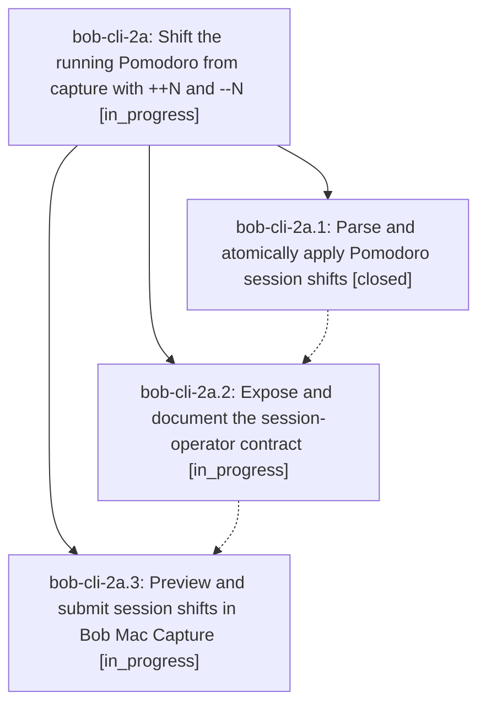

# Bead: bob-cli-2a — Shift the running Pomodoro from capture with ++N and --N

[Bead Pages](../README.md) / bob-cli-2a

**Status:** ◐ in_progress · **Type:** ▸ plan · **Tier:** epic
**Owner:** `bryanbugyi34@gmail.com` · **Created by:** [bbugyi200.apollo.2k](https://github.com/bobs-org/bob-cli--agents/blob/main/sessions/bbugyi200.apollo.2k.md) · **Assignee:** `bob-cli-2a.land`
**Created:** 2026-09-28 10:35:57 EDT
**Plan:** [202609/pomodoro\_shift\_operators.md](https://github.com/bobs-org/bob-cli--plans/blob/main/202609/pomodoro_shift_operators.md)

## Description

A whole capture item `++[N]` / `--[N]` moves today's running Pomodoro N five-minute units later / earlier exactly like Obsidian's `N\o` / `N\O`, every Pomodoro session operator's count is optional and defaults to 1 (so `+`, `-`, `++`, and `--` all work), and Bob CLI and Bob Mac Capture preview and apply these operators with identical, atomic results.

## Phases

| Bead | Title | Status | Size | Created | Agents | Commits |
|---|---|---|---|---|---:|---:|
| [bob-cli-2a.1](bob-cli-2a.1.md) | Parse and atomically apply Pomodoro session shifts | ✓ closed | medium | 2026-09-28 | 1 | 1 |
| [bob-cli-2a.2](bob-cli-2a.2.md) | Expose and document the session-operator contract | ◐ in_progress | medium | 2026-09-28 | 1 | 0 |
| [bob-cli-2a.3](bob-cli-2a.3.md) | Preview and submit session shifts in Bob Mac Capture | ◐ in_progress | medium | 2026-09-28 | 1 | 0 |

## Lineage

## Agents

| Agent | Bead | Commits |
|---|---|---:|
| [bbugyi200.apollo.bob-cli-2a.1](https://github.com/bobs-org/bob-cli--agents/blob/main/agents/bbugyi200.apollo.bob-cli-2a.1/README.md) | [bob-cli-2a.1](bob-cli-2a.1.md) | 1 |
| [bbugyi200.apollo.bob-cli-2a.2](https://github.com/bobs-org/bob-cli--agents/blob/main/agents/bbugyi200.apollo.bob-cli-2a.2/README.md) | [bob-cli-2a.2](bob-cli-2a.2.md) | 0 |
| [bbugyi200.apollo.bob-cli-2a.3](https://github.com/bobs-org/bob-cli--agents/blob/main/agents/bbugyi200.apollo.bob-cli-2a.3/README.md) | [bob-cli-2a.3](bob-cli-2a.3.md) | 0 |
| [bbugyi200.apollo.bob-cli-2a.land](https://github.com/bobs-org/bob-cli--agents/blob/main/agents/bbugyi200.apollo.bob-cli-2a.land/README.md) | [bob-cli-2a](README.md) | 0 |

## Commits

| Repo | Commit | Subject | Bead | Committed |
|---|---|---|---|---|
| bob-cli | [`fe2c0b8`](https://github.com/bobs-org/bob-cli/commit/fe2c0b81d29eb38ef92d8a3824980ae65738733b) | feat(capture): add pomodoro shift operator with staged planner | [bob-cli-2a.1](bob-cli-2a.1.md) | 2026-09-28 11:00:22 EDT |
