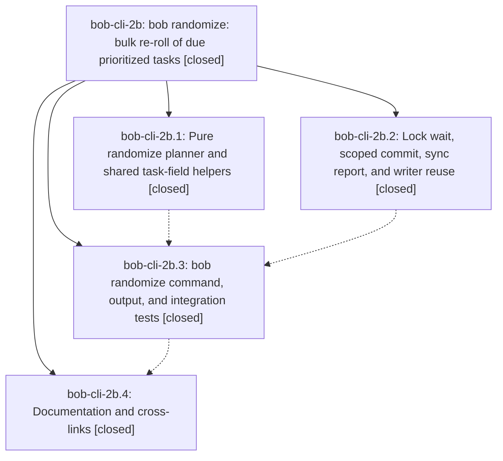

# Bead: bob-cli-2b — bob randomize: bulk re-roll of due prioritized tasks

[Bead Pages](../README.md) / bob-cli-2b

**Status:** ✓ closed · **Resolution:** done · **Type:** ▸ plan · **Tier:** epic
**Owner:** `bryanbugyi34@gmail.com` · **Created by:** [bbugyi200.apollo.2q](https://github.com/bobs-org/bob-cli--agents/blob/main/sessions/bbugyi200.apollo.2q.md) · **Assignee:** `bob-cli-2b.land`
**Created:** 2026-09-28 10:45:18 EDT · **Closed:** 2026-09-28 12:26:56 EDT
**Plan:** [202609/bob\_randomize.md](https://github.com/bobs-org/bob-cli--plans/blob/main/202609/bob_randomize.md)

## Description

`bob randomize` re-rolls every due P1–P4 Obsidian task to its own random date inside that task's configured priority window. Each touched note is written once, with the new date, Blocked status, a 🎲 Schedule Log entry, and status grouping applied together. The result is published as exactly one scoped `bob randomize` commit, taken between two vault-sync cycles under the shared maintenance lock. The command also has a reproducible dry-run preview, polished human output, and a stable JSON contract.

## Notes

[2026-09-28T16:11:03Z · bob-cli-2b.land] FOLLOW-UP TRIAGE: Phase notes bob-cli-2b.1#1, .2#1, .3#1, and .4#1 all propose the same pre-existing tests/cli.rs Clippy deny caused by the || true assertion from commit 22abed4. This is owned by active epic bob-cli-28 and its closeout plan; I corroborated it on bob-cli-28 with a DISCOVERED ISSUE note, so no duplicate task was filed. bob-cli-v covers older nonfatal warnings and is not the same defect. No other PROPOSED FOLLOW-UP entries were found. Remaining bob-cli-2b work discovered during landing: validate --until +N and configured roll dates without signed overflow or panic before closing.

[2026-09-28T16:13:10Z · bob-cli-2b.land] LAND AUDIT (before tale): Read the epic plan, all four closed phase beads and every note, epic commits b4b51ea/f17339d/1e8484b/35c6ba4, randomize planner/CLI/plumbing and integration tests. Interleaved capture commits fe2c0b8/0dfbc55/b10b45e shift or document Pomodoro times and do not change open task-link structure; randomize already uses the shared daily-note scanner. cargo test --test randomize: 14 passed. just check is unavailable (recipe not found); no just symvision recipe is listed. epic-symbols currently empty. Remaining epic defect: unchecked date arithmetic accepts --until +18446744073709551615 (direct dry-run advanced to config failure, exit 1 rather than usage exit 2) and can overflow configured roll dates; validated small tale sase_plan_randomize_date_bounds_land.md covers the fix and the epic closeout. Follow-up triage is in the preceding note; no parent_bead is linked.

[2026-09-28T16:26:56Z · bob-cli-2b.land] Date-bounds land verified: parse_until rejects unrepresentable +N (u64 wrap and i64::MAX, try_days, no panic) with usage exit 2; planner uses checked_add_days (try_days + checked_add_signed) so until+roll and the 35-day horizon either yield a valid date or fail deterministically at stage plan, exit 1, JSON contract intact, no writes. PlanFailure splits hints (range errors carry none; Blocked hint kept for registry). Tests: 2 new planner unit tests (extreme i64::MAX window errors; MAX boundary lands exactly, +1 day errors) + 1 integration test (oversized +N x2 exit 2, +7/9999-12-31 unchanged, extreme window exit 1 plan-stage with note untouched). cargo test --test randomize: 15 passed. lib randomize_plan: 27 passed. cargo fmt --check clean. Integration recheck: no commits newer than the land audit; interleaved fe2c0b8/0dfbc55/b10b45e touch only capture grammar/docs, never randomize/task-link/daily-note scanning. Follow-up triage unchanged: pre-existing tests/cli.rs || true clippy deny owned by bob-cli-28 (clippy --all-targets still red there; no randomize warnings). No parent bead.

## Phases

| Bead | Title | Status | Size | Created | Agents | Commits |
|---|---|---|---|---|---:|---:|
| [bob-cli-2b.1](bob-cli-2b.1.md) | Pure randomize planner and shared task-field helpers | ✓ closed | medium | 2026-09-28 | 1 | 1 |
| [bob-cli-2b.2](bob-cli-2b.2.md) | Lock wait, scoped commit, sync report, and writer reuse | ✓ closed | small | 2026-09-28 | 1 | 1 |
| [bob-cli-2b.3](bob-cli-2b.3.md) | bob randomize command, output, and integration tests | ✓ closed | medium | 2026-09-28 | 1 | 1 |
| [bob-cli-2b.4](bob-cli-2b.4.md) | Documentation and cross-links | ✓ closed | small | 2026-09-28 | 1 | 1 |

## Lineage

## Agents

| Agent | Bead | Commits |
|---|---|---:|
| [bbugyi200.apollo.bob-cli-2b.1](https://github.com/bobs-org/bob-cli--agents/blob/main/agents/bbugyi200.apollo.bob-cli-2b.1/README.md) | [bob-cli-2b.1](bob-cli-2b.1.md) | 1 |
| [bbugyi200.apollo.bob-cli-2b.2](https://github.com/bobs-org/bob-cli--agents/blob/main/agents/bbugyi200.apollo.bob-cli-2b.2/README.md) | [bob-cli-2b.2](bob-cli-2b.2.md) | 1 |
| [bbugyi200.apollo.bob-cli-2b.3](https://github.com/bobs-org/bob-cli--agents/blob/main/agents/bbugyi200.apollo.bob-cli-2b.3/README.md) | [bob-cli-2b.3](bob-cli-2b.3.md) | 1 |
| [bbugyi200.apollo.bob-cli-2b.4](https://github.com/bobs-org/bob-cli--agents/blob/main/agents/bbugyi200.apollo.bob-cli-2b.4/README.md) | [bob-cli-2b.4](bob-cli-2b.4.md) | 1 |
| [bbugyi200.apollo.bob-cli-2b.land](https://github.com/bobs-org/bob-cli--agents/blob/main/sessions/bbugyi200.apollo.bob-cli-2b.land.md) | [bob-cli-2b](README.md) | 2 |

## Commits

| Repo | Commit | Subject | Bead | Committed |
|---|---|---|---|---|
| bob-cli | [`b4b51ea`](https://github.com/bobs-org/bob-cli/commit/b4b51eaa769cab6713e3b29047a37848d3298b95) | feat(randomize): add plumbing for lock wait, scoped commit, sync report, writer reuse | [bob-cli-2b.2](bob-cli-2b.2.md) | 2026-09-28 11:09:07 EDT |
| bob-cli | [`f17339d`](https://github.com/bobs-org/bob-cli/commit/f17339d8117fb10a565f2b8ea9b8e700ee820ec2) | feat(randomize): pure planner phase with shared task-field helpers | [bob-cli-2b.1](bob-cli-2b.1.md) | 2026-09-28 11:14:31 EDT |
| bob-cli | [`1e8484b`](https://github.com/bobs-org/bob-cli/commit/1e8484b8df228cc11041f9a3b9fc1a5b08392329) | feat(randomize): add bob randomize priority reshuffle command | [bob-cli-2b.3](bob-cli-2b.3.md) | 2026-09-28 11:56:10 EDT |
| bob-cli | [`35c6ba4`](https://github.com/bobs-org/bob-cli/commit/35c6ba4a6c21cd684002342d11780a6abe92d189) | docs(randomize): add full contract guide and cross-links | [bob-cli-2b.4](bob-cli-2b.4.md) | 2026-09-28 12:05:56 EDT |
| bob-cli | [`8487fe2`](https://github.com/bobs-org/bob-cli/commit/8487fe28dba27ad396b135a87c172b4b54a41a39) | fix(randomize): reject unrepresentable until offsets and priority rolls without wrapping | [bob-cli-2b](README.md) | 2026-09-28 12:30:42 EDT |
| bob-cli--plans | [`bob-cli--plans@dfcd446`](https://github.com/bobs-org/bob-cli--plans/commit/dfcd4462d0324cc32b357bd771cf43c9c65844f6) | docs(plans): mark bob\_randomize epic and date-bounds land complete | [bob-cli-2b](README.md) | 2026-09-28 12:31:04 EDT |
