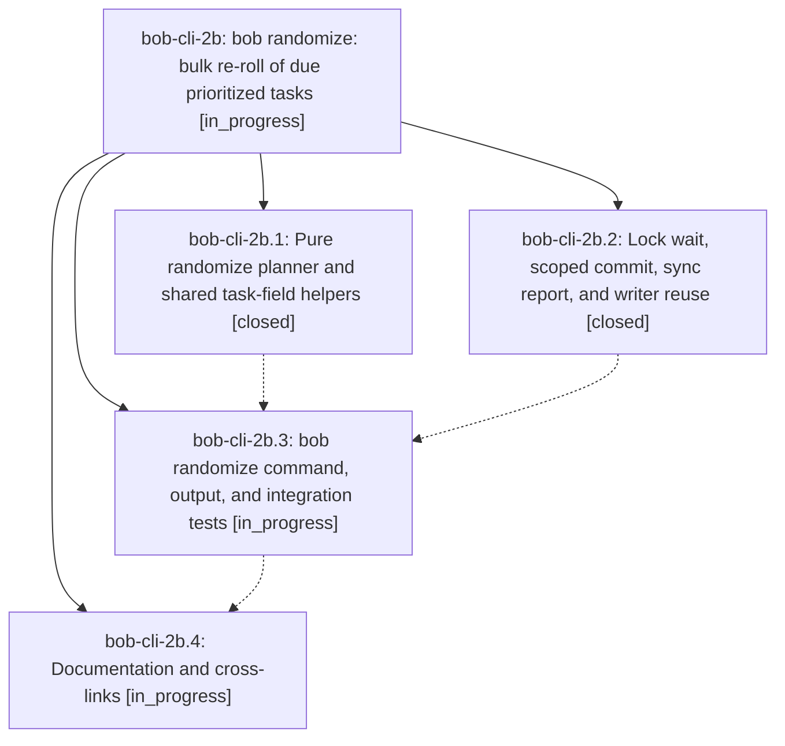

# Bead: bob-cli-2b — bob randomize: bulk re-roll of due prioritized tasks

[Bead Pages](../README.md) / bob-cli-2b

**Status:** ◐ in_progress · **Type:** ▸ plan · **Tier:** epic
**Owner:** `bryanbugyi34@gmail.com` · **Created by:** [bbugyi200.apollo.2q](https://github.com/bobs-org/bob-cli--agents/blob/main/sessions/bbugyi200.apollo.2q.md) · **Assignee:** `bob-cli-2b.land`
**Created:** 2026-09-28 10:45:18 EDT
**Plan:** [202609/bob\_randomize.md](https://github.com/bobs-org/bob-cli--plans/blob/main/202609/bob_randomize.md)

## Description

`bob randomize` re-rolls every due P1–P4 Obsidian task to its own random date inside that task's configured priority window. Each touched note is written once, with the new date, Blocked status, a 🎲 Schedule Log entry, and status grouping applied together. The result is published as exactly one scoped `bob randomize` commit, taken between two vault-sync cycles under the shared maintenance lock. The command also has a reproducible dry-run preview, polished human output, and a stable JSON contract.

## Phases

| Bead | Title | Status | Size | Created | Agents | Commits |
|---|---|---|---|---|---:|---:|
| [bob-cli-2b.1](bob-cli-2b.1.md) | Pure randomize planner and shared task-field helpers | ✓ closed | medium | 2026-09-28 | 1 | 1 |
| [bob-cli-2b.2](bob-cli-2b.2.md) | Lock wait, scoped commit, sync report, and writer reuse | ✓ closed | small | 2026-09-28 | 1 | 1 |
| [bob-cli-2b.3](bob-cli-2b.3.md) | bob randomize command, output, and integration tests | ◐ in_progress | medium | 2026-09-28 | 1 | 0 |
| [bob-cli-2b.4](bob-cli-2b.4.md) | Documentation and cross-links | ◐ in_progress | small | 2026-09-28 | 1 | 0 |

## Lineage

## Agents

| Agent | Bead | Commits |
|---|---|---:|
| [bbugyi200.apollo.bob-cli-2b.1](https://github.com/bobs-org/bob-cli--agents/blob/main/agents/bbugyi200.apollo.bob-cli-2b.1/README.md) | [bob-cli-2b.1](bob-cli-2b.1.md) | 1 |
| [bbugyi200.apollo.bob-cli-2b.2](https://github.com/bobs-org/bob-cli--agents/blob/main/agents/bbugyi200.apollo.bob-cli-2b.2/README.md) | [bob-cli-2b.2](bob-cli-2b.2.md) | 1 |
| [bbugyi200.apollo.bob-cli-2b.3](https://github.com/bobs-org/bob-cli--agents/blob/main/agents/bbugyi200.apollo.bob-cli-2b.3/README.md) | [bob-cli-2b.3](bob-cli-2b.3.md) | 0 |
| [bbugyi200.apollo.bob-cli-2b.4](https://github.com/bobs-org/bob-cli--agents/blob/main/agents/bbugyi200.apollo.bob-cli-2b.4/README.md) | [bob-cli-2b.4](bob-cli-2b.4.md) | 0 |
| [bbugyi200.apollo.bob-cli-2b.land](https://github.com/bobs-org/bob-cli--agents/blob/main/agents/bbugyi200.apollo.bob-cli-2b.land/README.md) | [bob-cli-2b](README.md) | 0 |

## Commits

| Repo | Commit | Subject | Bead | Committed |
|---|---|---|---|---|
| bob-cli | [`b4b51ea`](https://github.com/bobs-org/bob-cli/commit/b4b51eaa769cab6713e3b29047a37848d3298b95) | feat(randomize): add plumbing for lock wait, scoped commit, sync report, writer reuse | [bob-cli-2b.2](bob-cli-2b.2.md) | 2026-09-28 11:09:07 EDT |
| bob-cli | [`f17339d`](https://github.com/bobs-org/bob-cli/commit/f17339d8117fb10a565f2b8ea9b8e700ee820ec2) | feat(randomize): pure planner phase with shared task-field helpers | [bob-cli-2b.1](bob-cli-2b.1.md) | 2026-09-28 11:14:31 EDT |
