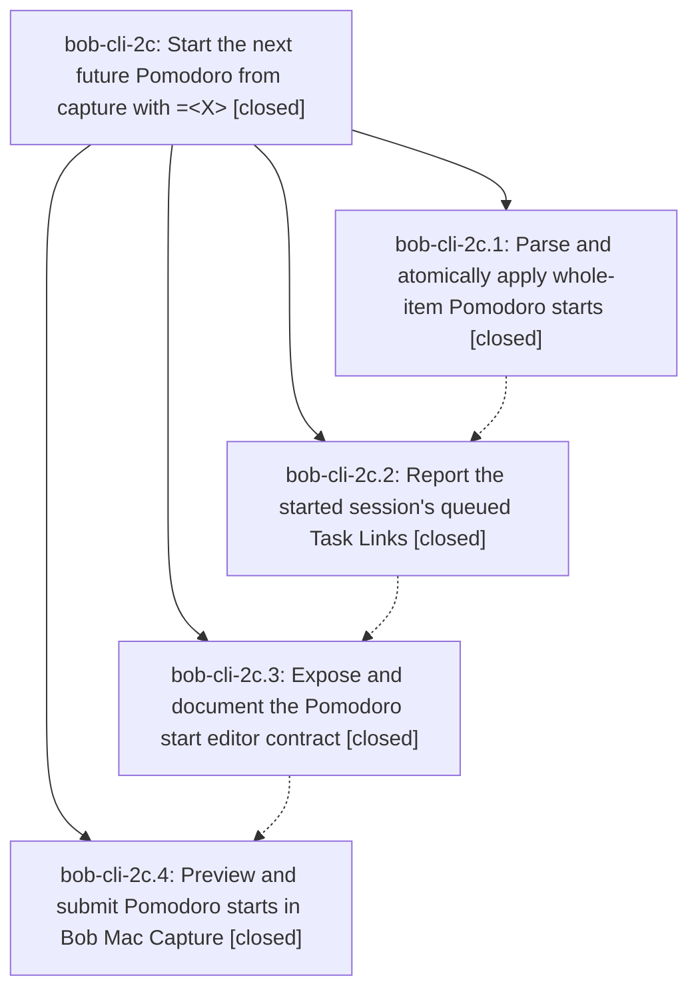

# Bead: bob-cli-2c — Start the next future Pomodoro from capture with =\<X\>

[Bead Pages](../README.md) / bob-cli-2c

**Status:** ✓ closed · **Resolution:** done · **Type:** ▸ plan · **Tier:** epic
**Owner:** `bryanbugyi34@gmail.com` · **Created by:** [bbugyi200.apollo.2s](https://github.com/bobs-org/bob-cli--agents/blob/main/sessions/bbugyi200.apollo.2s.md) · **Assignee:** `bob-cli-2c.land`
**Created:** 2026-09-28 12:19:13 EDT · **Closed:** 2026-09-28 14:17:33 EDT
**Plan:** [202609/pomodoro\_start\_next\_operator.md](https://github.com/bobs-org/bob-cli--plans/blob/main/202609/pomodoro_start_next_operator.md)

## Description

A whole capture item `=<X>` starts today's next future Pomodoro with the same `se<X>` timing as `@route:block-id=<X>`, only when a future Pomodoro exists and none is running, and Bob CLI and Bob Mac Capture preview (including the session's queued tasks) and apply it with identical, atomic results.

## Notes

[2026-09-28T18:09:45Z · bob-cli-2c.land] LAND TRIAGE before the Mac CI tale. Phases bob-cli-2c.1 through .4 are closed. CLI work is in 47a4b59, 193e9f9, and d223926 (lexer, PomodoroStart, shared next_future_pomodoro, tasks lineup, editor contract, zsh docs). Mac work is bob-mac-capture 147159e. macOS CI run 36461295564 failed: startLivePreview never sets session-start status or the failure error, and testQueuedTaskRowsMapStatusGlyphsAndLocators passes queuedTasksJSON without array brackets. That remains epic work and is planned as a tale. Integration: the only later bob-cli commit is 55fdb18 (bob-cli-2d.1 gkeep), which only publishes format_task_line; it does not parse or duplicate whole-item starts. No other mac commit landed during the epic.

FOLLOW-UP bob-cli-2c.2 and bob-cli-2c.3 (same defect): tests/cli.rs:31821 `|| true` makes cargo clippy --all-targets fail with clippy::overly_complex_bool_expr. Blame is 22abed47 (2026-09-27), bob-cli-28.1, not this epic. No new task. Recorded as a DISCOVERED ISSUE on in-progress epic bob-cli-28, which already owns the closeout (land note and sase_plan_pomodoro_link_closeout.md). bob-cli-2c.3 is corroboration of bob-cli-2c.2, not a second defect.

FOLLOW-UP bob-cli-2c.1: capture_pomodoros missing-note test mutates process-global BOB_DAY_FILE without the lock capture_complete already uses. Predates the epic (cc4c9a38, 2026-08-28). Not filed as a flake: this landing did not observe a fail-then-pass. Filed bug bob-cli-2e (small, ready) for the unlocked mutation. The proposing bead is named in that bug's description. A related artifact link to bob-cli-2c.1 failed because the artifact-link store rejected reused operation_id de29d2e25c1cfb4381f223c44d576f8c.

No --epic-symbol entries for bob-cli-2c. No parent bead.

[2026-09-28T18:17:33Z · bob-cli-2c.land--1] Verified phases bob-cli-2c.1/.2/.3 in commits 47a4b59, 193e9f9, and d223926: shared session_equals_token lexer, CaptureKind::PomodoroStart, next_future_pomodoro shared by the unnamed link start, the close next-up hint, and the whole-item start planner, POMODORO_CLOSE_INCOMPLETE_ERROR removed, pomodoro_start.tasks lineup, editor mode/spans/diagnostics, and zsh-quoted docs. Phase bob-cli-2c.4 is bob-mac-capture 147159e. The only bob-cli commit after the epic started, 55fdb18 (bob-cli-2d.1 gkeep), publishes format_task_line and does not parse or duplicate whole-item starts; no other mac commit landed during the epic. Mac CI 36461295564 failed because startLivePreview omitted session-start status and the failure error, and testQueuedTaskRowsMapStatusGlyphsAndLocators interpolated queuedTasksJSON without array brackets. Fixed both; macOS 26 SwiftPM run 36463489015 for d16808b73611b9c8c0903fe402b49475dbfdd082 passed. Follow-ups: the tests/cli.rs:31821 || true clippy deny stays on bob-cli-28 (no new task); the unlocked BOB_DAY_FILE mutation is bug bob-cli-2e, not epic work. No --epic-symbol entries. No parent bead. just symvision is not a recipe in this justfile.

## Phases

| Bead | Title | Status | Size | Created | Agents | Commits |
|---|---|---|---|---|---:|---:|
| [bob-cli-2c.1](bob-cli-2c.1.md) | Parse and atomically apply whole-item Pomodoro starts | ✓ closed | medium | 2026-09-28 | 1 | 1 |
| [bob-cli-2c.2](bob-cli-2c.2.md) | Report the started session's queued Task Links | ✓ closed | medium | 2026-09-28 | 1 | 1 |
| [bob-cli-2c.3](bob-cli-2c.3.md) | Expose and document the Pomodoro start editor contract | ✓ closed | medium | 2026-09-28 | 1 | 1 |
| [bob-cli-2c.4](bob-cli-2c.4.md) | Preview and submit Pomodoro starts in Bob Mac Capture | ✓ closed | medium | 2026-09-28 | 1 | 0 |

## Lineage

## Agents

| Agent | Bead | Commits |
|---|---|---:|
| [bbugyi200.apollo.bob-cli-2c.1](https://github.com/bobs-org/bob-cli--agents/blob/main/agents/bbugyi200.apollo.bob-cli-2c.1/README.md) | [bob-cli-2c.1](bob-cli-2c.1.md) | 1 |
| [bbugyi200.apollo.bob-cli-2c.2](https://github.com/bobs-org/bob-cli--agents/blob/main/agents/bbugyi200.apollo.bob-cli-2c.2/README.md) | [bob-cli-2c.2](bob-cli-2c.2.md) | 1 |
| [bbugyi200.apollo.bob-cli-2c.3](https://github.com/bobs-org/bob-cli--agents/blob/main/agents/bbugyi200.apollo.bob-cli-2c.3/README.md) | [bob-cli-2c.3](bob-cli-2c.3.md) | 1 |
| [bbugyi200.apollo.bob-cli-2c.4](https://github.com/bobs-org/bob-cli--agents/blob/main/agents/bbugyi200.apollo.bob-cli-2c.4/README.md) | [bob-cli-2c.4](bob-cli-2c.4.md) | 0 |
| [bbugyi200.apollo.bob-cli-2c.land](https://github.com/bobs-org/bob-cli--agents/blob/main/sessions/bbugyi200.apollo.bob-cli-2c.land.md) | [bob-cli-2c](README.md) | 1 |

## Commits

| Repo | Commit | Subject | Bead | Committed |
|---|---|---|---|---|
| bob-cli | [`47a4b59`](https://github.com/bobs-org/bob-cli/commit/47a4b59489a072cebcd3e73c6454063245dbc6df) | feat(capture): parse and atomically apply whole-item Pomodoro starts | [bob-cli-2c.1](bob-cli-2c.1.md) | 2026-09-28 12:41:45 EDT |
| bob-cli | [`193e9f9`](https://github.com/bobs-org/bob-cli/commit/193e9f9b4b3759204a10ec6369d79972af1044ac) | feat(capture): report the started session's queued Task Links | [bob-cli-2c.2](bob-cli-2c.2.md) | 2026-09-28 12:58:15 EDT |
| bob-cli | [`d223926`](https://github.com/bobs-org/bob-cli/commit/d22392671b5e92dadbafd2585cb797bbd017f459) | feat(capture): expose and document the Pomodoro start editor contract | [bob-cli-2c.3](bob-cli-2c.3.md) | 2026-09-28 13:14:29 EDT |
| bob-cli--plans | [`bob-cli--plans@59a69ad`](https://github.com/bobs-org/bob-cli--plans/commit/59a69ad35030d393fef84eb55220cbac5e53493f) | chore(plans): mark pomodoro start plan done after green Mac CI | [bob-cli-2c](README.md) | 2026-09-28 14:19:10 EDT |
