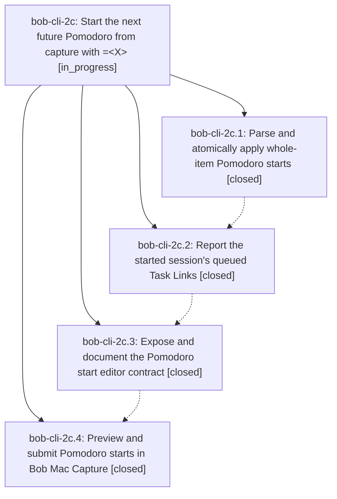

# Bead: bob-cli-2c — Start the next future Pomodoro from capture with =\<X\>

[Bead Pages](../README.md) / bob-cli-2c

**Status:** ◐ in_progress · **Type:** ▸ plan · **Tier:** epic
**Owner:** `bryanbugyi34@gmail.com` · **Created by:** [bbugyi200.apollo.2s](https://github.com/bobs-org/bob-cli--agents/blob/main/sessions/bbugyi200.apollo.2s.md) · **Assignee:** `bob-cli-2c.land`
**Created:** 2026-09-28 12:19:13 EDT
**Plan:** [202609/pomodoro\_start\_next\_operator.md](https://github.com/bobs-org/bob-cli--plans/blob/main/202609/pomodoro_start_next_operator.md)

## Description

A whole capture item `=<X>` starts today's next future Pomodoro with the same `se<X>` timing as `@route:block-id=<X>`, only when a future Pomodoro exists and none is running, and Bob CLI and Bob Mac Capture preview (including the session's queued tasks) and apply it with identical, atomic results.

## Phases

| Bead | Title | Status | Size | Created | Agents | Commits |
|---|---|---|---|---|---:|---:|
| [bob-cli-2c.1](bob-cli-2c.1.md) | Parse and atomically apply whole-item Pomodoro starts | ✓ closed | medium | 2026-09-28 | 1 | 1 |
| [bob-cli-2c.2](bob-cli-2c.2.md) | Report the started session's queued Task Links | ✓ closed | medium | 2026-09-28 | 1 | 1 |
| [bob-cli-2c.3](bob-cli-2c.3.md) | Expose and document the Pomodoro start editor contract | ✓ closed | medium | 2026-09-28 | 1 | 1 |
| [bob-cli-2c.4](bob-cli-2c.4.md) | Preview and submit Pomodoro starts in Bob Mac Capture | ✓ closed | medium | 2026-09-28 | 1 | 0 |

## Lineage

## Agents

| Agent | Bead | Commits |
|---|---|---:|
| [bbugyi200.apollo.bob-cli-2c.1](https://github.com/bobs-org/bob-cli--agents/blob/main/agents/bbugyi200.apollo.bob-cli-2c.1/README.md) | [bob-cli-2c.1](bob-cli-2c.1.md) | 1 |
| [bbugyi200.apollo.bob-cli-2c.2](https://github.com/bobs-org/bob-cli--agents/blob/main/agents/bbugyi200.apollo.bob-cli-2c.2/README.md) | [bob-cli-2c.2](bob-cli-2c.2.md) | 1 |
| [bbugyi200.apollo.bob-cli-2c.3](https://github.com/bobs-org/bob-cli--agents/blob/main/agents/bbugyi200.apollo.bob-cli-2c.3/README.md) | [bob-cli-2c.3](bob-cli-2c.3.md) | 1 |
| [bbugyi200.apollo.bob-cli-2c.4](https://github.com/bobs-org/bob-cli--agents/blob/main/agents/bbugyi200.apollo.bob-cli-2c.4/README.md) | [bob-cli-2c.4](bob-cli-2c.4.md) | 0 |
| [bbugyi200.apollo.bob-cli-2c.land](https://github.com/bobs-org/bob-cli--agents/blob/main/agents/bbugyi200.apollo.bob-cli-2c.land/README.md) | [bob-cli-2c](README.md) | 0 |

## Commits

| Repo | Commit | Subject | Bead | Committed |
|---|---|---|---|---|
| bob-cli | [`47a4b59`](https://github.com/bobs-org/bob-cli/commit/47a4b59489a072cebcd3e73c6454063245dbc6df) | feat(capture): parse and atomically apply whole-item Pomodoro starts | [bob-cli-2c.1](bob-cli-2c.1.md) | 2026-09-28 12:41:45 EDT |
| bob-cli | [`193e9f9`](https://github.com/bobs-org/bob-cli/commit/193e9f9b4b3759204a10ec6369d79972af1044ac) | feat(capture): report the started session's queued Task Links | [bob-cli-2c.2](bob-cli-2c.2.md) | 2026-09-28 12:58:15 EDT |
| bob-cli | [`d223926`](https://github.com/bobs-org/bob-cli/commit/d22392671b5e92dadbafd2585cb797bbd017f459) | feat(capture): expose and document the Pomodoro start editor contract | [bob-cli-2c.3](bob-cli-2c.3.md) | 2026-09-28 13:14:29 EDT |
