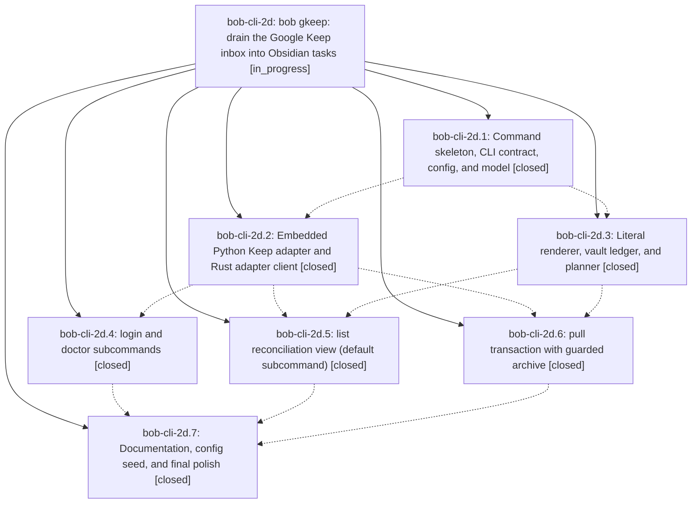

# Bead: bob-cli-2d — bob gkeep: drain the Google Keep inbox into Obsidian tasks

[Bead Pages](../README.md) / bob-cli-2d

**Status:** ◐ in_progress · **Type:** ▸ plan · **Tier:** epic
**Owner:** `bryanbugyi34@gmail.com` · **Created by:** [bbugyi200.apollo.2t](https://github.com/bobs-org/bob-cli--agents/blob/main/sessions/bbugyi200.apollo.2t.md) · **Assignee:** `bob-cli-2d.land`
**Created:** 2026-09-28 13:31:28 EDT
**Plan:** [202609/bob\_gkeep\_inbox\_drain.md](https://github.com/bobs-org/bob-cli--plans/blob/main/202609/bob_gkeep_inbox_drain.md)

## Description

`bob gkeep` moves every Google Keep inbox note into `~/bob/gkeep_inbox.md` as Obsidian tasks and archives each note in Keep only after its current content is provably in the vault. It also shows Keep and the vault side by side in one reconciliation view, and ships `doctor` and `login` so the setup is diagnosable. The output is styled and consistent with `bob plugins`, and the tests never touch live Keep.

## Notes

[2026-09-28T19:09:56Z · bob-cli-2d.land] LAND TRIAGE (bob-cli-2d.land): PROPOSED FOLLOW-UPs: (1) tests/cli.rs:31818 '|| true' clippy deny (proposed by all of bob-cli-2d.1-.7): not caused by this epic (reproduces on the clean base, comes from 22abed4). /sase_new_task routed it to active epic bob-cli-28, which causally owns it, as a DISCOVERED ISSUE corroboration note; no new task, since that epic's closeout plan already covers it and bob-cli-v tracks warnings only. (2) tests/gkeep_adapter.rs ETXTBSY flake (bob-cli-2d.4 note #2): CAUSED by this epic's test harness, so no task; it becomes remaining epic work in the land closeout tale, together with the adapter::tests::crash_garbage_and_timeout race (stdin EPIPE when a fast adapter exits before the request write). Other verification: chezmoi gkeep seed is committed and pushed (34c33aae). No commits by other work landed between epic start (55fdb18) and HEAD cad7c8e. No --epic-symbol entries. cargo test green. Land review found epic-caused bugs and gaps: adapter timeout leaves the uv/python grandchild and blocks; unknown attachment kind breaks the snapshot; missing archive re-sync confirm; pull JSON summary.failed miscount; double JSON on archive crash; wrong crash rows; list ages and timestamps treat local time as UTC; render escaping gaps (^id, ::: runs, ## headings, url marker spoof); about 20 gkeep clippy dead-code warnings; docs JSON/list drift. These are planned as a closeout tale.

[2026-09-28T19:12:01Z · bob-cli-2d.land] LAND DECLINED (bob-cli-2d.land): these land-review findings are epic-caused but deliberately not fixed, each with its reason. (a) After a failed commit, a rerun of a pending-only pull archives a block that was never committed. The epic plan sanctions this: pending-only pulls skip steps 4 and 6-8, and vault-sync commits the block later. (b) A target that is not valid UTF-8 is rewritten lossily. Obsidian notes are UTF-8, so this is effectively unreachable. (c) Verify locates a revision block's task line by its first exact match. The exactly-once whole-block check already guarantees the block is present. (d) Dimming the crash stderr tail is cosmetic; the text is already present. (e) The token-shape stderr warning under doctor -f json goes to stderr only, so the JSON is unaffected. (f) list -s vault silently falls back to the default target on an invalid config. This is intentional: -s vault needs no gkeep config. (g) Truncation drops the dim styling, emoji widths are off by one, the Keep-failure title shape differs, and human pull rows are not column-aligned. All cosmetic. (h) A leading 'N.' is escaped as '\N.' rather than 'N\.'. It renders a visible backslash but is safe. (i) The journal is not keyed by vault. There is one vault per host by design. (j) Glyphs appear in piped output: decided to keep always-on glyphs, because the epic plan pins those outputs and doctor rows need them; the unused ui helpers are deleted instead. (k) The login preflight does not resolve uv before consuming the cookie, and the exchange-auth hint mentions login. Both are minor; login fails fast with a clear setup error. Everything else from the review is planned in the closeout tale sase_plan_gkeep_land_closeout.

## Phases

| Bead | Title | Status | Size | Created | Agents | Commits |
|---|---|---|---|---|---:|---:|
| [bob-cli-2d.1](bob-cli-2d.1.md) | Command skeleton, CLI contract, config, and model | ✓ closed | medium | 2026-09-28 | 1 | 1 |
| [bob-cli-2d.2](bob-cli-2d.2.md) | Embedded Python Keep adapter and Rust adapter client | ✓ closed | medium | 2026-09-28 | 1 | 1 |
| [bob-cli-2d.3](bob-cli-2d.3.md) | Literal renderer, vault ledger, and planner | ✓ closed | medium | 2026-09-28 | 1 | 1 |
| [bob-cli-2d.4](bob-cli-2d.4.md) | login and doctor subcommands | ✓ closed | medium | 2026-09-28 | 1 | 1 |
| [bob-cli-2d.5](bob-cli-2d.5.md) | list reconciliation view (default subcommand) | ✓ closed | medium | 2026-09-28 | 1 | 1 |
| [bob-cli-2d.6](bob-cli-2d.6.md) | pull transaction with guarded archive | ✓ closed | medium | 2026-09-28 | 1 | 1 |
| [bob-cli-2d.7](bob-cli-2d.7.md) | Documentation, config seed, and final polish | ✓ closed | small | 2026-09-28 | 1 | 2 |

## Lineage

## Agents

| Agent | Bead | Commits |
|---|---|---:|
| [bbugyi200.apollo.bob-cli-2d.1](https://github.com/bobs-org/bob-cli--agents/blob/main/agents/bbugyi200.apollo.bob-cli-2d.1/README.md) | [bob-cli-2d.1](bob-cli-2d.1.md) | 1 |
| [bbugyi200.apollo.bob-cli-2d.2](https://github.com/bobs-org/bob-cli--agents/blob/main/agents/bbugyi200.apollo.bob-cli-2d.2/README.md) | [bob-cli-2d.2](bob-cli-2d.2.md) | 1 |
| [bbugyi200.apollo.bob-cli-2d.3](https://github.com/bobs-org/bob-cli--agents/blob/main/agents/bbugyi200.apollo.bob-cli-2d.3/README.md) | [bob-cli-2d.3](bob-cli-2d.3.md) | 1 |
| [bbugyi200.apollo.bob-cli-2d.4](https://github.com/bobs-org/bob-cli--agents/blob/main/agents/bbugyi200.apollo.bob-cli-2d.4/README.md) | [bob-cli-2d.4](bob-cli-2d.4.md) | 1 |
| [bbugyi200.apollo.bob-cli-2d.5](https://github.com/bobs-org/bob-cli--agents/blob/main/agents/bbugyi200.apollo.bob-cli-2d.5/README.md) | [bob-cli-2d.5](bob-cli-2d.5.md) | 1 |
| [bbugyi200.apollo.bob-cli-2d.6](https://github.com/bobs-org/bob-cli--agents/blob/main/agents/bbugyi200.apollo.bob-cli-2d.6/README.md) | [bob-cli-2d.6](bob-cli-2d.6.md) | 1 |
| [bbugyi200.apollo.bob-cli-2d.7](https://github.com/bobs-org/bob-cli--agents/blob/main/agents/bbugyi200.apollo.bob-cli-2d.7/README.md) | [bob-cli-2d.7](bob-cli-2d.7.md) | 2 |
| [bbugyi200.apollo.bob-cli-2d.land](https://github.com/bobs-org/bob-cli--agents/blob/main/sessions/bbugyi200.apollo.bob-cli-2d.land.md) | [bob-cli-2d](README.md) | 1 |

## Commits

| Repo | Commit | Subject | Bead | Committed |
|---|---|---|---|---|
| bob-cli | [`55fdb18`](https://github.com/bobs-org/bob-cli/commit/55fdb18d199f6d7d04ce20f4b8e26209f1b130f6) | feat(gkeep): add command skeleton, CLI contract, config, and model | [bob-cli-2d.1](bob-cli-2d.1.md) | 2026-09-28 13:53:12 EDT |
| bob-cli | [`72391b1`](https://github.com/bobs-org/bob-cli/commit/72391b15545ddba538fb05c7369bf820420e3825) | feat(gkeep): add literal renderer, vault ledger, and planner | [bob-cli-2d.3](bob-cli-2d.3.md) | 2026-09-28 14:17:06 EDT |
| bob-cli | [`c742ab5`](https://github.com/bobs-org/bob-cli/commit/c742ab56764309af0a15736ed50fa5c8aee0d2c8) | feat(gkeep): add pinned gkeep adapter with native client and tests | [bob-cli-2d.2](bob-cli-2d.2.md) | 2026-09-28 14:18:48 EDT |
| bob-cli | [`150b954`](https://github.com/bobs-org/bob-cli/commit/150b954251ddad1662945d98ba2e77ac4c993251) | feat(gkeep): add login and doctor subcommands with integration tests | [bob-cli-2d.4](bob-cli-2d.4.md) | 2026-09-28 14:36:45 EDT |
| bob-cli | [`c2a3429`](https://github.com/bobs-org/bob-cli/commit/c2a3429ad1a372caa61a1fb86945ad6ef6ca1d05) | feat(gkeep): implement list reconciliation view (default subcommand) | [bob-cli-2d.5](bob-cli-2d.5.md) | 2026-09-28 14:39:14 EDT |
| bob-cli | [`acefd9d`](https://github.com/bobs-org/bob-cli/commit/acefd9d39ff234cde82cc4300452d71a1a9d7255) | feat(gkeep): add pull transaction with guarded archive | [bob-cli-2d.6](bob-cli-2d.6.md) | 2026-09-28 14:42:27 EDT |
| bob-cli | [`cad7c8e`](https://github.com/bobs-org/bob-cli/commit/cad7c8e79ec41d3e35c3672151a3965780e64a18) | docs(gkeep): add gkeep contract guide and index entries | [bob-cli-2d.7](bob-cli-2d.7.md) | 2026-09-28 14:53:37 EDT |
| chezmoi | [`chezmoi@34c33aa`](https://github.com/bbugyi200/dotfiles/commit/34c33aae4dc7b48b00ea4318ae5fd5a1d6fbd47e) | chore(gkeep): seed gkeep config in chezmoi home config | [bob-cli-2d.7](bob-cli-2d.7.md) | 2026-09-28 14:54:09 EDT |
| bob-cli | [`d0c1692`](https://github.com/bobs-org/bob-cli/commit/d0c1692c111f2691d35c53a402a38af62591b918) | fix(gkeep): land closeout defects for bob-cli-2d | [bob-cli-2d](README.md) | 2026-09-28 15:53:07 EDT |
