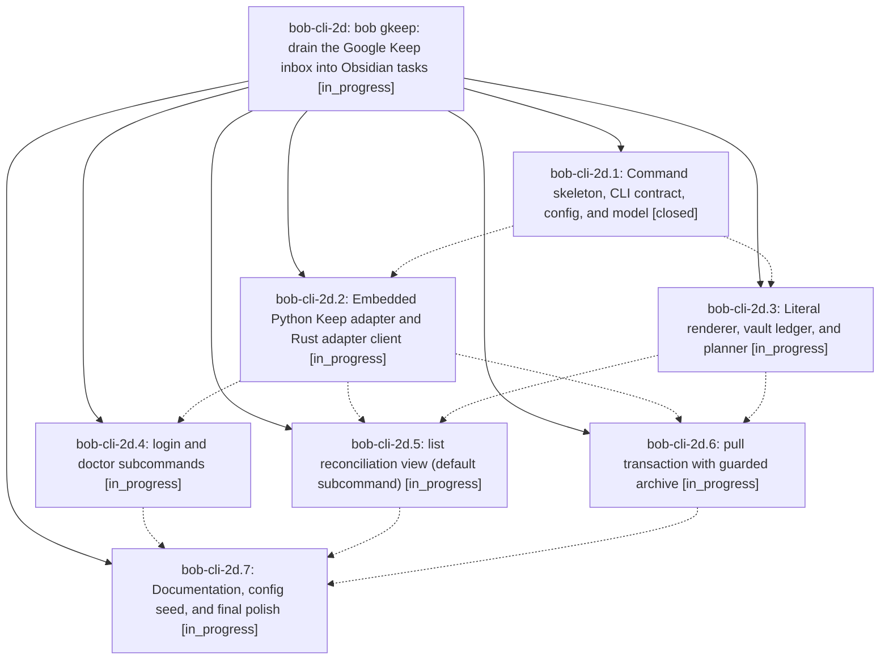

# Bead: bob-cli-2d — bob gkeep: drain the Google Keep inbox into Obsidian tasks

[Bead Pages](../README.md) / bob-cli-2d

**Status:** ◐ in_progress · **Type:** ▸ plan · **Tier:** epic
**Owner:** `bryanbugyi34@gmail.com` · **Created by:** [bbugyi200.apollo.2t](https://github.com/bobs-org/bob-cli--agents/blob/main/sessions/bbugyi200.apollo.2t.md) · **Assignee:** `bob-cli-2d.land`
**Created:** 2026-09-28 13:31:28 EDT
**Plan:** [202609/bob\_gkeep\_inbox\_drain.md](https://github.com/bobs-org/bob-cli--plans/blob/main/202609/bob_gkeep_inbox_drain.md)

## Description

`bob gkeep` moves every Google Keep inbox note into `~/bob/gkeep_inbox.md` as Obsidian tasks and archives each note in Keep only after its current content is provably in the vault. It also shows Keep and the vault side by side in one reconciliation view, and ships `doctor` and `login` so the setup is diagnosable. The output is styled and consistent with `bob plugins`, and the tests never touch live Keep.

## Phases

| Bead | Title | Status | Size | Created | Agents | Commits |
|---|---|---|---|---|---:|---:|
| [bob-cli-2d.1](bob-cli-2d.1.md) | Command skeleton, CLI contract, config, and model | ✓ closed | medium | 2026-09-28 | 1 | 1 |
| [bob-cli-2d.2](bob-cli-2d.2.md) | Embedded Python Keep adapter and Rust adapter client | ◐ in_progress | medium | 2026-09-28 | 1 | 0 |
| [bob-cli-2d.3](bob-cli-2d.3.md) | Literal renderer, vault ledger, and planner | ◐ in_progress | medium | 2026-09-28 | 1 | 0 |
| [bob-cli-2d.4](bob-cli-2d.4.md) | login and doctor subcommands | ◐ in_progress | medium | 2026-09-28 | 1 | 0 |
| [bob-cli-2d.5](bob-cli-2d.5.md) | list reconciliation view (default subcommand) | ◐ in_progress | medium | 2026-09-28 | 1 | 0 |
| [bob-cli-2d.6](bob-cli-2d.6.md) | pull transaction with guarded archive | ◐ in_progress | medium | 2026-09-28 | 1 | 0 |
| [bob-cli-2d.7](bob-cli-2d.7.md) | Documentation, config seed, and final polish | ◐ in_progress | small | 2026-09-28 | 1 | 0 |

## Lineage

## Agents

| Agent | Bead | Commits |
|---|---|---:|
| [bbugyi200.apollo.bob-cli-2d.1](https://github.com/bobs-org/bob-cli--agents/blob/main/agents/bbugyi200.apollo.bob-cli-2d.1/README.md) | [bob-cli-2d.1](bob-cli-2d.1.md) | 1 |
| [bbugyi200.apollo.bob-cli-2d.2](https://github.com/bobs-org/bob-cli--agents/blob/main/agents/bbugyi200.apollo.bob-cli-2d.2/README.md) | [bob-cli-2d.2](bob-cli-2d.2.md) | 0 |
| [bbugyi200.apollo.bob-cli-2d.3](https://github.com/bobs-org/bob-cli--agents/blob/main/agents/bbugyi200.apollo.bob-cli-2d.3/README.md) | [bob-cli-2d.3](bob-cli-2d.3.md) | 0 |
| [bbugyi200.apollo.bob-cli-2d.4](https://github.com/bobs-org/bob-cli--agents/blob/main/agents/bbugyi200.apollo.bob-cli-2d.4/README.md) | [bob-cli-2d.4](bob-cli-2d.4.md) | 0 |
| [bbugyi200.apollo.bob-cli-2d.5](https://github.com/bobs-org/bob-cli--agents/blob/main/agents/bbugyi200.apollo.bob-cli-2d.5/README.md) | [bob-cli-2d.5](bob-cli-2d.5.md) | 0 |
| [bbugyi200.apollo.bob-cli-2d.6](https://github.com/bobs-org/bob-cli--agents/blob/main/agents/bbugyi200.apollo.bob-cli-2d.6/README.md) | [bob-cli-2d.6](bob-cli-2d.6.md) | 0 |
| [bbugyi200.apollo.bob-cli-2d.7](https://github.com/bobs-org/bob-cli--agents/blob/main/agents/bbugyi200.apollo.bob-cli-2d.7/README.md) | [bob-cli-2d.7](bob-cli-2d.7.md) | 0 |
| [bbugyi200.apollo.bob-cli-2d.land](https://github.com/bobs-org/bob-cli--agents/blob/main/agents/bbugyi200.apollo.bob-cli-2d.land/README.md) | [bob-cli-2d](README.md) | 0 |

## Commits

| Repo | Commit | Subject | Bead | Committed |
|---|---|---|---|---|
| bob-cli | [`55fdb18`](https://github.com/bobs-org/bob-cli/commit/55fdb18d199f6d7d04ce20f4b8e26209f1b130f6) | feat(gkeep): add command skeleton, CLI contract, config, and model | [bob-cli-2d.1](bob-cli-2d.1.md) | 2026-09-28 13:53:12 EDT |
