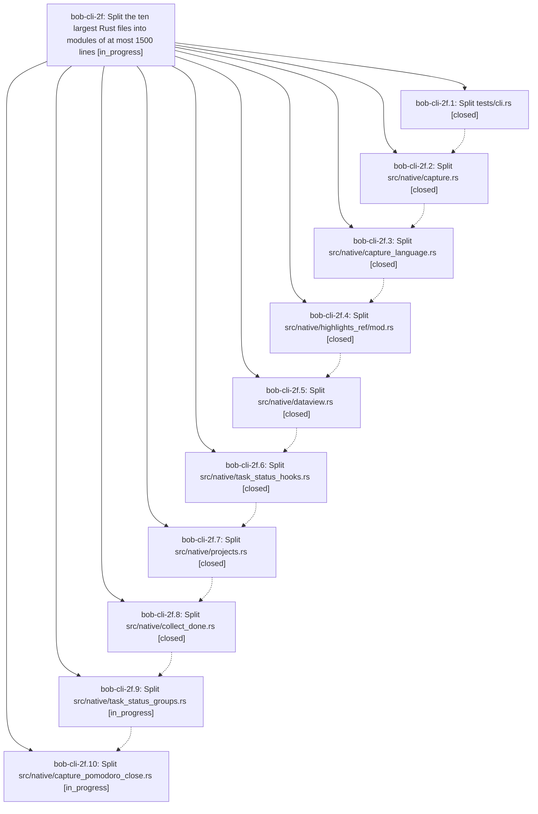

# Bead: bob-cli-2f — Split the ten largest Rust files into modules of at most 1500 lines

[Bead Pages](../README.md) / bob-cli-2f

**Status:** ◐ in_progress · **Type:** ▸ plan · **Tier:** epic
**Owner:** `bryanbugyi34@gmail.com` · **Created by:** [bbugyi200.apollo.2u](https://github.com/bobs-org/bob-cli--agents/blob/main/sessions/bbugyi200.apollo.2u.md) · **Assignee:** `bob-cli-2f.land`
**Created:** 2026-09-28 16:49:29 EDT
**Plan:** [202609/split\_largest\_rust\_files.md](https://github.com/bobs-org/bob-cli--plans/blob/main/202609/split_largest_rust_files.md)

## Description

Each of the ten largest Rust source files in bob-cli is split into cohesive modules in which every resulting file has at most 1500 lines. Behavior does not change, the test count stays the same, and `just all` stays green after every phase.

## Phases

| Bead | Title | Status | Size | Created | Agents | Commits |
|---|---|---|---|---|---:|---:|
| [bob-cli-2f.1](bob-cli-2f.1.md) | Split tests/cli.rs | ✓ closed | large | 2026-09-28 | 1 | 1 |
| [bob-cli-2f.10](bob-cli-2f.10.md) | Split src/native/capture\_pomodoro\_close.rs | ◐ in_progress | large | 2026-09-28 | 1 | 0 |
| [bob-cli-2f.2](bob-cli-2f.2.md) | Split src/native/capture.rs | ✓ closed | large | 2026-09-28 | 1 | 1 |
| [bob-cli-2f.3](bob-cli-2f.3.md) | Split src/native/capture\_language.rs | ✓ closed | large | 2026-09-28 | 1 | 1 |
| [bob-cli-2f.4](bob-cli-2f.4.md) | Split src/native/highlights\_ref/mod.rs | ✓ closed | large | 2026-09-28 | 1 | 1 |
| [bob-cli-2f.5](bob-cli-2f.5.md) | Split src/native/dataview.rs | ✓ closed | large | 2026-09-28 | 1 | 1 |
| [bob-cli-2f.6](bob-cli-2f.6.md) | Split src/native/task\_status\_hooks.rs | ✓ closed | large | 2026-09-28 | 1 | 1 |
| [bob-cli-2f.7](bob-cli-2f.7.md) | Split src/native/projects.rs | ✓ closed | large | 2026-09-28 | 1 | 1 |
| [bob-cli-2f.8](bob-cli-2f.8.md) | Split src/native/collect\_done.rs | ✓ closed | large | 2026-09-28 | 1 | 1 |
| [bob-cli-2f.9](bob-cli-2f.9.md) | Split src/native/task\_status\_groups.rs | ◐ in_progress | large | 2026-09-28 | 1 | 0 |

## Lineage

## Agents

| Agent | Bead | Commits |
|---|---|---:|
| [bbugyi200.apollo.bob-cli-2f.1](https://github.com/bobs-org/bob-cli--agents/blob/main/sessions/bbugyi200.apollo.bob-cli-2f.1.md) | [bob-cli-2f.1](bob-cli-2f.1.md) | 1 |
| [bbugyi200.apollo.bob-cli-2f.10](https://github.com/bobs-org/bob-cli--agents/blob/main/agents/bbugyi200.apollo.bob-cli-2f.10/README.md) | [bob-cli-2f.10](bob-cli-2f.10.md) | 0 |
| [bbugyi200.apollo.bob-cli-2f.2](https://github.com/bobs-org/bob-cli--agents/blob/main/sessions/bbugyi200.apollo.bob-cli-2f.2.md) | [bob-cli-2f.2](bob-cli-2f.2.md) | 1 |
| [bbugyi200.apollo.bob-cli-2f.3](https://github.com/bobs-org/bob-cli--agents/blob/main/sessions/bbugyi200.apollo.bob-cli-2f.3.md) | [bob-cli-2f.3](bob-cli-2f.3.md) | 1 |
| [bbugyi200.apollo.bob-cli-2f.4](https://github.com/bobs-org/bob-cli--agents/blob/main/sessions/bbugyi200.apollo.bob-cli-2f.4.md) | [bob-cli-2f.4](bob-cli-2f.4.md) | 1 |
| [bbugyi200.apollo.bob-cli-2f.5](https://github.com/bobs-org/bob-cli--agents/blob/main/sessions/bbugyi200.apollo.bob-cli-2f.5.md) | [bob-cli-2f.5](bob-cli-2f.5.md) | 1 |
| [bbugyi200.apollo.bob-cli-2f.6](https://github.com/bobs-org/bob-cli--agents/blob/main/sessions/bbugyi200.apollo.bob-cli-2f.6.md) | [bob-cli-2f.6](bob-cli-2f.6.md) | 1 |
| [bbugyi200.apollo.bob-cli-2f.7](https://github.com/bobs-org/bob-cli--agents/blob/main/sessions/bbugyi200.apollo.bob-cli-2f.7.md) | [bob-cli-2f.7](bob-cli-2f.7.md) | 1 |
| [bbugyi200.apollo.bob-cli-2f.8](https://github.com/bobs-org/bob-cli--agents/blob/main/sessions/bbugyi200.apollo.bob-cli-2f.8.md) | [bob-cli-2f.8](bob-cli-2f.8.md) | 1 |
| [bbugyi200.apollo.bob-cli-2f.9](https://github.com/bobs-org/bob-cli--agents/blob/main/agents/bbugyi200.apollo.bob-cli-2f.9/README.md) | [bob-cli-2f.9](bob-cli-2f.9.md) | 0 |
| [bbugyi200.apollo.bob-cli-2f.land](https://github.com/bobs-org/bob-cli--agents/blob/main/agents/bbugyi200.apollo.bob-cli-2f.land/README.md) | [bob-cli-2f](README.md) | 0 |

## Commits

| Repo | Commit | Subject | Bead | Committed |
|---|---|---|---|---|
| bob-cli | [`7d1c8dd`](https://github.com/bobs-org/bob-cli/commit/7d1c8dd3054fd30f6e4f5a15e2dc61c42c3b2593) | refactor(tests): split tests/cli.rs into tests/cli/ target with support and per-command modules | [bob-cli-2f.1](bob-cli-2f.1.md) | 2026-09-28 17:22:16 EDT |
| bob-cli | [`e73e2e9`](https://github.com/bobs-org/bob-cli/commit/e73e2e985b855f451ed2c41e4581b3200c161674) | refactor(capture): split capture executor into directory modules | [bob-cli-2f.2](bob-cli-2f.2.md) | 2026-09-28 17:43:48 EDT |
| bob-cli | [`e73900e`](https://github.com/bobs-org/bob-cli/commit/e73900e386cdbf3235ac1f9ab9e1be147e13b09a) | refactor(capture): split capture\_language grammar into focused modules | [bob-cli-2f.3](bob-cli-2f.3.md) | 2026-09-28 18:04:43 EDT |
| bob-cli | [`836e0a8`](https://github.com/bobs-org/bob-cli/commit/836e0a88564081a58b61e11f5767b01e4e0f30f0) | refactor(highlights-ref): split mod.rs into submodules under 1500 lines | [bob-cli-2f.4](bob-cli-2f.4.md) | 2026-09-28 18:34:52 EDT |
| bob-cli | [`2307179`](https://github.com/bobs-org/bob-cli/commit/2307179cd17439fc6bb2a14eecbc842189ab0199) | refactor(dataview): split query module into cohesive submodules | [bob-cli-2f.5](bob-cli-2f.5.md) | 2026-09-28 19:08:56 EDT |
| bob-cli | [`a89dff8`](https://github.com/bobs-org/bob-cli/commit/a89dff84d9d5c07662bd1482aa0ca78d08e6c09c) | refactor(task-status-hooks): split engine into directory module under 1500 lines | [bob-cli-2f.6](bob-cli-2f.6.md) | 2026-09-28 19:32:17 EDT |
| bob-cli | [`0abb2bd`](https://github.com/bobs-org/bob-cli/commit/0abb2bd6f45cd587fc0d66f1e1f8af096b751b61) | refactor(projects): split command into directory module under 1500 lines | [bob-cli-2f.7](bob-cli-2f.7.md) | 2026-09-28 19:51:32 EDT |
| bob-cli | [`65a3917`](https://github.com/bobs-org/bob-cli/commit/65a39179b278f4eee9d6cd8b0e44432e52dfbf13) | feat(collect-done): split collect\_done.rs into directory module | [bob-cli-2f.8](bob-cli-2f.8.md) | 2026-09-28 20:19:28 EDT |
