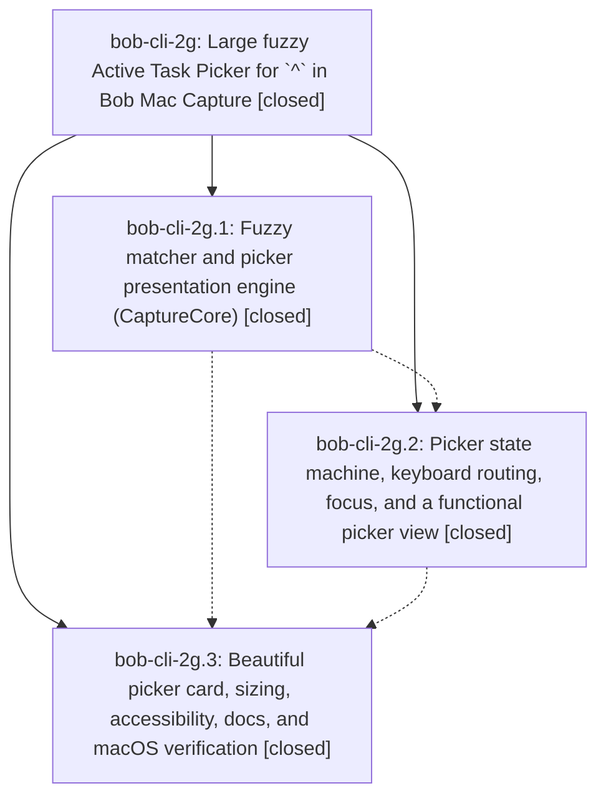

# Bead: bob-cli-2g — Large fuzzy Active Task Picker for \`^\` in Bob Mac Capture

[Bead Pages](../README.md) / bob-cli-2g

**Status:** ✓ closed · **Resolution:** done · **Type:** ▸ plan · **Tier:** epic
**Owner:** `bryanbugyi34@gmail.com` · **Created by:** [bbugyi200.apollo.bob-cli-2f.3.w1](https://github.com/bobs-org/bob-cli--agents/blob/main/sessions/bbugyi200.apollo.bob-cli-2f.3.w1.md) · **Assignee:** `bob-cli-2g.land`
**Created:** 2026-09-28 18:28:11 EDT · **Closed:** 2026-09-28 19:29:49 EDT
**Plan:** [202609/mac\_active\_task\_picker.md](https://github.com/bobs-org/bob-cli--plans/blob/main/202609/mac_active_task_picker.md)

## Description

Typing `^` as a capture item in Bob Mac Capture opens a large, keyboard-first Active Task Picker. It lists every In Progress and Next task grouped by today's Pomodoro plan, filters them instantly with fuzzy matching, and inserts the chosen `route:block-id` reliably. It never shows red incomplete-marker errors while you pick.

## Notes

[2026-09-28T23:15:39Z · bob-cli-2g.land] Landing triage of all PROPOSED FOLLOW-UP notes: bob-cli-2g.1, .2, and .3 each request macOS verification of this epic's picker work; .3 additionally requests rendered-image review and GUI smoke. These are one epic-caused completion obligation, so no separate task bead is warranted. mac is still unreachable (SSH port 22 timeout). macOS 26 CI runs 36494257046, 36495588592, and 36496614673 are red: earlier runs expose an ActiveTaskDisplayText test expectation contrary to the plan's next-backtick rule and an ActiveTaskMatchHighlights.coalesced index-out-of-range crash; latest run has eight CaptureCompletionCandidate argument-order compile errors in ActiveTaskPickerDesignTests. CI format lint and build pass, but test and downstream bundle/smoke are blocked. A focused tale will repair these, rerun CI, review rendered images where available, and finish this epic's closeout. No non-epic follow-up was proposed or declined for separate filing.

[2026-09-28T23:16:46Z · bob-cli-2g.land] Post-start drift review: linked bob-mac-capture has exactly the three consecutive epic commits 309431b, 039a322, 0a6cd0e and no later unrelated commit. Primary bob-cli commits since epic creation are 836e0a8 (highlights_ref module split) and 2307179 (dataview module split); their changed files do not touch capture-complete, task candidates, or the Mac picker contract, so no integration edit is indicated. Recheck at final landing in case new commits arrive.

[2026-09-28T23:29:49Z · bob-cli-2g.land--2] Green macOS CI run 36497722940 (macOS 26 SwiftPM success: lint, build, test, bundle, plist+signature, launch-smoke, install/reinstall) on master commit 4802d23 (fileprivate fix atop 866e165 picker repairs: CaptureCompletionCandidate arg order, ActiveTaskMatchHighlights.coalesced crash, next-backtick expectation). Drift: origin/master holds only epic commits 309431b,039a322,0a6cd0e plus the two repairs; no unrelated commits. Primary commits since epic (836e0a8 highlights-ref split, 2307179 dataview split, e73900e capture_language split, e73e2e9 capture split) do not touch capture-complete, task candidates, or the Mac picker contract; no integration edit. README/source/tests still cover full snapshot, local fuzzy filter, grouped rows, quiet incomplete-^, insert and submit, Escape/chip/Backspace, focus, sizing, accessibility. Rendered-image review NOT run here: tailnet mac unreachable (ssh port 22 timeout) and Linux has no Swift toolchain; BOB_MAC_CAPTURE_RENDER_DIR gated test skips in CI so no PNGs were produced for human inspection. Triage: phase .1/.2/.3 PROPOSED FOLLOW-UP notes are one epic-caused verification obligation, satisfied by green CI except the recorded render-review limitation; no separate task bead. epic-symbols clean; just symvision unavailable (no recipe in primary justfile).

## Phases

| Bead | Title | Status | Size | Created | Agents | Commits |
|---|---|---|---|---|---:|---:|
| [bob-cli-2g.1](bob-cli-2g.1.md) | Fuzzy matcher and picker presentation engine (CaptureCore) | ✓ closed | medium | 2026-09-28 | 1 | 0 |
| [bob-cli-2g.2](bob-cli-2g.2.md) | Picker state machine, keyboard routing, focus, and a functional picker view | ✓ closed | medium | 2026-09-28 | 1 | 0 |
| [bob-cli-2g.3](bob-cli-2g.3.md) | Beautiful picker card, sizing, accessibility, docs, and macOS verification | ✓ closed | medium | 2026-09-28 | 1 | 0 |

## Lineage

## Agents

| Agent | Bead | Commits |
|---|---|---:|
| [bbugyi200.apollo.bob-cli-2g.1](https://github.com/bobs-org/bob-cli--agents/blob/main/agents/bbugyi200.apollo.bob-cli-2g.1/README.md) | [bob-cli-2g.1](bob-cli-2g.1.md) | 0 |
| [bbugyi200.apollo.bob-cli-2g.2](https://github.com/bobs-org/bob-cli--agents/blob/main/agents/bbugyi200.apollo.bob-cli-2g.2/README.md) | [bob-cli-2g.2](bob-cli-2g.2.md) | 0 |
| [bbugyi200.apollo.bob-cli-2g.3](https://github.com/bobs-org/bob-cli--agents/blob/main/agents/bbugyi200.apollo.bob-cli-2g.3/README.md) | [bob-cli-2g.3](bob-cli-2g.3.md) | 0 |
| [bbugyi200.apollo.bob-cli-2g.land](https://github.com/bobs-org/bob-cli--agents/blob/main/sessions/bbugyi200.apollo.bob-cli-2g.land.md) | [bob-cli-2g](README.md) | 1 |

## Commits

| Repo | Commit | Subject | Bead | Committed |
|---|---|---|---|---|
| bob-cli--plans | [`bob-cli--plans@7175145`](https://github.com/bobs-org/bob-cli--plans/commit/7175145b44fbcd2a18b9958117bbc99e62f1190b) | docs(plans): mark mac\_active\_task\_picker done after green CI 36497722940 | [bob-cli-2g](README.md) | 2026-09-28 19:31:10 EDT |
