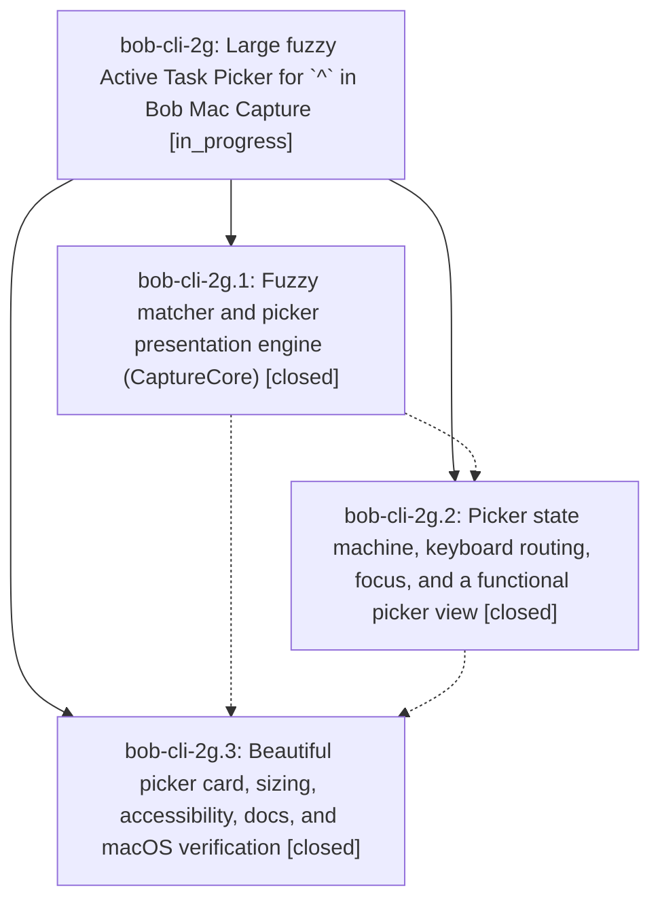

# Bead: bob-cli-2g — Large fuzzy Active Task Picker for \`^\` in Bob Mac Capture

[Bead Pages](../README.md) / bob-cli-2g

**Status:** ◐ in_progress · **Type:** ▸ plan · **Tier:** epic
**Owner:** `bryanbugyi34@gmail.com` · **Created by:** [bbugyi200.apollo.bob-cli-2f.3.w1](https://github.com/bobs-org/bob-cli--agents/blob/main/sessions/bbugyi200.apollo.bob-cli-2f.3.w1.md) · **Assignee:** `bob-cli-2g.land`
**Created:** 2026-09-28 18:28:11 EDT
**Plan:** [202609/mac\_active\_task\_picker.md](https://github.com/bobs-org/bob-cli--plans/blob/main/202609/mac_active_task_picker.md)

## Description

Typing `^` as a capture item in Bob Mac Capture opens a large, keyboard-first Active Task Picker. It lists every In Progress and Next task grouped by today's Pomodoro plan, filters them instantly with fuzzy matching, and inserts the chosen `route:block-id` reliably. It never shows red incomplete-marker errors while you pick.

## Phases

| Bead | Title | Status | Size | Created | Agents | Commits |
|---|---|---|---|---|---:|---:|
| [bob-cli-2g.1](bob-cli-2g.1.md) | Fuzzy matcher and picker presentation engine (CaptureCore) | ✓ closed | medium | 2026-09-28 | 1 | 0 |
| [bob-cli-2g.2](bob-cli-2g.2.md) | Picker state machine, keyboard routing, focus, and a functional picker view | ✓ closed | medium | 2026-09-28 | 1 | 0 |
| [bob-cli-2g.3](bob-cli-2g.3.md) | Beautiful picker card, sizing, accessibility, docs, and macOS verification | ✓ closed | medium | 2026-09-28 | 1 | 0 |

## Lineage

## Agents

| Agent | Bead | Commits |
|---|---|---:|
| [bbugyi200.apollo.bob-cli-2g.1](https://github.com/bobs-org/bob-cli--agents/blob/main/agents/bbugyi200.apollo.bob-cli-2g.1/README.md) | [bob-cli-2g.1](bob-cli-2g.1.md) | 0 |
| [bbugyi200.apollo.bob-cli-2g.2](https://github.com/bobs-org/bob-cli--agents/blob/main/agents/bbugyi200.apollo.bob-cli-2g.2/README.md) | [bob-cli-2g.2](bob-cli-2g.2.md) | 0 |
| [bbugyi200.apollo.bob-cli-2g.3](https://github.com/bobs-org/bob-cli--agents/blob/main/agents/bbugyi200.apollo.bob-cli-2g.3/README.md) | [bob-cli-2g.3](bob-cli-2g.3.md) | 0 |
| [bbugyi200.apollo.bob-cli-2g.land](https://github.com/bobs-org/bob-cli--agents/blob/main/agents/bbugyi200.apollo.bob-cli-2g.land/README.md) | [bob-cli-2g](README.md) | 0 |
