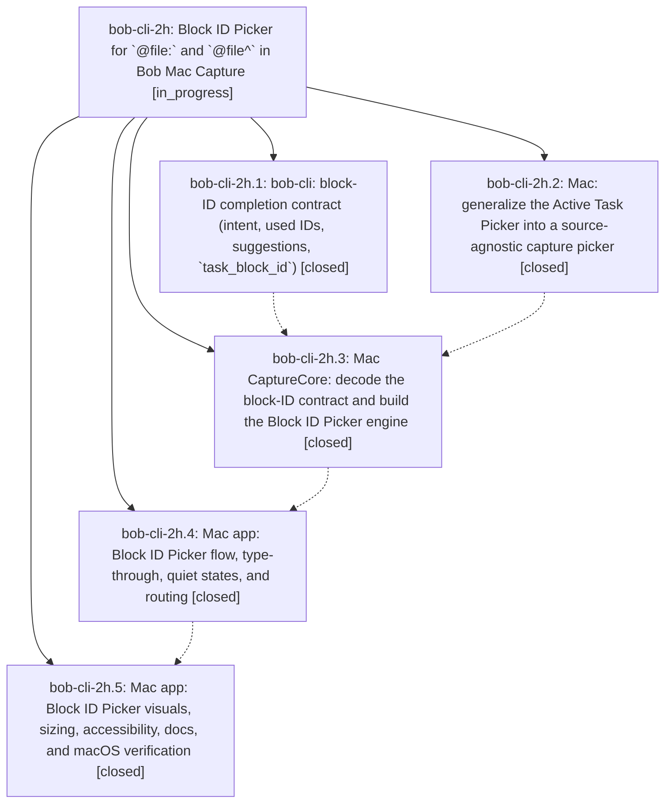

# Bead: bob-cli-2h — Block ID Picker for \`@file:\` and \`@file^\` in Bob Mac Capture

[Bead Pages](../README.md) / bob-cli-2h

**Status:** ◐ in_progress · **Type:** ▸ plan · **Tier:** epic
**Owner:** `bryanbugyi34@gmail.com` · **Created by:** [bbugyi200.apollo.31](https://github.com/bobs-org/bob-cli--agents/blob/main/sessions/bbugyi200.apollo.31.md) · **Assignee:** `bob-cli-2h.land`
**Created:** 2026-09-29 09:43:07 EDT
**Plan:** [202609/mac\_block\_id\_picker.md](https://github.com/bobs-org/bob-cli--plans/blob/main/202609/mac_block_id_picker.md)

## Description

Typing `@route:` or `@route^` anywhere those markers are valid opens the same large, fuzzy, keyboard-first picker language as `^`. A marker-only `@route:` browses and links the note's tasks. Every new-ID position (`@route^`, and `@route:` on an item with text) becomes an ID composer with Bob-generated suggestions, live availability against every ID already in the note, and type-through commits. Bob stays the only authority for grammar, candidates, intent, used IDs, and suggestions.

## Notes

[2026-09-29T15:32:35Z · bob-cli-2h.land] LAND TRIAGE (bob-cli-2h.land): (1) bob-cli-2h.1 PROPOSED FOLLOW-UP clippy '|| true' at tests/cli/capture/pomodoro_name.rs:808 — not caused by this epic (blame 7d1c8dd / bob-cli-28.1); owned by active epic bob-cli-28's closeout, so recorded as a DISCOVERED ISSUE corroboration note on bob-cli-28, no new task. (2) bob-cli-2h.2 #1, bob-cli-2h.3 note, bob-cli-2h.5 #1 and #4 (macOS verification never run; macOS CI red on every epic commit: 8203872 Test failed 5 assertions in testCaretPickerAcceptInsertsRouteBlockIDWithoutReopening/testCommandAcceptInsertsAndSubmits because ActiveTaskPickerPresentation row insertion is '^'+replacement while the replacement range excludes '^' -> '^^sase:deep-fix'; 8f84c07/b36458c/69e654d fail Build at CaptureModels.swift:2313 SingleValueDecodingContainer.decodeIfPresent) — caused by the epic, kept as remaining epic work in the landing tale. (3) bob-cli-2h.5 #2 rounded marker wash — declined: SwiftUI TextEditor over AttributedString cannot round background runs; the Done-when criterion ('the marker being edited is highlighted') is met by the square wash, and rounding needs overlay glyph geometry TextEditor does not expose; accepted as a deliberate deviation. (4) Plan Design decision 8 proposals: @route+/@@route+ parent-task picker with Add block ID flow + adding an ID from the Link picker -> new feature bob-cli-2i (large); project-note filename availability -> new feature bob-cli-2j (medium); latent '_' inconsistency -> NOT a follow-up but epic work: the plan premise was wrong (Bob's ':' validator is_block_id uses collect_done::is_block_id_byte and rejects '_' in every @route: form, verified with capture-parse on 'x @dev:foo_bar', '@dev:foo_bar', 'Write docs @sase:foo_bar'), yet bob-cli-2h.1 advertises block_id.allowed_character '[A-Za-z0-9_-]' / description with '_' for ':', so the Mac composer would treat foo_bar as available and Bob would reject it; fixed in the landing tale together with the misleading POMODORO_BLOCK_ID_ERROR wording (retired umbrella bob-cli-c). Settings toggles and ^/#name/wikilink changes were exclusions, not proposals: nothing to file.

## Phases

| Bead | Title | Status | Size | Created | Agents | Commits |
|---|---|---|---|---|---:|---:|
| [bob-cli-2h.1](bob-cli-2h.1.md) | bob-cli: block-ID completion contract (intent, used IDs, suggestions, \`task\_block\_id\`) | ✓ closed | medium | 2026-09-29 | 1 | 1 |
| [bob-cli-2h.2](bob-cli-2h.2.md) | Mac: generalize the Active Task Picker into a source-agnostic capture picker | ✓ closed | medium | 2026-09-29 | 1 | 0 |
| [bob-cli-2h.3](bob-cli-2h.3.md) | Mac CaptureCore: decode the block-ID contract and build the Block ID Picker engine | ✓ closed | medium | 2026-09-29 | 1 | 0 |
| [bob-cli-2h.4](bob-cli-2h.4.md) | Mac app: Block ID Picker flow, type-through, quiet states, and routing | ✓ closed | medium | 2026-09-29 | 1 | 0 |
| [bob-cli-2h.5](bob-cli-2h.5.md) | Mac app: Block ID Picker visuals, sizing, accessibility, docs, and macOS verification | ✓ closed | medium | 2026-09-29 | 1 | 0 |

## Lineage

## Agents

| Agent | Bead | Commits |
|---|---|---:|
| [bbugyi200.apollo.bob-cli-2h.1](https://github.com/bobs-org/bob-cli--agents/blob/main/agents/bbugyi200.apollo.bob-cli-2h.1/README.md) | [bob-cli-2h.1](bob-cli-2h.1.md) | 1 |
| [bbugyi200.apollo.bob-cli-2h.2](https://github.com/bobs-org/bob-cli--agents/blob/main/agents/bbugyi200.apollo.bob-cli-2h.2/README.md) | [bob-cli-2h.2](bob-cli-2h.2.md) | 0 |
| [bbugyi200.apollo.bob-cli-2h.3](https://github.com/bobs-org/bob-cli--agents/blob/main/agents/bbugyi200.apollo.bob-cli-2h.3/README.md) | [bob-cli-2h.3](bob-cli-2h.3.md) | 0 |
| [bbugyi200.apollo.bob-cli-2h.4](https://github.com/bobs-org/bob-cli--agents/blob/main/agents/bbugyi200.apollo.bob-cli-2h.4/README.md) | [bob-cli-2h.4](bob-cli-2h.4.md) | 0 |
| [bbugyi200.apollo.bob-cli-2h.5](https://github.com/bobs-org/bob-cli--agents/blob/main/agents/bbugyi200.apollo.bob-cli-2h.5/README.md) | [bob-cli-2h.5](bob-cli-2h.5.md) | 0 |
| [bbugyi200.apollo.bob-cli-2h.land](https://github.com/bobs-org/bob-cli--agents/blob/main/sessions/bbugyi200.apollo.bob-cli-2h.land.md) | [bob-cli-2h](README.md) | 1 |

## Commits

| Repo | Commit | Subject | Bead | Committed |
|---|---|---|---|---|
| bob-cli | [`271cadd`](https://github.com/bobs-org/bob-cli/commit/271caddeed5bf27e792c0370b854bf5703aa8023) | feat(capture): implement block-ID completion contract | [bob-cli-2h.1](bob-cli-2h.1.md) | 2026-09-29 10:06:29 EDT |
| bob-cli | [`ad8616e`](https://github.com/bobs-org/bob-cli/commit/ad8616eca05ff6c9decb91779df8d6f9e6af4174) | fix(capture): report Bob's real block-ID character rule for @route: | [bob-cli-2h](README.md) | 2026-09-29 11:53:01 EDT |
