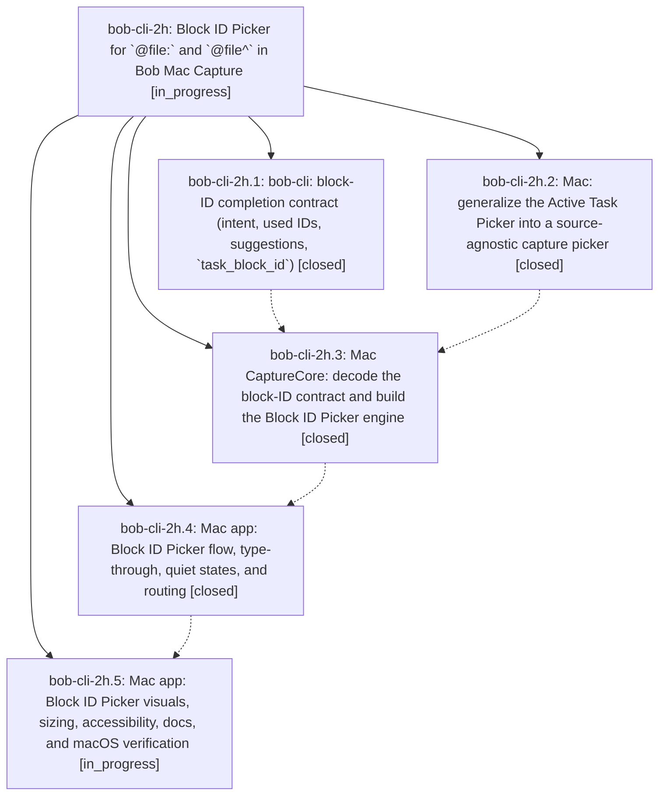

# Bead: bob-cli-2h — Block ID Picker for \`@file:\` and \`@file^\` in Bob Mac Capture

[Bead Pages](../README.md) / bob-cli-2h

**Status:** ◐ in_progress · **Type:** ▸ plan · **Tier:** epic
**Owner:** `bryanbugyi34@gmail.com` · **Created by:** [bbugyi200.apollo.31](https://github.com/bobs-org/bob-cli--agents/blob/main/sessions/bbugyi200.apollo.31.md) · **Assignee:** `bob-cli-2h.land`
**Created:** 2026-09-29 09:43:07 EDT
**Plan:** [202609/mac\_block\_id\_picker.md](https://github.com/bobs-org/bob-cli--plans/blob/main/202609/mac_block_id_picker.md)

## Description

Typing `@route:` or `@route^` anywhere those markers are valid opens the same large, fuzzy, keyboard-first picker language as `^`. A marker-only `@route:` browses and links the note's tasks. Every new-ID position (`@route^`, and `@route:` on an item with text) becomes an ID composer with Bob-generated suggestions, live availability against every ID already in the note, and type-through commits. Bob stays the only authority for grammar, candidates, intent, used IDs, and suggestions.

## Phases

| Bead | Title | Status | Size | Created | Agents | Commits |
|---|---|---|---|---|---:|---:|
| [bob-cli-2h.1](bob-cli-2h.1.md) | bob-cli: block-ID completion contract (intent, used IDs, suggestions, \`task\_block\_id\`) | ✓ closed | medium | 2026-09-29 | 1 | 1 |
| [bob-cli-2h.2](bob-cli-2h.2.md) | Mac: generalize the Active Task Picker into a source-agnostic capture picker | ✓ closed | medium | 2026-09-29 | 1 | 0 |
| [bob-cli-2h.3](bob-cli-2h.3.md) | Mac CaptureCore: decode the block-ID contract and build the Block ID Picker engine | ✓ closed | medium | 2026-09-29 | 1 | 0 |
| [bob-cli-2h.4](bob-cli-2h.4.md) | Mac app: Block ID Picker flow, type-through, quiet states, and routing | ✓ closed | medium | 2026-09-29 | 1 | 0 |
| [bob-cli-2h.5](bob-cli-2h.5.md) | Mac app: Block ID Picker visuals, sizing, accessibility, docs, and macOS verification | ◐ in_progress | medium | 2026-09-29 | 1 | 0 |

## Lineage

## Agents

| Agent | Bead | Commits |
|---|---|---:|
| [bbugyi200.apollo.bob-cli-2h.1](https://github.com/bobs-org/bob-cli--agents/blob/main/agents/bbugyi200.apollo.bob-cli-2h.1/README.md) | [bob-cli-2h.1](bob-cli-2h.1.md) | 1 |
| [bbugyi200.apollo.bob-cli-2h.2](https://github.com/bobs-org/bob-cli--agents/blob/main/agents/bbugyi200.apollo.bob-cli-2h.2/README.md) | [bob-cli-2h.2](bob-cli-2h.2.md) | 0 |
| [bbugyi200.apollo.bob-cli-2h.3](https://github.com/bobs-org/bob-cli--agents/blob/main/agents/bbugyi200.apollo.bob-cli-2h.3/README.md) | [bob-cli-2h.3](bob-cli-2h.3.md) | 0 |
| [bbugyi200.apollo.bob-cli-2h.4](https://github.com/bobs-org/bob-cli--agents/blob/main/agents/bbugyi200.apollo.bob-cli-2h.4/README.md) | [bob-cli-2h.4](bob-cli-2h.4.md) | 0 |
| [bbugyi200.apollo.bob-cli-2h.5](https://github.com/bobs-org/bob-cli--agents/blob/main/agents/bbugyi200.apollo.bob-cli-2h.5/README.md) | [bob-cli-2h.5](bob-cli-2h.5.md) | 0 |
| [bbugyi200.apollo.bob-cli-2h.land](https://github.com/bobs-org/bob-cli--agents/blob/main/agents/bbugyi200.apollo.bob-cli-2h.land/README.md) | [bob-cli-2h](README.md) | 0 |

## Commits

| Repo | Commit | Subject | Bead | Committed |
|---|---|---|---|---|
| bob-cli | [`271cadd`](https://github.com/bobs-org/bob-cli/commit/271caddeed5bf27e792c0370b854bf5703aa8023) | feat(capture): implement block-ID completion contract | [bob-cli-2h.1](bob-cli-2h.1.md) | 2026-09-29 10:06:29 EDT |
