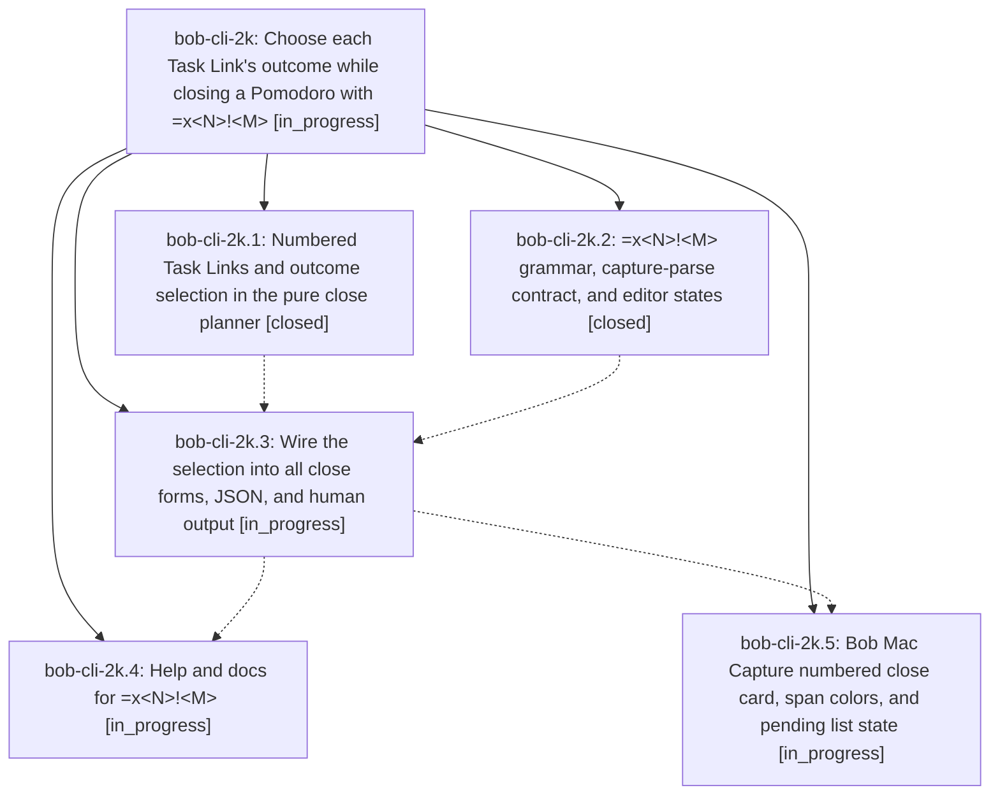

# Bead: bob-cli-2k — Choose each Task Link's outcome while closing a Pomodoro with =x\<N\>!\<M\>

[Bead Pages](../README.md) / bob-cli-2k

**Status:** ◐ in_progress · **Type:** ▸ plan · **Tier:** epic
**Owner:** `bryanbugyi34@gmail.com` · **Created by:** [bbugyi200.apollo.34](https://github.com/bobs-org/bob-cli--agents/blob/main/sessions/bbugyi200.apollo.34.md) · **Assignee:** `bob-cli-2k.land`
**Created:** 2026-09-29 13:45:02 EDT
**Plan:** [202609/close\_task\_selection.md](https://github.com/bobs-org/bob-cli--plans/blob/main/202609/close_task_selection.md)

## Description

`=x<N>`, `=x!<M>`, and `=x<N>!<M>` close the running Pomodoro and decide, by number,
which of its Task Links stay in progress, which are deferred, and which are
completed and struck. This does in one capture what the user does by hand before
Ctrl+Enter: append `#` to links that should not start, and transclude links whose
tasks are finished. Every close stays atomic. A mistyped list gets a precise
diagnostic. Plain `=x` keeps working byte for byte as it does today. `bob capture`
output and the Bob Mac Capture close card show a number badge on every Task Link
and the outcome each one will get, so choosing the numbers is easy.

## Phases

| Bead | Title | Status | Size | Created | Agents | Commits |
|---|---|---|---|---|---:|---:|
| [bob-cli-2k.1](bob-cli-2k.1.md) | Numbered Task Links and outcome selection in the pure close planner | ✓ closed | medium | 2026-09-29 | 1 | 1 |
| [bob-cli-2k.2](bob-cli-2k.2.md) | =x\<N\>!\<M\> grammar, capture-parse contract, and editor states | ✓ closed | medium | 2026-09-29 | 1 | 1 |
| [bob-cli-2k.3](bob-cli-2k.3.md) | Wire the selection into all close forms, JSON, and human output | ◐ in_progress | medium | 2026-09-29 | 1 | 0 |
| [bob-cli-2k.4](bob-cli-2k.4.md) | Help and docs for =x\<N\>!\<M\> | ◐ in_progress | small | 2026-09-29 | 1 | 0 |
| [bob-cli-2k.5](bob-cli-2k.5.md) | Bob Mac Capture numbered close card, span colors, and pending list state | ◐ in_progress | medium | 2026-09-29 | 1 | 0 |

## Lineage

## Agents

| Agent | Bead | Commits |
|---|---|---:|
| [bbugyi200.apollo.bob-cli-2k.1](https://github.com/bobs-org/bob-cli--agents/blob/main/agents/bbugyi200.apollo.bob-cli-2k.1/README.md) | [bob-cli-2k.1](bob-cli-2k.1.md) | 1 |
| [bbugyi200.apollo.bob-cli-2k.2](https://github.com/bobs-org/bob-cli--agents/blob/main/agents/bbugyi200.apollo.bob-cli-2k.2/README.md) | [bob-cli-2k.2](bob-cli-2k.2.md) | 1 |
| [bbugyi200.apollo.bob-cli-2k.3](https://github.com/bobs-org/bob-cli--agents/blob/main/agents/bbugyi200.apollo.bob-cli-2k.3/README.md) | [bob-cli-2k.3](bob-cli-2k.3.md) | 0 |
| [bbugyi200.apollo.bob-cli-2k.4](https://github.com/bobs-org/bob-cli--agents/blob/main/agents/bbugyi200.apollo.bob-cli-2k.4/README.md) | [bob-cli-2k.4](bob-cli-2k.4.md) | 0 |
| [bbugyi200.apollo.bob-cli-2k.5](https://github.com/bobs-org/bob-cli--agents/blob/main/agents/bbugyi200.apollo.bob-cli-2k.5/README.md) | [bob-cli-2k.5](bob-cli-2k.5.md) | 0 |
| [bbugyi200.apollo.bob-cli-2k.land](https://github.com/bobs-org/bob-cli--agents/blob/main/agents/bbugyi200.apollo.bob-cli-2k.land/README.md) | [bob-cli-2k](README.md) | 0 |

## Commits

| Repo | Commit | Subject | Bead | Committed |
|---|---|---|---|---|
| bob-cli | [`6f45d38`](https://github.com/bobs-org/bob-cli/commit/6f45d389110426f7e1a52f7e4d2107b0edf99c61) | feat(close): numbered Task Links and outcome selection in pure close planner | [bob-cli-2k.1](bob-cli-2k.1.md) | 2026-09-29 14:07:53 EDT |
| bob-cli | [`1838779`](https://github.com/bobs-org/bob-cli/commit/1838779284b63937735b988a4f09e57d7ae50325) | feat(capture): add pomodoro close selection grammar | [bob-cli-2k.2](bob-cli-2k.2.md) | 2026-09-29 14:15:59 EDT |
