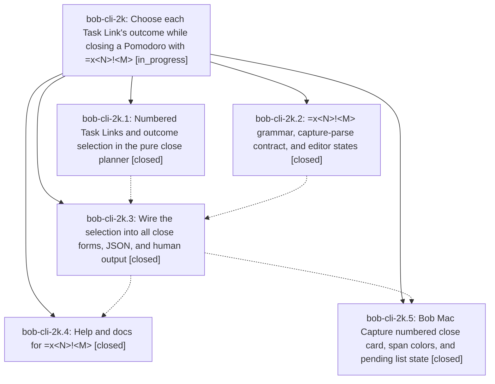

# Bead: bob-cli-2k — Choose each Task Link's outcome while closing a Pomodoro with =x\<N\>!\<M\>

[Bead Pages](../README.md) / bob-cli-2k

**Status:** ◐ in_progress · **Type:** ▸ plan · **Tier:** epic
**Owner:** `bryanbugyi34@gmail.com` · **Created by:** [bbugyi200.apollo.34](https://github.com/bobs-org/bob-cli--agents/blob/main/sessions/bbugyi200.apollo.34.md) · **Assignee:** `bob-cli-2k.land`
**Created:** 2026-09-29 13:45:02 EDT
**Plan:** [202609/close\_task\_selection.md](https://github.com/bobs-org/bob-cli--plans/blob/main/202609/close_task_selection.md)

## Description

`=x<N>`, `=x!<M>`, and `=x<N>!<M>` close the running Pomodoro and decide, by number,
which of its Task Links stay in progress, which are deferred, and which are
completed and struck. This does in one capture what the user does by hand before
Ctrl+Enter: append `#` to links that should not start, and transclude links whose
tasks are finished. Every close stays atomic. A mistyped list gets a precise
diagnostic. Plain `=x` keeps working byte for byte as it does today. `bob capture`
output and the Bob Mac Capture close card show a number badge on every Task Link
and the outcome each one will get, so choosing the numbers is easy.

## Notes

[2026-09-29T19:16:07Z · bob-cli-2k.land] LAND TRIAGE (bob-cli-2k.land) of PROPOSED FOLLOW-UPs: (1) clippy deny at tests/cli/capture/pomodoro_name.rs:808 '|| true' (proposed by .1, .2, .3, .4): pre-existing, not caused by this epic, and owned by active epic bob-cli-28 (22abed47), so recorded as a DISCOVERED ISSUE corroboration note on bob-cli-28 with no new task. (2) The 23 pre-existing clippy warnings (.2): duplicate of bob-cli-v. Added +1: the count is unchanged at 17 lib + 1 cli-test, so this epic added none. (3) Flaky gkeep_auth login_missing_email_is_a_setup_error broken pipe (.4): not caused by this epic, and no existing bead matched, so created task bob-cli-2m (flake, small; root cause is an EPIPE race in run_login's stdin write). (4) The plan's folded worked-example post-images (.3): caused by this epic, since docs/capture.md still prints the folded =x2/=x0 blocks. Declined as a task and kept as remaining epic work in the landing tale. (5) Found by the land review, not a phase proposal: '^route:id=x…' does not treat a deferred '[[T]]#' in the running Pomodoro as already current, so it appends a duplicate link and '^bob:web-capture=x3' fails as a conflicting duplicate. Root cause is bob-cli-28.1's find_movable_task_links, so recorded as a DISCOVERED ISSUE note on bob-cli-28 with no new task.

[2026-09-29T19:18:23Z · bob-cli-2k.land] LAND AUDIT (bob-cli-2k.land): Read all five phase beads and their notes, the plan, bob-cli commits 6f45d38/1838779/2c32a91/b3405bd, and bob-mac-capture 7e672cc/f6eae0b. macOS CI run 36615238978 at f6eae0b is green. There is no drift: no unrelated commits landed in either repo since the epic started. On master b3405bd, cargo test is fully green (1167 lib + 535 cli + other suites), cargo fmt --check is clean, and clippy has no new warnings; its only error is the pre-existing pomodoro_name.rs:808 deny. There are no epic-symbol entries. Epic-caused defects remain, planned as a lander tale (sase_plan_close_selection_land.md):
(1) assign_task_indices keys rows by first ledger line, so a task first mentioned on an unnumbered line gets index null and loses its listed Blocked warning. The human index column also turns on from task_links rather than numbered rows.
(2) Listed warnings miss a listed higher duplicate and compare status symbols instead of status types.
(3) '^r:id=x1!' reports the task-toggle error instead of incomplete (tokens.rs toggle check runs before the close suffix).
(4) Extra-text range uses parent_text.find(rest): '=x1 1' reports [2,3) instead of [4,5).
(5) Wrong range for '=x1,,' and the wrong message for '=x1,!2'.
(6) '=x0,' is reported as incomplete although it can never be valid; '=x00' is accepted.
(7) '^r:id=x1,1 s:2' gets different messages from execution and the editor.
(8) Block-ID completion inside '@r:id=x1,' returns intent new.
(9) Docs: the =x2/=x0 post-images are folded (wrong bytes), the help has a stray literal \n line, the help misattributes numbering to capture-parse, README wording is ambiguous, a code span is broken, and the Contents list and section structure are off.
(10) Test gaps listed in the tale.

## Phases

| Bead | Title | Status | Size | Created | Agents | Commits |
|---|---|---|---|---|---:|---:|
| [bob-cli-2k.1](bob-cli-2k.1.md) | Numbered Task Links and outcome selection in the pure close planner | ✓ closed | medium | 2026-09-29 | 1 | 1 |
| [bob-cli-2k.2](bob-cli-2k.2.md) | =x\<N\>!\<M\> grammar, capture-parse contract, and editor states | ✓ closed | medium | 2026-09-29 | 1 | 1 |
| [bob-cli-2k.3](bob-cli-2k.3.md) | Wire the selection into all close forms, JSON, and human output | ✓ closed | medium | 2026-09-29 | 1 | 1 |
| [bob-cli-2k.4](bob-cli-2k.4.md) | Help and docs for =x\<N\>!\<M\> | ✓ closed | small | 2026-09-29 | 1 | 1 |
| [bob-cli-2k.5](bob-cli-2k.5.md) | Bob Mac Capture numbered close card, span colors, and pending list state | ✓ closed | medium | 2026-09-29 | 1 | 0 |

## Lineage

## Agents

| Agent | Bead | Commits |
|---|---|---:|
| [bbugyi200.apollo.bob-cli-2k.1](https://github.com/bobs-org/bob-cli--agents/blob/main/agents/bbugyi200.apollo.bob-cli-2k.1/README.md) | [bob-cli-2k.1](bob-cli-2k.1.md) | 1 |
| [bbugyi200.apollo.bob-cli-2k.2](https://github.com/bobs-org/bob-cli--agents/blob/main/agents/bbugyi200.apollo.bob-cli-2k.2/README.md) | [bob-cli-2k.2](bob-cli-2k.2.md) | 1 |
| [bbugyi200.apollo.bob-cli-2k.3](https://github.com/bobs-org/bob-cli--agents/blob/main/agents/bbugyi200.apollo.bob-cli-2k.3/README.md) | [bob-cli-2k.3](bob-cli-2k.3.md) | 1 |
| [bbugyi200.apollo.bob-cli-2k.4](https://github.com/bobs-org/bob-cli--agents/blob/main/agents/bbugyi200.apollo.bob-cli-2k.4/README.md) | [bob-cli-2k.4](bob-cli-2k.4.md) | 1 |
| [bbugyi200.apollo.bob-cli-2k.5](https://github.com/bobs-org/bob-cli--agents/blob/main/agents/bbugyi200.apollo.bob-cli-2k.5/README.md) | [bob-cli-2k.5](bob-cli-2k.5.md) | 0 |
| [bbugyi200.apollo.bob-cli-2k.land](https://github.com/bobs-org/bob-cli--agents/blob/main/sessions/bbugyi200.apollo.bob-cli-2k.land.md) | [bob-cli-2k](README.md) | 1 |

## Commits

| Repo | Commit | Subject | Bead | Committed |
|---|---|---|---|---|
| bob-cli | [`6f45d38`](https://github.com/bobs-org/bob-cli/commit/6f45d389110426f7e1a52f7e4d2107b0edf99c61) | feat(close): numbered Task Links and outcome selection in pure close planner | [bob-cli-2k.1](bob-cli-2k.1.md) | 2026-09-29 14:07:53 EDT |
| bob-cli | [`1838779`](https://github.com/bobs-org/bob-cli/commit/1838779284b63937735b988a4f09e57d7ae50325) | feat(capture): add pomodoro close selection grammar | [bob-cli-2k.2](bob-cli-2k.2.md) | 2026-09-29 14:15:59 EDT |
| bob-cli | [`2c32a91`](https://github.com/bobs-org/bob-cli/commit/2c32a91940b415e4c281910040c6cd415a5fe76f) | feat(capture): wire selection capture into pomodoro close | [bob-cli-2k.3](bob-cli-2k.3.md) | 2026-09-29 14:34:25 EDT |
| bob-cli | [`b3405bd`](https://github.com/bobs-org/bob-cli/commit/b3405bd20909d5ba1efd0e72b0c65f5c8ab88506) | docs(capture): document task-link outcome specifiers =x\[\<N\>\]\[!\<M\>\] | [bob-cli-2k.4](bob-cli-2k.4.md) | 2026-09-29 14:46:45 EDT |
| bob-cli | [`afb2e5c`](https://github.com/bobs-org/bob-cli/commit/afb2e5c19174b902f1d34ea6f03bf594e686b8cb) | fix(capture): land epic bob-cli-2k selection follow-ups | [bob-cli-2k](README.md) | 2026-09-29 15:43:59 EDT |
