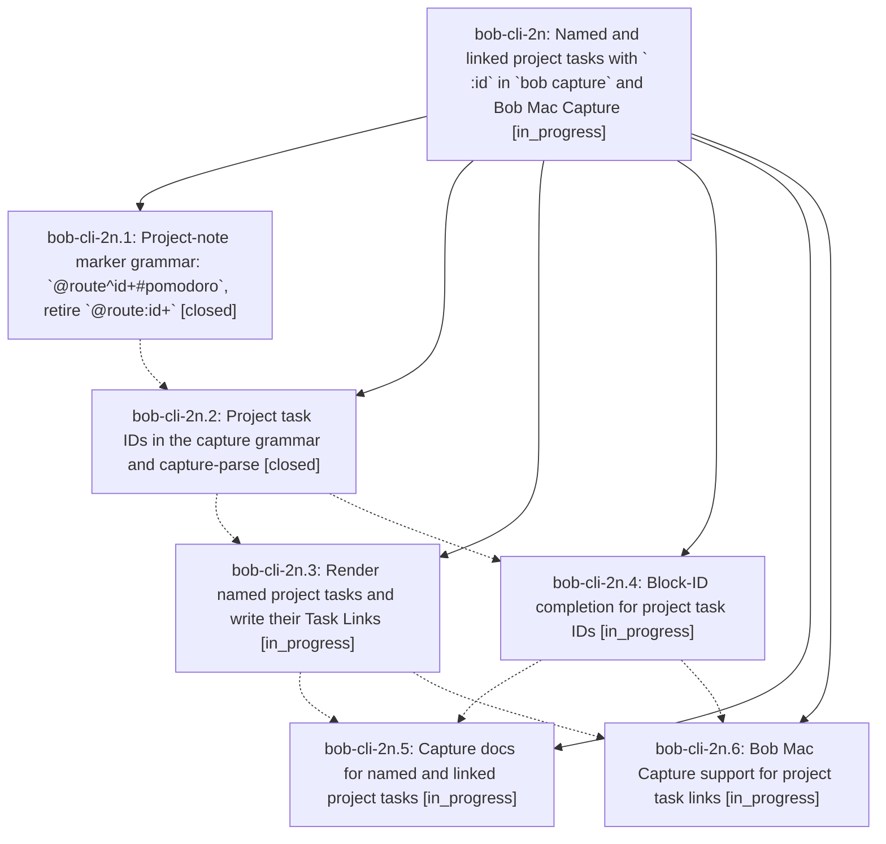

# Bead: bob-cli-2n — Named and linked project tasks with \` :id\` in \`bob capture\` and Bob Mac Capture

[Bead Pages](../README.md) / bob-cli-2n

**Status:** ◐ in_progress · **Type:** ▸ plan · **Tier:** epic
**Owner:** `bryanbugyi34@gmail.com` · **Created by:** [bbugyi200.apollo.35](https://github.com/bobs-org/bob-cli--agents/blob/main/sessions/bbugyi200.apollo.35.md) · **Assignee:** `bob-cli-2n.land`
**Created:** 2026-09-29 15:35:24 EDT
**Plan:** [202609/project\_task\_links.md](https://github.com/bobs-org/bob-cli--plans/blob/main/202609/project_task_links.md)

## Description

A project-note capture (`@route^id+` or `@route^id+#pomodoro`) can name any of its task bullets with a trailing ` ^id`, or name them and link them into the current/next (or named) Pomodoro with a trailing ` :id`. The `^prj` task is never linked, the retired `@route:id+` forms fail with a message that teaches the new spelling, and Bob Mac Capture highlights, completes, previews, and reports the new syntax.

## Phases

| Bead | Title | Status | Size | Created | Agents | Commits |
|---|---|---|---|---|---:|---:|
| [bob-cli-2n.1](bob-cli-2n.1.md) | Project-note marker grammar: \`@route^id+#pomodoro\`, retire \`@route:id+\` | ✓ closed | medium | 2026-09-29 | 1 | 1 |
| [bob-cli-2n.2](bob-cli-2n.2.md) | Project task IDs in the capture grammar and capture-parse | ✓ closed | medium | 2026-09-29 | 1 | 1 |
| [bob-cli-2n.3](bob-cli-2n.3.md) | Render named project tasks and write their Task Links | ◐ in_progress | medium | 2026-09-29 | 1 | 0 |
| [bob-cli-2n.4](bob-cli-2n.4.md) | Block-ID completion for project task IDs | ◐ in_progress | small | 2026-09-29 | 1 | 0 |
| [bob-cli-2n.5](bob-cli-2n.5.md) | Capture docs for named and linked project tasks | ◐ in_progress | small | 2026-09-29 | 1 | 0 |
| [bob-cli-2n.6](bob-cli-2n.6.md) | Bob Mac Capture support for project task links | ◐ in_progress | medium | 2026-09-29 | 1 | 0 |

## Lineage

## Agents

| Agent | Bead | Commits |
|---|---|---:|
| [bbugyi200.apollo.bob-cli-2n.1](https://github.com/bobs-org/bob-cli--agents/blob/main/agents/bbugyi200.apollo.bob-cli-2n.1/README.md) | [bob-cli-2n.1](bob-cli-2n.1.md) | 1 |
| [bbugyi200.apollo.bob-cli-2n.2](https://github.com/bobs-org/bob-cli--agents/blob/main/agents/bbugyi200.apollo.bob-cli-2n.2/README.md) | [bob-cli-2n.2](bob-cli-2n.2.md) | 1 |
| [bbugyi200.apollo.bob-cli-2n.3](https://github.com/bobs-org/bob-cli--agents/blob/main/agents/bbugyi200.apollo.bob-cli-2n.3/README.md) | [bob-cli-2n.3](bob-cli-2n.3.md) | 0 |
| [bbugyi200.apollo.bob-cli-2n.4](https://github.com/bobs-org/bob-cli--agents/blob/main/agents/bbugyi200.apollo.bob-cli-2n.4/README.md) | [bob-cli-2n.4](bob-cli-2n.4.md) | 0 |
| [bbugyi200.apollo.bob-cli-2n.5](https://github.com/bobs-org/bob-cli--agents/blob/main/agents/bbugyi200.apollo.bob-cli-2n.5/README.md) | [bob-cli-2n.5](bob-cli-2n.5.md) | 0 |
| [bbugyi200.apollo.bob-cli-2n.6](https://github.com/bobs-org/bob-cli--agents/blob/main/agents/bbugyi200.apollo.bob-cli-2n.6/README.md) | [bob-cli-2n.6](bob-cli-2n.6.md) | 0 |
| [bbugyi200.apollo.bob-cli-2n.land](https://github.com/bobs-org/bob-cli--agents/blob/main/agents/bbugyi200.apollo.bob-cli-2n.land/README.md) | [bob-cli-2n](README.md) | 0 |

## Commits

| Repo | Commit | Subject | Bead | Committed |
|---|---|---|---|---|
| bob-cli | [`65f5b43`](https://github.com/bobs-org/bob-cli/commit/65f5b43acafb3eedcb922f402a5d305c841652a0) | feat(capture): project-note pomodoro marker phase (@route^id+#pomodoro) | [bob-cli-2n.1](bob-cli-2n.1.md) | 2026-09-29 16:37:01 EDT |
| bob-cli | [`e9c4dae`](https://github.com/bobs-org/bob-cli/commit/e9c4dae3274e09a8af0ec01762d2b35d9afd862e) | feat(capture): add project task-id grammar pass with shared lexer and editor spans | [bob-cli-2n.2](bob-cli-2n.2.md) | 2026-09-29 16:59:30 EDT |
