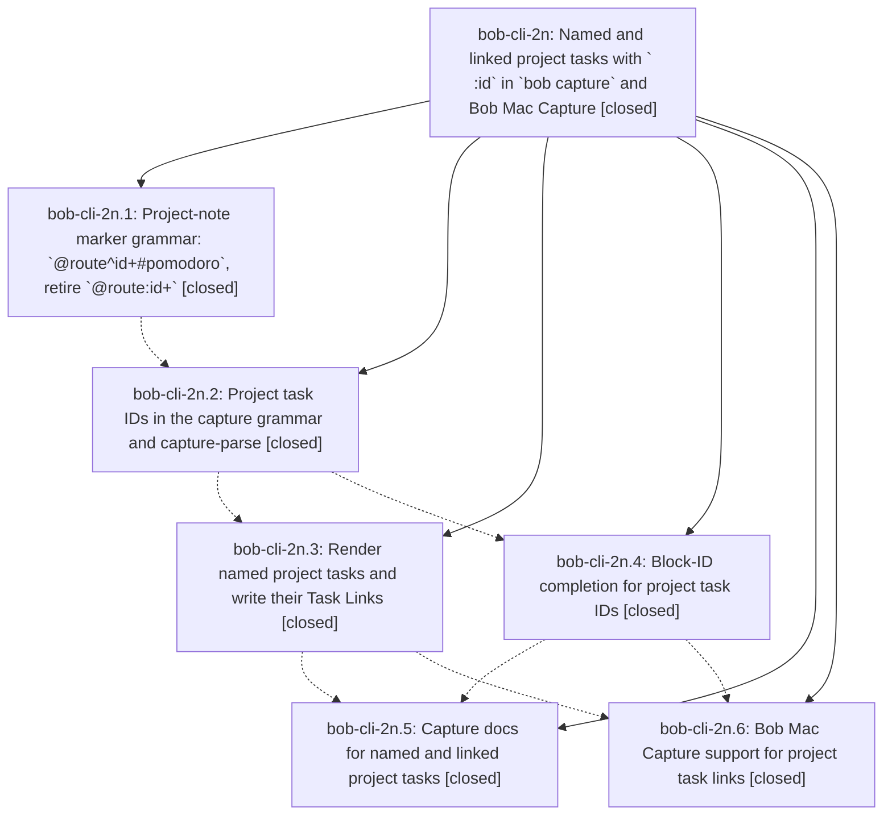

# Bead: bob-cli-2n — Named and linked project tasks with \` :id\` in \`bob capture\` and Bob Mac Capture

[Bead Pages](../README.md) / bob-cli-2n

**Status:** ✓ closed · **Resolution:** done · **Type:** ▸ plan · **Tier:** epic
**Owner:** `bryanbugyi34@gmail.com` · **Created by:** [bbugyi200.apollo.35](https://github.com/bobs-org/bob-cli--agents/blob/main/sessions/bbugyi200.apollo.35.md) · **Assignee:** `bob-cli-2n.land`
**Created:** 2026-09-29 15:35:24 EDT · **Closed:** 2026-09-29 18:20:44 EDT
**Plan:** [202609/project\_task\_links.md](https://github.com/bobs-org/bob-cli--plans/blob/main/202609/project_task_links.md)

## Description

A project-note capture (`@route^id+` or `@route^id+#pomodoro`) can name any of its task bullets with a trailing ` ^id`, or name them and link them into the current/next (or named) Pomodoro with a trailing ` :id`. The `^prj` task is never linked, the retired `@route:id+` forms fail with a message that teaches the new spelling, and Bob Mac Capture highlights, completes, previews, and reports the new syntax.

## Notes

[2026-09-29T21:57:15Z · bob-cli-2n.land] LAND TRIAGE (bob-cli-2n.land): PROPOSED FOLLOW-UPs from bob-cli-2n.1/.2/.3/.4 (clippy::overly_complex_bool_expr deny at tests/cli/capture/pomodoro_name.rs:808, '|| true') -> not caused by this epic (blame 7d1c8dd / origin 22abed4 = bob-cli-28.1); no new task, corroborated as a DISCOVERED ISSUE note on active epic bob-cli-28, whose closeout owns it. PROPOSED FOLLOW-UP from bob-cli-2n.5 (clippy single_element_loop at src/native/capture_parse.rs:1117) -> not caused by this epic (blame d2239267) and only a warning, not the lint failure; +1 recorded on existing task bob-cli-v (clippy warnings). bob-cli-2n.6 made no proposal. Land-audit findings that are epic defects (Pomodoro-name resolution in task-link reporting, ^id=<X> error wording, empty checkbox-only ^ task body, lone ' :' + #name diagnostic, route-less @:id+ editor/execution divergence, stale README/docs/comments/help) are planned as a closeout tale. Declined audit nits: line.rs LineOutcome candidate not added (plan step 2.1) because execution's last-body-word post-pass is behavior-equivalent and shared with the editor; editor skips task-ID spans while the marker is still incomplete (e.g. '+#') because the plan does not specify it and it resolves once the marker completes; '@cash^+#bugs=3' reports different first errors in editor vs execution but both reject a doubly malformed token; unreachable capture_block_ids.rs project-task fallback is guarded by shared project_task_token_at.

[2026-09-29T22:20:44Z · bob-cli-2n.land] All six phases verified against the plan and commits 65f5b43, e9c4dae, 5f6c761, 301e809, and 42cd336. Mac commit ff41276 passed macOS CI run 36634195459. The only post-start non-epic commit, afb2e5c, predates the epic commits and is incorporated. Tale fixes items 1-7: (1) project_note.rs reports resolved entry.name for Found with canonical fallback; (2) tokens.rs/editor_classify.rs gate project-note = messages on trailing + before first =; (3) project_tasks.rs strips leading checkbox before empty-body check; (4) editor_parse.rs counts Unfinished : as pending link for unused-name rule; (5) tokens.rs rejects route-less @:<block>+ via retired builder in terminal validation; (6) README/docs/model/completion/cli/capture_project_note/capture_block_ids/capture_complete stale text refreshed; (7) renderer byte-for-byte worked example, CLI full new-note/daily-note bytes with single ADMIN, dry-run JSON equals real except dry_run, plus grammar/editor/CLI regression tests for items 1-5. Verify: cargo fmt --check clean; cargo test passes (1198 lib, 545 CLI, all other targets); cargo clippy --all-targets --all-features shows only pre-existing overly_complex_bool_expr at tests/cli/capture/pomodoro_name.rs:808 owned by bob-cli-28, lib warnings back to baseline 17. Triage: pomodoro_name.rs:808 deny to DISCOVERED ISSUE on bob-cli-28 (proposed by .1-.4); single_element_loop +1 on bob-cli-v (proposed by .5); .6 proposed nothing; declined audit nits in LAND TRIAGE note. just --list shows no symvision recipe (absent). Epic plan 202609/project_task_links.md set status done; no parent_bead.

## Phases

| Bead | Title | Status | Size | Created | Agents | Commits |
|---|---|---|---|---|---:|---:|
| [bob-cli-2n.1](bob-cli-2n.1.md) | Project-note marker grammar: \`@route^id+#pomodoro\`, retire \`@route:id+\` | ✓ closed | medium | 2026-09-29 | 1 | 1 |
| [bob-cli-2n.2](bob-cli-2n.2.md) | Project task IDs in the capture grammar and capture-parse | ✓ closed | medium | 2026-09-29 | 1 | 1 |
| [bob-cli-2n.3](bob-cli-2n.3.md) | Render named project tasks and write their Task Links | ✓ closed | medium | 2026-09-29 | 1 | 1 |
| [bob-cli-2n.4](bob-cli-2n.4.md) | Block-ID completion for project task IDs | ✓ closed | small | 2026-09-29 | 1 | 1 |
| [bob-cli-2n.5](bob-cli-2n.5.md) | Capture docs for named and linked project tasks | ✓ closed | small | 2026-09-29 | 1 | 1 |
| [bob-cli-2n.6](bob-cli-2n.6.md) | Bob Mac Capture support for project task links | ✓ closed | medium | 2026-09-29 | 1 | 0 |

## Lineage

## Agents

| Agent | Bead | Commits |
|---|---|---:|
| [bbugyi200.apollo.bob-cli-2n.1](https://github.com/bobs-org/bob-cli--agents/blob/main/agents/bbugyi200.apollo.bob-cli-2n.1/README.md) | [bob-cli-2n.1](bob-cli-2n.1.md) | 1 |
| [bbugyi200.apollo.bob-cli-2n.2](https://github.com/bobs-org/bob-cli--agents/blob/main/agents/bbugyi200.apollo.bob-cli-2n.2/README.md) | [bob-cli-2n.2](bob-cli-2n.2.md) | 1 |
| [bbugyi200.apollo.bob-cli-2n.3](https://github.com/bobs-org/bob-cli--agents/blob/main/agents/bbugyi200.apollo.bob-cli-2n.3/README.md) | [bob-cli-2n.3](bob-cli-2n.3.md) | 1 |
| [bbugyi200.apollo.bob-cli-2n.4](https://github.com/bobs-org/bob-cli--agents/blob/main/agents/bbugyi200.apollo.bob-cli-2n.4/README.md) | [bob-cli-2n.4](bob-cli-2n.4.md) | 1 |
| [bbugyi200.apollo.bob-cli-2n.5](https://github.com/bobs-org/bob-cli--agents/blob/main/agents/bbugyi200.apollo.bob-cli-2n.5/README.md) | [bob-cli-2n.5](bob-cli-2n.5.md) | 1 |
| [bbugyi200.apollo.bob-cli-2n.6](https://github.com/bobs-org/bob-cli--agents/blob/main/sessions/bbugyi200.apollo.bob-cli-2n.6.md) | [bob-cli-2n.6](bob-cli-2n.6.md) | 0 |
| [bbugyi200.apollo.bob-cli-2n.land](https://github.com/bobs-org/bob-cli--agents/blob/main/sessions/bbugyi200.apollo.bob-cli-2n.land.md) | [bob-cli-2n](README.md) | 1 |

## Commits

| Repo | Commit | Subject | Bead | Committed |
|---|---|---|---|---|
| bob-cli | [`65f5b43`](https://github.com/bobs-org/bob-cli/commit/65f5b43acafb3eedcb922f402a5d305c841652a0) | feat(capture): project-note pomodoro marker phase (@route^id+#pomodoro) | [bob-cli-2n.1](bob-cli-2n.1.md) | 2026-09-29 16:37:01 EDT |
| bob-cli | [`e9c4dae`](https://github.com/bobs-org/bob-cli/commit/e9c4dae3274e09a8af0ec01762d2b35d9afd862e) | feat(capture): add project task-id grammar pass with shared lexer and editor spans | [bob-cli-2n.2](bob-cli-2n.2.md) | 2026-09-29 16:59:30 EDT |
| bob-cli | [`5f6c761`](https://github.com/bobs-org/bob-cli/commit/5f6c761208a36eea54c6327185e3f419ea105a71) | feat(capture): render named project tasks and write their Task Links | [bob-cli-2n.3](bob-cli-2n.3.md) | 2026-09-29 17:13:21 EDT |
| bob-cli | [`301e809`](https://github.com/bobs-org/bob-cli/commit/301e809053278768e46263d03f127b930acc4e41) | feat(capture): add project\_task\_block\_id capture-complete context | [bob-cli-2n.4](bob-cli-2n.4.md) | 2026-09-29 17:16:19 EDT |
| bob-cli | [`42cd336`](https://github.com/bobs-org/bob-cli/commit/42cd3362d7b7cb0472df40a6267009b93add3b5a) | docs(capture): document named and linked project tasks | [bob-cli-2n.5](bob-cli-2n.5.md) | 2026-09-29 17:25:41 EDT |
| bob-cli | [`d9e85c2`](https://github.com/bobs-org/bob-cli/commit/d9e85c25bdc80cffe309d17b6b6c160ff7dced51) | fix(capture): land epic bob-cli-2n project task links follow-ups | [bob-cli-2n](README.md) | 2026-09-29 18:24:13 EDT |
