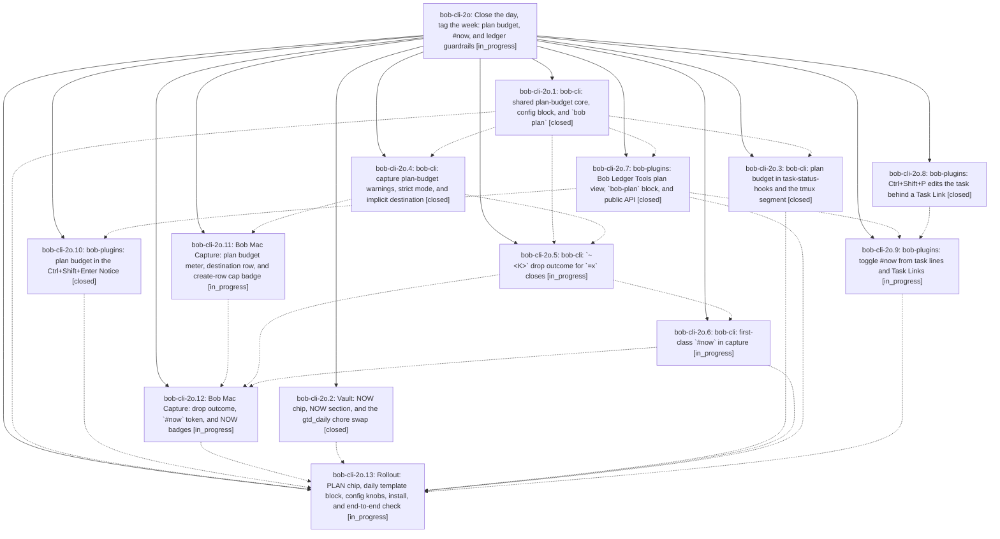

# Bead: bob-cli-2o — Close the day, tag the week: plan budget, #now, and ledger guardrails

[Bead Pages](../README.md) / bob-cli-2o

**Status:** ◐ in_progress · **Type:** ▸ plan · **Tier:** epic
**Owner:** `bryanbugyi34@gmail.com` · **Created by:** [bbugyi200.apollo.38](https://github.com/bobs-org/bob-cli--agents/blob/main/sessions/bbugyi200.apollo.38.md) · **Assignee:** `bob-cli-2o.land`
**Created:** 2026-09-29 18:09:56 EDT
**Plan:** [202609/pomodoro\_plan\_budget\_now\_tag.md](https://github.com/bobs-org/bob-cli--plans/blob/main/202609/pomodoro_plan_budget_now_tag.md)

## Description

Today's Pomodoro plan is a visible, capped, closed list (GTD + 3 themes, about 10 Task Links) and this week's bets live in a `#now` tag. One shared budget definition shows the same numbers in `bob plan`, task-status-hooks, tmux, `bob capture`, Bob Mac Capture, and Obsidian. New gestures let Bryan drop, defer, and tag work from the ledger itself, and nothing rewrites the plan behind Bryan's back.

## Phases

| Bead | Title | Status | Size | Created | Agents | Commits |
|---|---|---|---|---|---:|---:|
| [bob-cli-2o.1](bob-cli-2o.1.md) | bob-cli: shared plan-budget core, config block, and \`bob plan\` | ✓ closed | medium | 2026-09-29 | 1 | 1 |
| [bob-cli-2o.10](bob-cli-2o.10.md) | bob-plugins: plan budget in the Ctrl+Shift+Enter Notice | ✓ closed | small | 2026-09-29 | 1 | 0 |
| [bob-cli-2o.11](bob-cli-2o.11.md) | Bob Mac Capture: plan budget meter, destination row, and create-row cap badge | ◐ in_progress | medium | 2026-09-29 | 1 | 0 |
| [bob-cli-2o.12](bob-cli-2o.12.md) | Bob Mac Capture: drop outcome, \`#now\` token, and NOW badges | ◐ in_progress | medium | 2026-09-29 | 1 | 0 |
| [bob-cli-2o.13](bob-cli-2o.13.md) | Rollout: PLAN chip, daily template block, config knobs, install, and end-to-end check | ◐ in_progress | small | 2026-09-29 | 1 | 0 |
| [bob-cli-2o.2](bob-cli-2o.2.md) | Vault: NOW chip, NOW section, and the gtd\_daily chore swap | ✓ closed | small | 2026-09-29 | 1 | 0 |
| [bob-cli-2o.3](bob-cli-2o.3.md) | bob-cli: plan budget in task-status-hooks and the tmux segment | ✓ closed | small | 2026-09-29 | 1 | 1 |
| [bob-cli-2o.4](bob-cli-2o.4.md) | bob-cli: capture plan-budget warnings, strict mode, and implicit destination | ✓ closed | medium | 2026-09-29 | 1 | 1 |
| [bob-cli-2o.5](bob-cli-2o.5.md) | bob-cli: \`~\<K\>\` drop outcome for \`=x\` closes | ◐ in_progress | medium | 2026-09-29 | 1 | 0 |
| [bob-cli-2o.6](bob-cli-2o.6.md) | bob-cli: first-class \`#now\` in capture | ◐ in_progress | medium | 2026-09-29 | 1 | 0 |
| [bob-cli-2o.7](bob-cli-2o.7.md) | bob-plugins: Bob Ledger Tools plan view, \`bob-plan\` block, and public API | ✓ closed | medium | 2026-09-29 | 1 | 0 |
| [bob-cli-2o.8](bob-cli-2o.8.md) | bob-plugins: Ctrl+Shift+P edits the task behind a Task Link | ✓ closed | medium | 2026-09-29 | 1 | 0 |
| [bob-cli-2o.9](bob-cli-2o.9.md) | bob-plugins: toggle #now from task lines and Task Links | ◐ in_progress | medium | 2026-09-29 | 1 | 0 |

## Lineage

## Agents

| Agent | Bead | Commits |
|---|---|---:|
| [bbugyi200.apollo.bob-cli-2o.1](https://github.com/bobs-org/bob-cli--agents/blob/main/agents/bbugyi200.apollo.bob-cli-2o.1/README.md) | [bob-cli-2o.1](bob-cli-2o.1.md) | 1 |
| [bbugyi200.apollo.bob-cli-2o.10](https://github.com/bobs-org/bob-cli--agents/blob/main/agents/bbugyi200.apollo.bob-cli-2o.10/README.md) | [bob-cli-2o.10](bob-cli-2o.10.md) | 0 |
| [bbugyi200.apollo.bob-cli-2o.11](https://github.com/bobs-org/bob-cli--agents/blob/main/agents/bbugyi200.apollo.bob-cli-2o.11/README.md) | [bob-cli-2o.11](bob-cli-2o.11.md) | 0 |
| [bbugyi200.apollo.bob-cli-2o.12](https://github.com/bobs-org/bob-cli--agents/blob/main/agents/bbugyi200.apollo.bob-cli-2o.12/README.md) | [bob-cli-2o.12](bob-cli-2o.12.md) | 0 |
| [bbugyi200.apollo.bob-cli-2o.13](https://github.com/bobs-org/bob-cli--agents/blob/main/agents/bbugyi200.apollo.bob-cli-2o.13/README.md) | [bob-cli-2o.13](bob-cli-2o.13.md) | 0 |
| [bbugyi200.apollo.bob-cli-2o.2](https://github.com/bobs-org/bob-cli--agents/blob/main/agents/bbugyi200.apollo.bob-cli-2o.2/README.md) | [bob-cli-2o.2](bob-cli-2o.2.md) | 0 |
| [bbugyi200.apollo.bob-cli-2o.3](https://github.com/bobs-org/bob-cli--agents/blob/main/agents/bbugyi200.apollo.bob-cli-2o.3/README.md) | [bob-cli-2o.3](bob-cli-2o.3.md) | 1 |
| [bbugyi200.apollo.bob-cli-2o.4](https://github.com/bobs-org/bob-cli--agents/blob/main/agents/bbugyi200.apollo.bob-cli-2o.4/README.md) | [bob-cli-2o.4](bob-cli-2o.4.md) | 1 |
| [bbugyi200.apollo.bob-cli-2o.5](https://github.com/bobs-org/bob-cli--agents/blob/main/agents/bbugyi200.apollo.bob-cli-2o.5/README.md) | [bob-cli-2o.5](bob-cli-2o.5.md) | 0 |
| [bbugyi200.apollo.bob-cli-2o.6](https://github.com/bobs-org/bob-cli--agents/blob/main/agents/bbugyi200.apollo.bob-cli-2o.6/README.md) | [bob-cli-2o.6](bob-cli-2o.6.md) | 0 |
| [bbugyi200.apollo.bob-cli-2o.7](https://github.com/bobs-org/bob-cli--agents/blob/main/agents/bbugyi200.apollo.bob-cli-2o.7/README.md) | [bob-cli-2o.7](bob-cli-2o.7.md) | 0 |
| [bbugyi200.apollo.bob-cli-2o.8](https://github.com/bobs-org/bob-cli--agents/blob/main/agents/bbugyi200.apollo.bob-cli-2o.8/README.md) | [bob-cli-2o.8](bob-cli-2o.8.md) | 0 |
| [bbugyi200.apollo.bob-cli-2o.9](https://github.com/bobs-org/bob-cli--agents/blob/main/sessions/bbugyi200.apollo.bob-cli-2o.9.md) | [bob-cli-2o.9](bob-cli-2o.9.md) | 0 |
| [bbugyi200.apollo.bob-cli-2o.land](https://github.com/bobs-org/bob-cli--agents/blob/main/agents/bbugyi200.apollo.bob-cli-2o.land/README.md) | [bob-cli-2o](README.md) | 0 |

## Commits

| Repo | Commit | Subject | Bead | Committed |
|---|---|---|---|---|
| bob-cli | [`db89ee8`](https://github.com/bobs-org/bob-cli/commit/db89ee8af0ea3f9830fe2d2b9511f76983daeca4) | feat(plan): add plan config, budget engine, and read-only bob plan command | [bob-cli-2o.1](bob-cli-2o.1.md) | 2026-09-29 18:44:26 EDT |
| bob-cli | [`f481c7a`](https://github.com/bobs-org/bob-cli/commit/f481c7a065f99806018167f6e712de543e5251ad) | feat(hooks-tmux): plan budget in task-status-hooks and the tmux segment | [bob-cli-2o.3](bob-cli-2o.3.md) | 2026-09-29 19:19:10 EDT |
| bob-cli | [`35b96b3`](https://github.com/bobs-org/bob-cli/commit/35b96b3d734e1d21b42905312233e54afbcfc482) | feat(capture): plan-budget warnings, strict mode, and destination roles | [bob-cli-2o.4](bob-cli-2o.4.md) | 2026-09-29 19:33:21 EDT |
