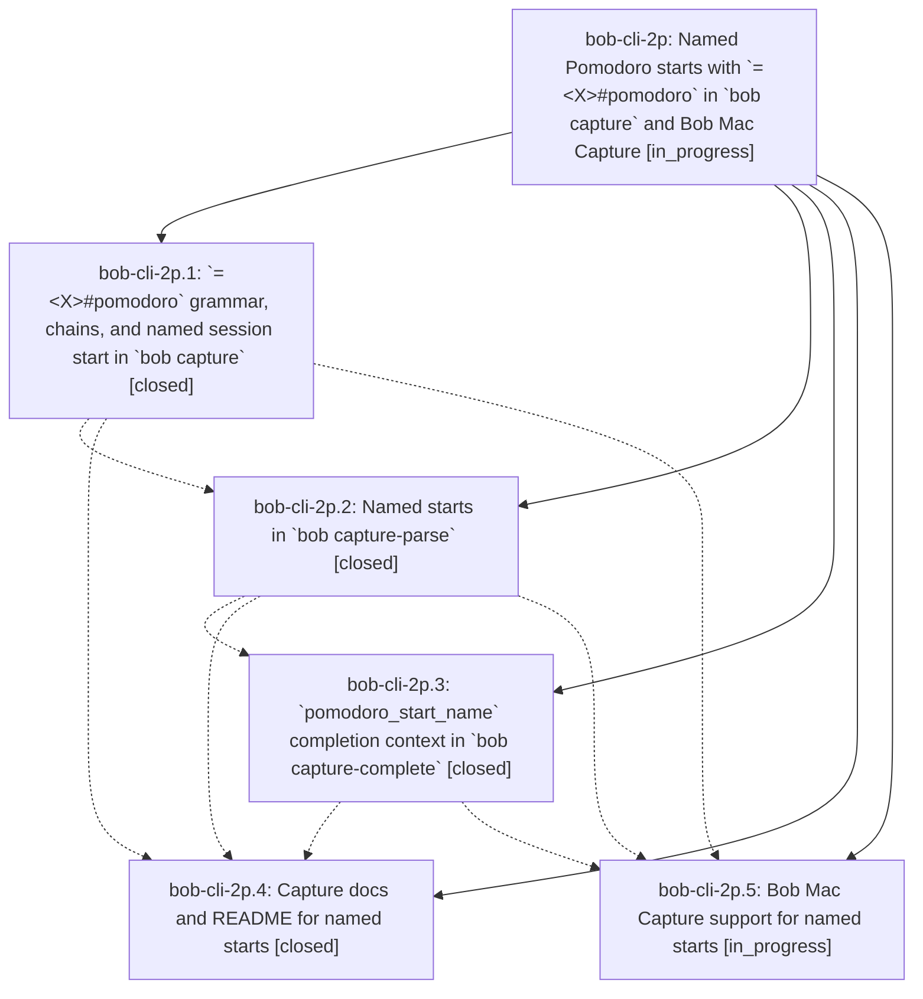

# Bead: bob-cli-2p — Named Pomodoro starts with \`=\<X\>#pomodoro\` in \`bob capture\` and Bob Mac Capture

[Bead Pages](../README.md) / bob-cli-2p

**Status:** ◐ in_progress · **Type:** ▸ plan · **Tier:** epic
**Owner:** `bryanbugyi34@gmail.com` · **Created by:** [bbugyi200.apollo.36.w0](https://github.com/bobs-org/bob-cli--agents/blob/main/sessions/bbugyi200.apollo.36.w0.md) · **Assignee:** `bob-cli-2p.land`
**Created:** 2026-09-29 19:17:57 EDT
**Plan:** [202609/named\_pomodoro\_start.md](https://github.com/bobs-org/bob-cli--plans/blob/main/202609/named_pomodoro_start.md)

## Description

A whole capture item `=<X>#<pomodoro>` (for example `=#deep-work`, `=3#bugs`, `=-2#bugs`) starts the named Pomodoro now with `se<X>` timing, atomically. It starts the open placeholder whose name matches (whole slug, else prefix), or a new session named like a completed match, or a brand-new named session. The token composes in same-line chains (`=x =#bugs` switches sessions in one line). `bob capture-parse` and `bob capture-complete` expose it, and Bob Mac Capture completes the name with a start-aware list, highlights it, previews the session live, and teaches the syntax.

## Phases

| Bead | Title | Status | Size | Created | Agents | Commits |
|---|---|---|---|---|---:|---:|
| [bob-cli-2p.1](bob-cli-2p.1.md) | \`=\<X\>#pomodoro\` grammar, chains, and named session start in \`bob capture\` | ✓ closed | medium | 2026-09-29 | 1 | 1 |
| [bob-cli-2p.2](bob-cli-2p.2.md) | Named starts in \`bob capture-parse\` | ✓ closed | medium | 2026-09-29 | 1 | 1 |
| [bob-cli-2p.3](bob-cli-2p.3.md) | \`pomodoro\_start\_name\` completion context in \`bob capture-complete\` | ✓ closed | medium | 2026-09-29 | 1 | 1 |
| [bob-cli-2p.4](bob-cli-2p.4.md) | Capture docs and README for named starts | ✓ closed | small | 2026-09-29 | 1 | 1 |
| [bob-cli-2p.5](bob-cli-2p.5.md) | Bob Mac Capture support for named starts | ◐ in_progress | medium | 2026-09-29 | 1 | 0 |

## Lineage

## Agents

| Agent | Bead | Commits |
|---|---|---:|
| [bbugyi200.apollo.bob-cli-2p.1](https://github.com/bobs-org/bob-cli--agents/blob/main/agents/bbugyi200.apollo.bob-cli-2p.1/README.md) | [bob-cli-2p.1](bob-cli-2p.1.md) | 1 |
| [bbugyi200.apollo.bob-cli-2p.2](https://github.com/bobs-org/bob-cli--agents/blob/main/agents/bbugyi200.apollo.bob-cli-2p.2/README.md) | [bob-cli-2p.2](bob-cli-2p.2.md) | 1 |
| [bbugyi200.apollo.bob-cli-2p.3](https://github.com/bobs-org/bob-cli--agents/blob/main/agents/bbugyi200.apollo.bob-cli-2p.3/README.md) | [bob-cli-2p.3](bob-cli-2p.3.md) | 1 |
| [bbugyi200.apollo.bob-cli-2p.4](https://github.com/bobs-org/bob-cli--agents/blob/main/agents/bbugyi200.apollo.bob-cli-2p.4/README.md) | [bob-cli-2p.4](bob-cli-2p.4.md) | 1 |
| [bbugyi200.apollo.bob-cli-2p.5](https://github.com/bobs-org/bob-cli--agents/blob/main/agents/bbugyi200.apollo.bob-cli-2p.5/README.md) | [bob-cli-2p.5](bob-cli-2p.5.md) | 0 |
| [bbugyi200.apollo.bob-cli-2p.land](https://github.com/bobs-org/bob-cli--agents/blob/main/agents/bbugyi200.apollo.bob-cli-2p.land/README.md) | [bob-cli-2p](README.md) | 0 |

## Commits

| Repo | Commit | Subject | Bead | Committed |
|---|---|---|---|---|
| bob-cli | [`cba59ee`](https://github.com/bobs-org/bob-cli/commit/cba59ee919fd88f886c93735688b2994c5810b39) | feat(capture): named Pomodoro starts with =\<X\>#pomodoro | [bob-cli-2p.1](bob-cli-2p.1.md) | 2026-09-29 19:32:06 EDT |
| bob-cli | [`4a480bf`](https://github.com/bobs-org/bob-cli/commit/4a480bf014d8c4448442da8e869dccbcdc624589) | feat(capture): support named pomodoro starts in editor parse | [bob-cli-2p.2](bob-cli-2p.2.md) | 2026-09-29 19:49:07 EDT |
| bob-cli | [`f41ab05`](https://github.com/bobs-org/bob-cli/commit/f41ab0550a1fe9f4ed988a3186e6d5c454f01e00) | feat(capture): add pomodoro\_start\_name completion context for =\<X\>#name | [bob-cli-2p.3](bob-cli-2p.3.md) | 2026-09-29 20:15:51 EDT |
| bob-cli | [`8d79b1d`](https://github.com/bobs-org/bob-cli/commit/8d79b1dfa9b738dae1bc626edabae2cf58836e43) | docs(capture): document =\<X\>#pomodoro named starts | [bob-cli-2p.4](bob-cli-2p.4.md) | 2026-09-29 20:29:45 EDT |
