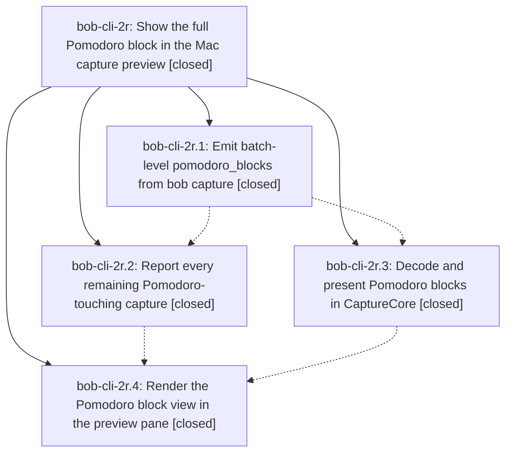

# Bead: bob-cli-2r — Show the full Pomodoro block in the Mac capture preview

[Bead Pages](../README.md) / bob-cli-2r

**Status:** ✓ closed · **Resolution:** done · **Type:** ▸ plan · **Tier:** epic
**Owner:** `bryanbugyi34@gmail.com` · **Created by:** [bbugyi200.apollo.3c](https://github.com/bobs-org/bob-cli--agents/blob/main/sessions/bbugyi200.apollo.3c.md) · **Assignee:** `bob-cli-2r.land`
**Created:** 2026-09-30 07:52:28 EDT · **Closed:** 2026-09-30 10:55:07 EDT
**Plan:** [202609/pomodoro\_full\_block\_preview.md](https://github.com/bobs-org/bob-cli--plans/blob/main/202609/pomodoro_full_block_preview.md)

## Description

Whenever a capture touches, creates, or reports a Pomodoro, the Bob Mac Capture live preview shows that Pomodoro in full: its headline and every nested child line, exactly as Bob will write it, with the lines the capture changes clearly marked. Bob computes the blocks and the diff. The app only decodes and renders them in one consistent, polished block view.

## Notes

[2026-09-30T14:39:53Z · bob-cli-2r.land] LAND TRIAGE before the closeout tale. Phases bob-cli-2r.1 through .4 are closed. CLI commits f32359f and a297a48 emit pomodoro_blocks with the planned refs. Mac commits 642313f, ecd428a, and 5497775 decode and render them. bob-cli-2s.1 (0b50af3) and bob-cli-2s.2 (1121e06) landed during this epic; start planners still push a started ref, and the real-bob fixture pomodoro-start-drop.json includes the dropped lines as change=removed. Mac PreviewPane still renders pomodoroBlocks after the in-progress bob-cli-2s.3 start-card commits d46667b and e22365c. No parent bead. No --epic-symbol entries. Remaining epic work, planned as a tale: reinstate the debug_asserts that bob-cli-2r.1 deferred until blocks_refs (the comments and the two unit tests still suppress them), and call assert_pomodoro_blocks_cover_changes from the new start-drop family.

Follow-up outcomes:
1. debug_assert on unreported headline rewrites and vanished entries (bob-cli-2r.1) — kept as remaining epic work in the closeout tale. blocks_refs has landed, and the module docstring already says debug builds panic, but autodetect does not.
2. clippy `|| true` at tests/cli/capture/pomodoro_name.rs:808 (bob-cli-2r.1 and bob-cli-2r.2, one defect) — declined as a new task. Pre-existing from bob-cli-28.1. That epic is still in_progress and its closeout already owns the fix. Corroborated with a DISCOVERED ISSUE note on bob-cli-28.
3. empty pomodoro_close.entry_line and task_line when a day-file task's Work Log shifts ## Pomodoros (bob-cli-2r.1) — filed bob-cli-2t (bug, small, ready). Not caused by this epic: block refs were fixed via locate_close_headline, the plan pins close JSON byte for byte, and the staged-contents overwrite predates this epic (f8b03c2).
4. equal-indent toggle move emits no pomodoro_blocks (bob-cli-2r.2) — filed bob-cli-2u (feature, medium, ready). Not a missed planned case: autodetect and the coverage helper deliberately ignore Myers-aligned moves, and toggles have no refs. Whole-item start relocation must keep that exemption.
5. Visual review skipped (bob-cli-2r.4, not a PROPOSED FOLLOW-UP) — declined. The plan says to skip when the Mac cannot link XCTest and to say so on the bead. The phase did.
6. d46667b macOS CI red (bob-cli-2r.4 note, not a PROPOSED FOLLOW-UP) — declined. That commit belongs to in-progress bob-cli-2s.3, and fix commit e22365c already landed on bob-mac-capture.

Related links from bob-cli-2t and bob-cli-2u back to this epic could not be written: `sase artifact link add` still fails with the pre-existing operation_id collision tracked on bob-cli-21. The relation is in each task's creation reason.

[2026-09-30T14:55:07Z · bob-cli-2r.land] Closeout tale done. Phases .1-.4 closed: CLI f32359f/a297a48 emit batch-level pomodoro_blocks with refs; Mac 642313f/ecd428a/5497775 decode/render (per land triage; this turn left bob-mac-capture untouched). Reinstated both autodetect debug_asserts in src/native/capture/pomodoro_blocks.rs: rewritten-headline force_unchanged branch panics 'rewritten pomodoro headline has no ref' (genuinely-new Created path still silent), post-loop pre-entry walk panics 'pomodoro entry vanished without a ref' (release keeps emitting unchanged / dropping silently); removed the until-blocks_refs comments; converted unreported_headline_rewrite and vanished_entry tests to debug-only should_panic style. Scoping to preserve existing contracts: the vanish walk skips currently-tracked headlines (forward owns those: existing forwarding test still panics 'tracked pomodoro headline lost') and headlines whose bytes survive as a post entry via the same exact-text moved-headline fallback forward/resolve_refs use (whole-item starts displace completed entries as Myers delete+insert; the Started ref already covers the rewritten headline, so no planner ref was missing and no output changed). Start-drop: start_drop_bare_removes_link_with_nested_note now calls assert_pomodoro_blocks_cover_changes and passes as written. Ran: cargo fmt --check clean; cargo test --lib pomodoro_blocks (20 passed); cargo test --test cli start_drop_bare_removes_link_with_nested_note (1 passed); cargo test --test cli pomodoro (172 passed, incl. the 2 whole-item move tests). cargo clippy fails only on the pre-existing || true deny at tests/cli/capture/pomodoro_name.rs:808 (bob-cli-28 owns it; untouched); no new lint from this diff. Follow-ups already on bead: bob-cli-2t and bob-cli-2u filed ready; bob-cli-28 corroborated for the clippy deny; visual review and d46667b CI note declined. just symvision is not a recipe in this repo; not added, not run.

## Phases

| Bead | Title | Status | Size | Created | Agents | Commits |
|---|---|---|---|---|---:|---:|
| [bob-cli-2r.1](bob-cli-2r.1.md) | Emit batch-level pomodoro\_blocks from bob capture | ✓ closed | medium | 2026-09-30 | 1 | 1 |
| [bob-cli-2r.2](bob-cli-2r.2.md) | Report every remaining Pomodoro-touching capture | ✓ closed | medium | 2026-09-30 | 1 | 1 |
| [bob-cli-2r.3](bob-cli-2r.3.md) | Decode and present Pomodoro blocks in CaptureCore | ✓ closed | medium | 2026-09-30 | 1 | 0 |
| [bob-cli-2r.4](bob-cli-2r.4.md) | Render the Pomodoro block view in the preview pane | ✓ closed | medium | 2026-09-30 | 1 | 0 |

## Lineage

## Agents

| Agent | Bead | Commits |
|---|---|---:|
| [bbugyi200.apollo.bob-cli-2r.1](https://github.com/bobs-org/bob-cli--agents/blob/main/agents/bbugyi200.apollo.bob-cli-2r.1/README.md) | [bob-cli-2r.1](bob-cli-2r.1.md) | 1 |
| [bbugyi200.apollo.bob-cli-2r.2](https://github.com/bobs-org/bob-cli--agents/blob/main/agents/bbugyi200.apollo.bob-cli-2r.2/README.md) | [bob-cli-2r.2](bob-cli-2r.2.md) | 1 |
| [bbugyi200.apollo.bob-cli-2r.3](https://github.com/bobs-org/bob-cli--agents/blob/main/sessions/bbugyi200.apollo.bob-cli-2r.3.md) | [bob-cli-2r.3](bob-cli-2r.3.md) | 0 |
| [bbugyi200.apollo.bob-cli-2r.4](https://github.com/bobs-org/bob-cli--agents/blob/main/agents/bbugyi200.apollo.bob-cli-2r.4/README.md) | [bob-cli-2r.4](bob-cli-2r.4.md) | 0 |
| [bbugyi200.apollo.bob-cli-2r.land](https://github.com/bobs-org/bob-cli--agents/blob/main/sessions/bbugyi200.apollo.bob-cli-2r.land.md) | [bob-cli-2r](README.md) | 1 |

## Commits

| Repo | Commit | Subject | Bead | Committed |
|---|---|---|---|---|
| bob-cli | [`f32359f`](https://github.com/bobs-org/bob-cli/commit/f32359ff6a2cd7798a4fcf197240ef9781ad9e76) | feat(capture): add pomodoro blocks tracker with batch-level JSON | [bob-cli-2r.1](bob-cli-2r.1.md) | 2026-09-30 08:46:17 EDT |
| bob-cli | [`a297a48`](https://github.com/bobs-org/bob-cli/commit/a297a48c4646f07a9f519bfcaad77d22045938a1) | feat(capture): report every remaining Pomodoro-touching capture in pomodoro\_blocks | [bob-cli-2r.2](bob-cli-2r.2.md) | 2026-09-30 09:39:18 EDT |
| bob-cli | [`490e452`](https://github.com/bobs-org/bob-cli/commit/490e452eaf94a70b981a8a114758ae324e0ae0e2) | feat(capture): reinstate pomodoro block debug asserts and lock start-drop coverage | [bob-cli-2r](README.md) | 2026-09-30 10:58:20 EDT |
